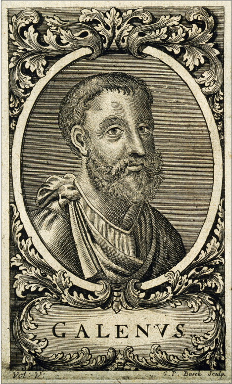

# History of neuroscience

---

::: {#fig-history-of-neuroscience}

<iframe width="1280" height="435" src="https://www.youtube.com/embed/S0HKupSZq8k?si=5OA7DXobn0HcV9E9" title="YouTube video player" frameborder="0" allow="accelerometer; autoplay; clipboard-write; encrypted-media; gyroscope; picture-in-picture; web-share" referrerpolicy="strict-origin-when-cross-origin" allowfullscreen></iframe>

@NeuroBriefs2011-pd
:::

## Why study history? {-}

::: {.incremental}
- What can *observation* tell us about brain and behavior?
- Vital role of *tools/methods/techniques* in discovery
- *"If I have seen further, it is by standing on the shoulders of giants."* -- Isaac Newton, 1676; [@Wikipedia-contributors2024-qw]
:::

## Pre/Early history

## [*Trephining* (trepanning)](https://en.wikipedia.org/wiki/Trepanning){preview-link="true"} {-}

:::: {.columns}
::: {.column width=50%}
::: {.incremental}
- Deliberate creation of openings in the skull
- Earliest evidence +7,000 yrs old
- Q: Why did they do this?
- A: Treat head injury, epilepsy, mental disorders, release evil spirits
:::
:::
::: {.column width=50%}

:::
::::

## Egyptians (1,500-3,000 BCE)

:::: {.columns}
::: {.column width=50%}
- First written (hieroglyphic) record of the term “brain”
:::
::: {.column width=50%}

:::
::::

## [Beer-making (~2-5,000 BCE)](https://en.wikipedia.org/wiki/History_of_beer){preview-link="true"}

:::: {.columns}
::: {.column width=50%}
- Speculate: What might beer-making have to do with the neurological bases of human behavior?
:::
::: {.column width=50%}

:::
::::

## Greek and Roman era

:::: {.columns}
::: {.column width=50%}
- [*Hippocrates*](https://en.wikipedia.org/wiki/Hippocrates){preview-link="true"}
  - "Father of Medicine"; [Hippocratic Oath](https://en.wikipedia.org/wiki/Hippocratic_Oath){preview-link="true"}
  - *Brain* seat of intelligence [@Chudler_undated-lu]
  - *Epilepsy* a disease of the brain [@Chudler_undated-lu]
:::
::: {.column width=50%}
{width="70%"}
:::
::::

## Aristotle

:::: {.columns}
::: {.column width=50%}
- [*Aristotle* (~335 BCE)](https://en.wikipedia.org/wiki/Aristotle)
    - mind and body *not* distinct
    - brain “cools” the body, *heart* is the mental organ
:::
::: {.column width=50%}
{width="70%"}
:::
::::

## [*Galen* (~177 CE)](https://en.wikipedia.org/wiki/Galen){preview-link="true"}

:::: {.columns}
::: {.column width=70%}
- Physician in Roman Empire, of Greek descent
- Anatomical reports based on dissection of monkeys, pigs
- Influenced by Hippocrates' notion that human temperaments (~personalities) linked to "humors": blood, black bile, yellow bile, phlegm
:::
::: {.column width=30%}
{width="60%"}
:::
::::

## Your turn...

::: {.question}
Do modern humans think that individual differences in thought, mood, and behavior relate to biological factors?
:::

## [*Galen* (~177 CE)](https://en.wikipedia.org/wiki/Galen){preview-link="true"}

:::: {.columns}
::: {.column width=70%}
- Observed that gladiators' head injuries impaired thinking, movement
- Speculated that fluid filling the brain cavities called *ventricles*, circulates through nerves, body
- "Ventricular" theory of nervous system function
:::
::: {.column width=30%}

:::
::::

## Summing up: Early knowledge

- Mental functions controlled by organs in the head, i.e., the brain
- Mental functions can be influenced by substances we consume
- Head injury can impair behavior and thinking
- Something flows from brain to body via nerves

## Your turn... {-}

::: {.question}
## Why didn't they know more?
:::

::: {.fragment}
::: {.answer}
::: {.incremental}
- Limited technology (tools & techniques)
- Limited cultural support for systematic observation & description $\rightarrow$ **SCIENCE**
- Lack of ability to use knowledge even if it were acquired
:::
:::
:::

## *Leonardo da Vinci* (~1508) {-}

:::: {.columns}
::: {.column width=50%}
- Wax casts of ventricles
- Ventricles *not* spherical!
- Better "measure" $\rightarrow$ more precise evidence
:::
::: {.column width=50%}
{width="60%"}
:::
::::

## *Andreas Vesalius* (1543) {-}

:::: {.columns}
::: {.column width=50%}
- *De Humani Corporis Fabrica Libri Septem (On the fabric of the human body in seven books)* [@Wikipedia-contributors2025-gu]
- 1st detailed drawings of brain and body anatomy
:::
::: {.column width=50%}

:::
::::

## René Descartes -- mid 1600’s {-}

:::: {.columns}
::: {.column width=50%}
- Reflexes “reflect” sensory events in the world
- Reflexes ≠ voluntary functions
- Reflexes and animal “minds” are physical, machine-like
:::
::: {.column width=50%}

:::
::::

## René Descartes -- mid 1600’s

:::: {.columns}
::: {.column width=50%}
- Human mind is not machine-like
    - “Dual” influences on behavior
    - Physical + spiritual
    - *Philosophical dualism*
:::
::: {.column width=50%}

:::
::::

## René Descartes -- mid 1600’s

:::: {.columns}
::: {.column width=50%}
- Soul controls body via *pineal gland*
  - Fluid from ventricles cause muscles to “inflate”
- One of the earliest "[mechanistic](https://en.wikipedia.org/wiki/Mechanism_(philosophy)#Mechanical_philosophy)" accounts of behavior
:::
::: {.column width=50%}

:::
::::

## Your turn...

::: {.question}
## Do you agree with Descartes?

- **Yes**, human minds are fundamentally different from animal minds. The human mind is influenced by both physical and extraphysical processes.
- **No**, human minds are similar to animal minds. The human mind arises solely from physical processes.
:::

::: {.fragment}
::: {.question}
## How would you _scientifically_ test Descartes' idea about the role of the pineal gland?
:::
:::

## Other critical milestones

- Invention of [light microscope](http://www.history-of-the-microscope.org/invention-of-glass-lenses-and-the-history-of-the-light-microscope.php){preview-link="true"} (1609 CE), [electron microscope](https://en.wikipedia.org/wiki/Electron_microscope){preview-link="true"} (1926)
- Cell stains -- [Camillo Golgi](https://en.wikipedia.org/wiki/Camillo_Golgi){preview-link="true"}, [Santiago Ramon y Cajal](https://en.wikipedia.org/wiki/Santiago_Ram%C3%B3n_y_Cajal){preview-link="true"} -- late 1800s
- Recording of electrical activity of nerves, [Luigi Galvani](https://en.wikipedia.org/wiki/Luigi_Galvani){preview-link="true"}
- Whole brain imaging (late 20th century)

## Lessons from early history {-}

- Understanding shaped by new methods, tools
- If you can't see it/measure it, you can't say much about it

## Lessons from early history {-}

- Neuroscience shaped by [great debates](http://www.columbia.edu/cu/psychology/courses/1010/mangels/neugiro/history/history.html)
  - Is the mind == brain?
  - Are human minds and animal minds similar or categorically different?
  - Are functions local or distributed?
  - Do neurons connect like pipes or pass info like relay runners?
  - What flows from the head to the body?
