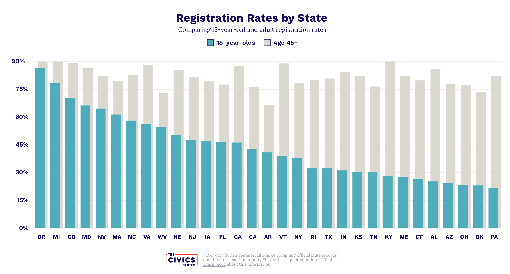
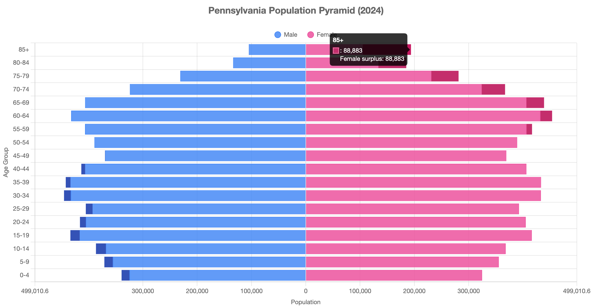

## Elections!

- PA voter registration deadline: *Monday, October 19, 2026*
- Election Day: *Tuesday, November 2, 2026*
- Options
  - Vote in person (polling place near the address you used to register)
  - Vote by mail (in PA, ballot must be received by 8:00 pm on Election Day)
  
## Why vote?

- What direction do you want your city, county, state, country to take?
- How should tax dollars be collected & spent?

---

{#fig-voter-registration-rates-by-state}

---

{#fig-pa-population-pyramid-2024}

## More info

- [Handout from Penn State](../student-voting-registration-penn-state.html)
