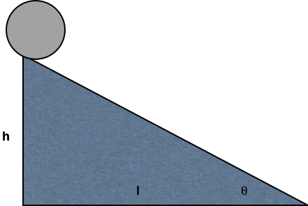
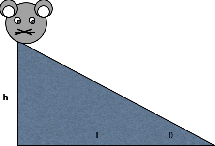

# Preliminaries

## For fun

::: {#fig-ode-to-the-brain}

<iframe width="1240" height="450" src="https://www.youtube.com/embed/JB7jSFeVz1U?si=EtOirLlbWKNhGK9o" title="YouTube video player" frameborder="0" allow="accelerometer; autoplay; clipboard-write; encrypted-media; gyroscope; picture-in-picture; web-share" referrerpolicy="strict-origin-when-cross-origin" allowfullscreen></iframe>

@Melodysheep2011-wg
:::

---

:::: {.columns}
::: {.column width=50%}
> "*If understanding everything we need to know about the brain is a mile, how far have we walked?*"

@National_Geographic2014-gv
:::
::: {.column width=50%}

:::
::::

## Today's topics

- Warm-up
- Introductions
- Structure of the course

# Warm-up

---

::: question
## *If understanding everything we need to know about the brain is a mile, how far have we walked?*
:::

::: fragment
::: answer
- A. 3/4 mile
- B. 1/2 mile
- C. 1/4 mile
- D. 100 yards
- E. 3 in
:::
:::

## Today's topics

- Introductions
- Structure of the course
- What's this course about?
- Why is biology essential for the science of behavior?

# Introductions

## Teaching Assistant {-}

## Rick Gilmore

# Structure of the course {-}

---

- [Schedule](https://psu-psychology.github.io/psych-260-2025-fall/schedule.html){preview-link="true"}
- [Evaluation](https://psu-psychology.github.io/psych-260-2025-fall/evaluation.html){preview-link="true"}

# What is this course about? {-}

---

- What is behavior?
- How is human behavior similar to/different from other animals?
- What are the *neurological* bases (of human) behavior?
- What *other* bases (of human behavior) are there?
- How do the neurological bases of human behavior affect your life?

---

- Why does taking/drinking X make me feel Y?
- My grandmother has Alzheimer's disease. What's happening to her brain?
- Carrie Fisher had bipolar disorder. What's that about?
- Why is sleep so important for brain health?
- My mom says my frontal cortex isn't fully mature. Is she right?
- Is it safe for high school athletes to play football (or soccer, hockey, etc.)?

## There are many "neurological" bases...

<!-- ## Genes {-} -->

<!-- ![[@Jimenez2009]](http://ecx.images-amazon.com/images/I/41OzMnt3lpL._SX319_BO1,204,203,200_.jpg) -->

## Neurotransmitters {-}

{fig-align="center"}

## Neurons {-}

{fig-align="center"width="80%"}

## Networks {-}

## Brains {-}

{fig-align="center"width="50%"}

## Behavior {-}

{fig-align="center"}

## Keys for success {-}

- Study the figures, not just the text.
- Study regularly -- don't cram.
  - 5-6 hrs/week outside of class time
- Come to class.
- Participate!

# Why is biology essential for the science of behavior? {-}

---

- What is science?
    - What distinguishes sciences?
    - What is neuroscience?
- Why is neuroscience harder than physics?

## What is [science](http://dictionary.reference.com/browse/science)? {-}

::: {.incremental}

- Body of facts or truths
- *Process* of acquiring (and verifying) knowledge
    - Systematic study
    - Observation, experiment, description
    - Aims at reliable, reproducible, general, systematic, universal laws
    - *Strives* for objectivity

:::
 
## Science vs. other ways of thinking {-}

- Science is a *way of thinking* and a *set of behaviors*
- Scientists strive toward *communal norms* @Merton1979-ys: communalism, universalism, disinterestedness, organized skepticism
- Don't always meet them, but keep striving
- Science *describes*, tries to *predict*

## Science alone...

- Not especially well-suited to *prescribing* (recommending) or *proscribing* (prohibiting)
    - little to say about what is good, just, right, moral, etc.
    - (Although systematic descriptions of phenomena can be used to make pre/proscriptive claims...)

## Science rests on **evidence and logic**

- NOT on authorities (e.g., people whose stature is largely or solely based on their position or economic status)
- However, some scientific claims (and scientists) are more credible and authoritative than others.
- Everyone has opinions. Are yours supported by *evidence*?

## Science respects tradition

- but not uncritically
  - questions and tests it repeatedly...

## Science should be...

- reproducible, robust, transparent
  - others can get the same answer if they follow the same procedures
- but see [PSYCH 490.003](https://psu-psychology.github.io/psych-490-reproducibility-2023-spring)
- Don't just "trust the science"
  - demand rigorous and transparent processes
  - insist on data/evidence & logical argument

## Science...

:::: {.columns}
::: {.column width=40%}
- has led to huge advances in human health & prosperity
:::
::: {.column width=60%}
![[@owid-its-not-just-about-child-mortality-life-expectancy-improved-at-all-ages]](https://ourworldindata.org/cdn-cgi/imagedelivery/qLq-8BTgXU8yG0N6HnOy8g/10a0ca12-415d-41c8-f6b8-0fcdd9fac900/w=3080)
:::
::::

## Gilmore's views:

::: {.incremental}
+ Science will be essential for maintaining & extending these advances in the future
- We all pay (taxes) for scientific research [@Unknown2022-fu]^[$48B for NIH in FY26 [@UnknownUnknown-av], or ~\$140 per person [@UnknownUnknown-gh]].
- We all have a stake in questions like:
  - Do we want more scientific advances in the future?
  - Who do we want to own the knowledge?
:::

---

::: {.question}
## Your turn
What scientific advances about the neurological bases of human behavior are important for *your* future? For everyone's?
:::
    
## Similarities among sciences {-}

- What are the different kinds of X?
    - **Form**, e.g., anatomy
- How does X work?
    - **Function**, e.g., physiology
- Where did X come from?
    - **Origins**, e.g., development/evolution
    
## Examples {-}

- "Coronavirus gets its name because of its crown-like shape."
- "Viruses reproduce (and cause illness) by forcing host organisms to create massive quantities of the virus that then spread to others."
- "Coronavirus originated in non-human animals in China or escaped from a biological laboratory."

## We are family

<!-- ## Differences among sciences {-} -->

<!-- - Phenomena of interest (studying *what*) -->
<!-- - Methods or tools (studying it *how*) -->
<!-- - At what *level(s) of analysis* -->
<!--     - Spatial scale (nanometers $10^{-9}m$ to light-years $10^{15}m$) -->
<!--     - Temporal scale (milliseconds $10^{-3}s$ to millenia $10^3s$) -->

<!-- ## What is neuroscience? {-} -->

<!-- - The study of the nervous system -->
<!--     - And the behavior it makes possible -->
<!-- - Questions neuroscience asks... -->
<!--     - What are the parts of the nervous system? -->
<!--     - How do the parts work?  What do they do? -->
<!--     - Where did they come from? -->

<!-- ## Spatial and temporal scales {-} -->

<!--  -->

## Why neuroscience is harder than physics {-}

{fig-align="center"}

## Why neuroscience is harder than physics {-}

{fig-align="center"}

## Take homes

- Evaluation: best 3 exams scores/4; best 3 quizzes/4.
- Systematic description and study of the nervous system touches on multiple aspects of behavior and mental experience

## Next time

- History of neuroscience
- Levels of analysis
- (if time) Methods

# Resources

## About

This talk was produced using [Quarto](https://quarto.org), using the [RStudio](https://posit.co/products/open-source/rstudio/)
Integrated Development Environment (IDE), version 2026.7.1.147.

The source files are in R and R Markdown, then rendered to HTML using the
[revealJS](https://revealjs.com) framework.
The HTML slides are hosted in a [GitHub repo](https://github.com/psu-psychology/psych-260-2026-fall) and served by GitHub pages:
<https://psu-psychology.github.io/psych-260-2026-fall/>

## References
