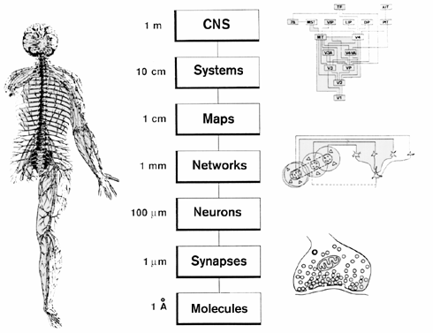
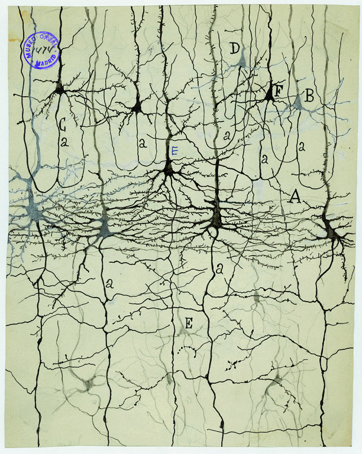
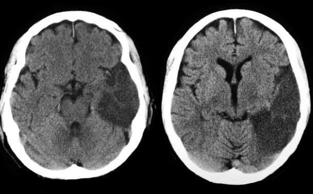
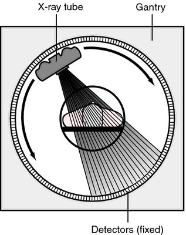
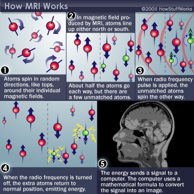
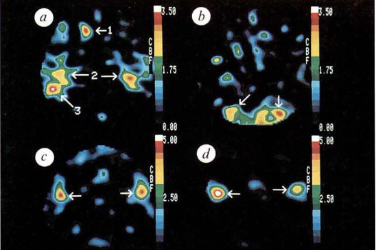
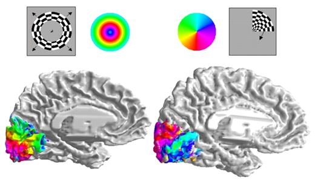

# Preliminaries

---

::: {#fig-stevie-wonder-superstition}
<iframe width="1240" height="450" src="https://www.youtube.com/embed/97hwNY3ni10?si=2k0feL7PKLxzhtNm" title="YouTube video player" frameborder="0" allow="accelerometer; autoplay; clipboard-write; encrypted-media; gyroscope; picture-in-picture; web-share" referrerpolicy="strict-origin-when-cross-origin" allowfullscreen></iframe>

@Musikladen2020-id
:::

## Today's topics

- Warm-up
- Evaluating methods
- Structural methods
- Functional methods

# Warm-up

---

::: question
## What historical figure believed that the pineal gland caused fluid from the cerebral ventricles to inflate the muscles?

- A. Galen
- B. Descartes
- C. Aristotle
:::

::: fragment
::: answer
- ~~A. Galen~~
- **B. Descartes**
- ~~C. Aristotle~~
:::
:::

---

::: {.question}
## What historical figure observed the consequences of head injuries on behavior?

- A. Galen
- B. Descartes
- C. Aristotle
:::

::: {.fragment}
::: {.answer}
- **A. Galen**
- ~~B. Descartes~~
- ~~C. Aristotle~~
:::
:::

# Evaluating methods

---

{#fig-churchland width="70%"}

---

{width="75%" #fig-sejnowski-2014}

## Evaluating methods

+ Spatial/temporal resolution
  - high/fine (small details, fast events)
  - low/poor (big picture, slow events)
+ Cost (time/$)
+ Invasiveness (surgery vs. no)

## Types of methods

- Structural
    + What are the parts?
    + How do they connect?
- Functional
    + How do the parts *respond*?
    - What do the parts *do*?
    
# Structural methods
    
## Cellular methods
  
- Golgi, Nissl stains
- Tract-tracing
- Whole brain cellular, e.g. CLARITY

## Golgi stain

:::: {.columns}
::: {.column width=40%}
- [Camillo Golgi](https://en.wikipedia.org/wiki/Camillo_Golgi){preview-link="true"}
- [Complete nerve cells, but only 1-5\% of total]{.blue-text}
<!-- - Soak tissue in Potassium Dichromate ($K_2Cr_2O_7$) then apply Silver Nitrate ($AgNO_3$) -->
:::
::: {.column width=60%}
{#fig-golgi-stain width="60%"}
:::
::::

## Do neurons connect like pipes?

:::: {.columns}
::: {.column width=33%}
- Yes!
- [Camillo Golgi](https://en.wikipedia.org/wiki/Camillo_Golgi){preview-link="true"}
:::
::: {.column width=33%}

:::
::: {.column width=33%}
- No!
- [Santiago Ramon y Cajal](https://en.wikipedia.org/wiki/Santiago_Ramón_y_Cajal){preview-link="true"}
:::
::::

## [Santiago Ramon y Cajal](https://en.wikipedia.org/wiki/Santiago_Ramón_y_Cajal){preview-link="true"}

:::: {.columns}
::: {.column width=60%}
- *Neuron doctrine*: there are gaps between neurons
- *Something* passes between neurons to cross the gap
- Shared 1906 Nobel Prize with Golgi
:::
::: {.column width=40%}
{#fig-cajal width="80%" fig-align="right"}
:::
::::

## Nissl stain

:::: {.columns}
::: {.column width=60%}
- [Franz Nissl](https://en.wikipedia.org/wiki/Franz_Nissl){preview-link="true"}
- [Only cell bodies]{.blue-text}
- Cellular distribution, concentration, microanatomy
- Density of staining ~ cell density/number
:::
::: {.column width=40%}
{#fig-nissl-stain}
:::
::::

## Your turn...

:::: {.columns}
::: {.column width=60%}
::: {.question}
## Are neurons distributed evenly throughout the brain?
:::

::: {.fragment}
::: {.question}
## Are neurons more concentrated on the inside or the outside of the brain?
:::
:::

::: {.fragment}
::: {.question}
## BONUS: What "slice" does the image depict?
:::
:::

:::
::: {.column width=40%}

:::
::::

## Large-scale cellular techniques

:::: {.columns}
::: {.column width=50%}
> *"If understanding everything we need to know about the brain is a mile, how far have we walked?"*
> -- J. Lichtman
:::
::: {.column width=50%}



@National_Geographic2014-gv
:::
::::

## [Clarity](http://clarityresourcecenter.com/CLARITY.html)

::: {#fig-clarity}
<iframe width="1280" height="450" src="https://www.youtube.com/embed/c-NMfp13Uug?si=DiMnA5otRbgAXjcE" title="YouTube video player" frameborder="0" allow="accelerometer; autoplay; clipboard-write; encrypted-media; gyroscope; picture-in-picture; web-share" referrerpolicy="strict-origin-when-cross-origin" allowfullscreen></iframe>

@Video2013-bj
:::

## Evaluating cellular techniques

- Pros:
  - High spatial resolution (resolve small details)
  - e.g., what are the parts, where are they located, how do they connect
- Cons:
  - Poor temporal resolution
  - Invasive
  
## Your turn

::: {.question}
## Why aren't cellular techniques especially useful for studing living humans?
:::

## Whole-brain methods

- Computed Tomography/Computed Axial Tomography
- Magnetic Resonance Imaging (MRI)-related
    - Diffusion Tensor Imaging (DTI)
    - *MR Spectroscopy*
    - Voxel-based Morphometry (VBM)
    
## Computed axial tomography (CAT)

:::: {.columns}
::: {.column width=40%}
- Computed tomography [CT](https://en.wikipedia.org/wiki/CT_scan)
- X-ray based
:::
::: {.column width=60%}
{#fig-ct-stroke}
:::
::::

## How tomography works

:::: {.columns}
::: {.column width=50%}
#fig-tomography}
:::
::: {.column width=50%}
{#fig-tomography-shadows}
:::
::::

## [MRI](https://en.wikipedia.org/wiki/Magnetic_resonance_imaging)

::: {#fig-mri-video}
<iframe width="1280" height="450" src="https://www.youtube.com/embed/1CGzk-nV06g?si=yyA8Xak0MW75BbHV" title="YouTube video player" frameborder="0" allow="accelerometer; autoplay; clipboard-write; encrypted-media; gyroscope; picture-in-picture; web-share" referrerpolicy="strict-origin-when-cross-origin" allowfullscreen></iframe>

@National-Institute-on-Biomedical-Imaging-and-BioengineeringUnknown-vz
:::

## [MRI](https://en.wikipedia.org/wiki/Magnetic_resonance_imaging)

:::: {.columns}
::: {.column width=50%}
- Some common substances (e.g., H) & complex molecules have magnetic dipole
- Axes align with strong magnetic field
:::
::: {.column width=50%}
{#fig-mri-steps}
:::
::::

## [MRI](https://en.wikipedia.org/wiki/Magnetic_resonance_imaging)

:::: {.columns}
::: {.column width=50%}
- When alignment perturbed by radio frequency (RF) pulse, speed of realignment varies by tissue
- Realignment emits RF signals
:::
::: {.column width=50%}
{#fig-mri-knee}
:::
::::

## [MRI](https://en.wikipedia.org/wiki/Magnetic_resonance_imaging)

:::: {.columns}
::: {.column width=50%}
- Types
    - Structural
    - Functional (*f*MRI)
- Reveals tissue density/type differences
- [Gray matter](https://en.wikipedia.org/wiki/Grey_matter) (neurons & dendrites & axons & glia) vs. [white matter](https://en.wikipedia.org/wiki/White_matter) (mostly axons)
:::
::: {.column width=50%}
{width="75%"}
:::
::::

---

:::: {.columns}
::: {.column width=50%}
{width="75%"}
:::
::: {.column width=50%}
{width="75%"}
:::
::::

## [Diffusion tensor imaging (DTI)](https://en.wikipedia.org/wiki/Diffusion_MRI#Diffusion_tensor_imaging)

:::: {.columns}
::: {.column width=50%}
- Type of structural MRI
- Measures patterns of movement/diffusion of $H_{2}O$
- Reveals integrity/density of axon fibers
- Measure of connectivity
- Colors used to visualize *orientation* of fibers
:::
::: {.column width=50%}

:::
::::
    
# Functional methods

## Types of functional methods {-}

- Recording from the brain 
- Interfering with the brain 
- Stimulating the brain
- *Simulating the brain*

## Recording from the brain {-}

- Single/multi *unit* recording
    - Microelectrodes
    - Units -> Small numbers of nerve cells

## Single/multi-unit Recording {auto-animate=true}

:::: {.columns}
::: {.column width=50%}
- What does neuron X respond to?
- High temporal (ms) & spatial resolution (um)
- Invasive
- Used in non-human animals for purely research purposes
:::
::: {.column width=50%}
{#fig-nishimura-2021}
:::
::::

## {auto-animate=true}

{width="55%"}

## [Electrocorticography (ECoG)](https://en.wikipedia.org/wiki/Electrocorticography)

:::: {.columns}
::: {.column width=50%}
- Used in human neurosurgery
:::
::: {.column width=50%}
{#fig-ecog}
:::
::::

## ECoG



@AANSNeurosurgery2019-ik

## [Positron Emission Tomography (PET)](https://en.wikipedia.org/wiki/Positron_emission_tomography)

- Radioactive tracers (glucose, oxygen) delivered intravenously 
- Radioactive decay --> positron emission
- Experimental condition - control
- Average across individuals

---

::: {#fig-how-does-a-pet-scan-work}
<iframe width="1280" height="435" src="https://www.youtube.com/embed/GHLBcCv4rqk?si=V15ABLIOHfrzXZZJ" title="YouTube video player" frameborder="0" allow="accelerometer; autoplay; clipboard-write; encrypted-media; gyroscope; picture-in-picture; web-share" referrerpolicy="strict-origin-when-cross-origin" allowfullscreen></iframe>

@National-Institute-of-Biomedical-Imaging-and-Bioengineering2013-nc
:::

## PET

:::: {.columns}
::: {.column width=50%}
+ Temporal (~ s) and spatial (mm-cm) resolution *worse* than fMRI
+ Radioactive exposures + mildly invasive 
+ Dose < airline crew exposure in 1 yr
:::
::: {.column width=50%}
{#fig-petersen1988}
:::
::::

## [Functional Magnetic Resonance Imaging (fMRI)](https://en.wikipedia.org/wiki/Functional_magnetic_resonance_imaging)

:::: {.columns}
::: {.column width=50%}
- Neural activity
- Greater in some areas than others
- Local $O_2$ consumption increase
:::
::: {.column width=50%}
](https://www.cmu.edu/news/stories/archives/2013/june/images/happysadbrainactivity_400x200.jpg){#fig-fmri-cmu}
:::
::::

## Blood Oxygen Level Dependent (BOLD) response

:::: {.columns}
::: {.column width=50%}
+ Oxygenated vs. deoxygenated hemoglobin creates magnetic contrast
+ Do regional blood $O_2$ volumes (and flow) vary with behavior X?
:::
::: {.column width=50%}
{#fig-mriquestions}
:::
::::

<!-- Stopped here 2026-08-28 -->

## Mapping visual cortex

:::: {.columns}
::: {.column width=50%}
- "Mapping" = what areas respond to what input

{#fig-doughtery}
:::
::: {.column width=50%}
 \
@Charting2020-gi \
 \
@Charting2020-fi
:::
::::

## fMRI

+ Non-invasive, but expensive (>$500/hr)
+ Moderate but improving spatial (mm), temporal (~sec) resolution
+ **Indirect** measure of brain activity

## fMRI

:::: {.columns}
::: {.column width=50%}
- [Hemodynamic Response](https://en.wikipedia.org/wiki/Haemodynamic_response) Function (HRF)
    + 1s delay plus 3-6 s 'initial-dip'
:::
::: {.column width=50%}
{#fig-mriqs}
:::
::::

## Your turn

::: {.question}
## Why is fMRI considered an *indirect* measure of brain activity?
:::

## [Electroencephalography (EEG)](https://en.wikipedia.org/wiki/Electroencephalography)

:::: {.columns}
::: {.column width=50%}
::: {.incremental}
- How does it work?
    - Electrodes on scalp or brain surface
- What do we measure?
    - Combined activity of huge # of neurons
- High/fine temporal resolution (detect fast changes) but poor spatial resolution
:::
:::
::: {.column width=50%}
{#fig-spike-waves-wikipedia}
:::
::::

## EEG

:::: {.columns}
::: {.column width=50%}
- Activity in different frequency bands
  + LOW (slow changes): deep sleep
  + MIDDLE: Quiet, alert state
  + HIGH (fast changes): “Binding” information across senses
:::
::: {.column width=50%}

:::
::::

## [Event-related potentials (ERPs)](https://en.wikipedia.org/wiki/Event-related_potential)

:::: {.columns}
::: {.column width=50%}
- EEGs related (in time) to some event 
- Averaged over many repetitions of that event
:::
::: {.column width=50%}
{#fig-erps}
:::
::::

## Manipulating the brain

- Nature’s “experiments”
    + Stroke, head injury, tumor
    + Neuropsychology
- If damage to X impairs performance on Y -> X critical for/controls Y
- Poor spatial/temporal resolution, limited experimental control

## The case of [Phineas Gage](https://en.wikipedia.org/wiki/Phineas_Gage)

{fig-align="center" width="60%" #fig-phineas-gage}

## Stimulating the brain

- Pharmacological
- Electrical ([transcranial Direct Current Stimulation - tDCS](https://en.wikipedia.org/wiki/Transcranial_direct-current_stimulation))
- Magnetic (Transcranial magnetic stimulation - *TMS*)
- Optical (optogenetics)

## Evaluating stimulation methods

- Spatial/temporal resolution?
    + Does stimulation mimic natural activity?
    + Optogenetic stimulation highly similar, others less so
- Deep brain stimulation as therapy
    + Parkinson’s Disease 
    + Depression 
    + Epilepsy

# Wrap-up

## Main points

- Structural measures
- Functional measures

---

## Next time

- Neuroanatomy

# Resources

## About

This talk was produced using [Quarto](https://quarto.org), using the [RStudio](https://posit.co/products/open-source/rstudio/)
Integrated Development Environment (IDE), version 2026.8.2.200.

The source files are in R and R Markdown, then rendered to HTML using the
[revealJS](https://revealjs.com) framework.
The HTML slides are hosted in a [GitHub repo](https://github.com/psu-psychology/psych-260-2026-fall) and served by GitHub pages:
<https://psu-psychology.github.io/psych-260-2026-fall/>

## References