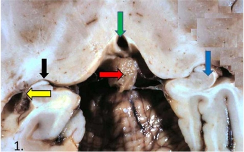

# Preliminaries

---

::: {#fig-suprachiasmatic-nucleus}
<iframe width="1280" height="450" src="https://www.youtube.com/embed/fgJPnQCJ9eE?si=k2RXYzXtaNsRSAU1" title="YouTube video player" frameborder="0" allow="accelerometer; autoplay; clipboard-write; encrypted-media; gyroscope; picture-in-picture; web-share" referrerpolicy="strict-origin-when-cross-origin" allowfullscreen></iframe>

@McGee2011-ew
:::

## Today's topics

- Announcement
- Warm up
- Anatomy of the brain (continued)

## Announcement

- Quiz 1 next [Wednesday, September 9](../schedule.qmd#wed-sep-09)
- 10 multiple choice questions + possible bonus
- Check [deadlines page](../slides/deadlines.qmd)
- How to study
  - Structure by structure
  - Where is it; what is it part of; what is its function
  
---

::: {.question}
## Tell me about the *dura mater*
:::

::: {.fragment}
::: {.answer}
- Located between CNS (brain & spinal cord) and skull
- Part of *meninges*; adjacent to arachnoid membrane
- Protects the CNS; provides structural support
:::
:::

# Warm up

---

::: {.question}
## Which of the following methods measures electromagnetic fields?
:::

::: {.answer}
- A. Event-related potentials (ERP)
- B. Electroencephalography (EEG)
- D. Both A. and B.
:::

---

::: {.question}
## Which of the following methods measures electromagnetic fields?
:::

::: {.answer}
- A. Event-related potentials (ERP)
- B. Electroencephalography (EEG)
- **D. Both A. and B.**
:::

---

::: {.question}
## Why is fMRI an *indirect* measure of brain activity?
:::

::: {.answer}
- A. fMRI measures change in blood oxygen that stem from neural activity several seconds earlier
- B. fMRI measures electrical activity of individual neurons
- C. fMRI measures things inside the head
:::

---

::: {.question}
## Why is fMRI an *indirect* measure of brain activity?
:::

::: {.answer}
- A. **fMRI measures changes in blood oxygen that stem from neural activity several seconds earlier**
- B. ~~fMRI measures electrical activity of individual neurons~~
- C. ~~fMRI measures things inside the head~~
:::

---

::: {.question}
## Unlike Descartes and previous natural philosophers, we now think that the function of the cerebral spinal fluid (CSF)-filled ventricles is the following:
:::

::: {.answer}
- A. Inflate the muscles
- B. Provide structural support
- C. Convey nutrients and oxygen to brain tissue
:::

---

::: {.question}
## Unlike Descartes and previous natural philosophers, we now think that the function of the cerebral spinal fluid (CSF)-filled ventricles is the following:
:::

::: {.answer}
- ~~A. Inflate the muscles~~
- B. Provide structural support
- ~~C. Convey nutrients and oxygen to brain tissue~~
:::

# Anatomy of the brain

## Organization of the brain

| Major division | Ventricular Landmark | Embryonic Division | Structure       |
|----------------|----------------------|--------------------|-----------------|
| *Forebrain*  | Lateral              | Telencephalon      | *Cerebral cortex* |
|                |                      |                    | [*Basal ganglia*](https://www.brainfacts.org/3D-Brain?__hstc=177771770.77b16463fbc715940e874d00368bdb13.1643137967770.1643137967770.1643137967770.1&__hssc=177771770.2.1643137967771&__hsfp=799304230#intro=false&focus=Brain-basal_ganglia){preview-link="true"}   |
|                |                      |                    | [*Hippocampus*](https://www.brainfacts.org/3D-Brain?__hstc=177771770.77b16463fbc715940e874d00368bdb13.1643137967770.1643137967770.1643137967770.1&__hssc=177771770.2.1643137967771&__hsfp=799304230#intro=false&focus=Brain-limbic_system-hippocampus-hippocampus){preview-link="true"}, [*Amygdala*](https://www.brainfacts.org/3D-Brain?__hstc=177771770.77b16463fbc715940e874d00368bdb13.1643137967770.1643137967770.1643137967770.1&__hssc=177771770.2.1643137967771&__hsfp=799304230#intro=false&focus=Brain-limbic_system-amygdala){preview-link="true"} |

## Organization of the brain

| Major division | Ventricular Landmark | Embryonic Division | Structure       |
|----------------|----------------------|--------------------|-----------------|
|                | Third                | Diencephalon       | [*Thalamus*](https://www.brainfacts.org/3D-Brain?__hstc=177771770.77b16463fbc715940e874d00368bdb13.1643137967770.1643137967770.1643137967770.1&__hssc=177771770.2.1643137967771&__hsfp=799304230#intro=false&focus=Brain-thalamus){preview-link="true"}        |
|                |                      |                    | [*Hypothalamus*](https://www.brainfacts.org/3D-Brain?__hstc=177771770.77b16463fbc715940e874d00368bdb13.1643137967770.1643137967770.1643137967770.1&__hssc=177771770.2.1643137967771&__hsfp=799304230#intro=false&focus=Brain-limbic_system-hypothalamus){preview-link="true"}    |
| [*Midbrain*](https://www.brainfacts.org/3D-Brain?__hstc=177771770.77b16463fbc715940e874d00368bdb13.1643137967770.1643137967770.1643137967770.1&__hssc=177771770.2.1643137967771&__hsfp=799304230#intro=false&focus=Brain-brain_stem-midbrain){preview-link="true"}   | Cerebral Aqueduct    | Mesencephalon      | *Tectum*, *Tegmentum* |

## Organization of the brain

| Major division | Ventricular Landmark | Embryonic Division | Structure       |
|----------------|----------------------|--------------------|-----------------|
| *Hindbrain*  | 4th                  | Rhombencephalon    | *Cerebellum*, [*pons*](https://www.brainfacts.org/3D-Brain?__hstc=177771770.77b16463fbc715940e874d00368bdb13.1643137967770.1643137967770.1643137967770.1&__hssc=177771770.2.1643137967771&__hsfp=799304230#intro=false&focus=Brain-brain_stem-pons){preview-link="true"}  |
|                | --                   |                    | [*Medulla oblongata*](https://www.brainfacts.org/3D-Brain?__hstc=177771770.77b16463fbc715940e874d00368bdb13.1643137967770.1643137967770.1643137967770.1&__hssc=177771770.2.1643137967771&__hsfp=799304230#intro=false&focus=Brain-brain_stem-medulla_oblongata){preview-link="true"} |

---

::: {.callout-note}

Some of these terms arise from the developmental stages of the human embryo.

{fig-align="center"}

:::

# Components of the brain

## Hindbrain

:::: {.columns}
::: {.column width=50%}
- Structures adjacent to 4th ventricle ^[Ventricles are useful landmarks for CNS anatomy.]
:::
::: {.column width=50%}
{#fig-hindbrain}
:::
::::

## Medulla oblongata

:::: {.columns}
::: {.column width=50%}
- Fibers of passage (to/from spinal cord)
- Cranial nerves VI-XII
- Cardiovascular regulation
- Muscle tone
:::
::: {.column width=50%}

:::
::::

## [Cerebellum](https://en.wikipedia.org/wiki/Cerebellum)

:::: {.columns}
::: {.column width=50%}
- “Little brain”
- Dorsal to pons
- Movement coordination, classical conditioning (associative learning), + ???
- [3D atlas](https://www.brainfacts.org/3d-brain#intro=false&focus=Brain-cerebellum){preview-link="true"}
:::
::: {.column width=50%}
{fig-align="center" #fig-cerebellum} \

{#fig-cerebellum-superior}
:::
::::

---

::: {#fig-tumor-video}
<iframe id="reddit-embed" src="https://www.redditmedia.com/r/interestingasfuck/comments/sa58hm/how_a_craniectomy_is_performed_to_remove_a_tumor/?ref_source=embed&amp;ref=share&amp;embed=true" sandbox="allow-scripts allow-same-origin allow-popups" style="border: none;" height="476" width="640" scrolling="no"></iframe>
:::

<!-- How to remove a tumor in the cerebellum -->

## Pons

:::: {.columns}
::: {.column width=50%}
- Bulge on brain stem
- Neuromodulatory nuclei
- Relay to cerebellum
- Cranial nerve V
:::
::: {.column width=50%}
{#fig-lateral-view-hindbrain}
:::
::::

## Midbrain

:::: {.columns}
::: {.column width=50%}
{#fig-brainstem-lateral}
:::
::: {.column width=50%}
{#fig-brainstem-tectum}
:::
::::

## Midbrain

:::: {.columns}
::: {.column width=50%}
::: {.fragment}
- *Tectum*
  - Tectum -> "roof"
  - *Superior colliculus* (reflexive orienting of eyes, head, ears)
  - *Inferior colliculus* (sound/auditory processing)
:::
:::
::: {.column width=50%}
::: {.fragment}
- *Tegmentum*
  - Tegmentum -> "floor"
  - Species-typical movement sequences (e.g., cat: hissing, pouncing)
  - Cranial nerves III, IV
:::
:::
::::

## Midbrain

:::: {.columns}
::: {.column width=50%}
- Tectum
  - Tectum -> "roof"
  - *Superior colliculus* (reflexive orienting of eyes, head, ears)
  - *Inferior colliculus* (sound/auditory processing)
:::
::: {.column width=50%}
- Tegmentum
  - *Nuclei*^[Cluster of functionally related neurons.] that release modulatory neurotransmitters ("neuromodulators")
    + *Dopamine (DA)*
    + *Norepinephrine (NE)*
    + *Serotonin (5-HT)*
:::
::::

## Pineal gland

:::: {.columns}
::: {.column width=50%}
- Pine cone like appearance
- Releases melatonin (hormone) into bloodstream
- Does *not* inflate the muscles
  - Sorry, Rene (Descartes)
:::
::: {.column width=50%}
{#fig-pineal-gland}
:::
::::

## Forebrain

{#fig-forebrain width="75%"}

## Diencephalon ("between" brain)

:::: {.columns}
::: {.column width=50%}
- Thalamus
- Hypothalamus
:::
::: {.column width=50%}
{#fig-diencephalon}
:::
::::

## Thalamus

:::: {.columns}
::: {.column width=50%}
- Input to cortex
- Functionally distinct nuclei
    - *Lateral geniculate nucleus (LGN)*, vision
    - *Medial geniculate nucleus (MGN)*, audition
:::
::: {.column width=50%}
{fig-align="right" #fig-thalamus}
:::
::::

## Hypothalamus

:::: {.columns}
::: {.column width=50%}
- Five Fs: fighting, fleeing/freezing, feeding, and reproduction
- Controls *Autonomic Nervous System (ANS)*
    - Sympathetic branch
    - Parasympathetic branch
:::
::: {.column width=50%}
{fig-align="right" #fig-hypothalamus}
:::
::::

## Hypothalamus

:::: {.columns}
::: {.column width=50%}
- Controls *endocrine system* via *pituitary gland* (“master” gland)
    + *Anterior pituitary* (indirect release of hormones)
    + *Posterior* (direct release of hormones)
        - *Oxytocin*
        - *Vasopressin*
:::
::: {.column width=50%}
{fig-align="right"}
:::
::::

## Hypothalamus

:::: {.columns}
::: {.column width=50%}
- Regulates circadian rhythms (via Suprachiasmatic Nucleus)
  - Input from retina
  - Output to pineal gland
:::
::: {.column width=50%}
{fig-align="center" #fig-scn}
:::
::::

## Telencephalon

- Basal (not basil!) ganglia
- Hippocampus
- Amygdala
- Cerebral cortex

## [Basal ganglia](https://en.wikipedia.org/wiki/Basal_ganglia){preview-link="true"}

:::: {.columns}
::: {.column width=50%}
- Skill and habit learning
- Sequencing of movement
- Clinical relevance
  - Parkinson’s Disease
  - Huntington's Disease
:::
::: {.column width=50%}

:::
::::

## [Basal ganglia](https://en.wikipedia.org/wiki/Basal_ganglia){preview-link="true"}

:::: {.columns}
::: {.column width=50%}
- [Striatum](https://en.wikipedia.org/wiki/Striatum){preview-link="true"}
    - Dorsal
        - [Caudate nucleus](https://en.wikipedia.org/wiki/Caudate_nucleus)
        - [Putamen](https://en.wikipedia.org/wiki/Putamen){preview-link="true"}
    - Ventral
        - [Nucleus accumbens (NAcc)](https://en.wikipedia.org/wiki/Nucleus_accumbens){preview-link="true"}
:::
::: {.column width=50%}

:::
::::

## [Basal ganglia](https://en.wikipedia.org/wiki/Basal_ganglia){preview-link="true"}

:::: {.columns}
::: {.column width=50%}
- [Globus pallidus](https://en.wikipedia.org/wiki/Globus_pallidus){preview-link="true"}
- [Subthalamic nucleus](https://en.wikipedia.org/wiki/Subthalamic_nucleus){preview-link="true"}
- [Substantia nigra](https://en.wikipedia.org/wiki/Substantia_nigra) (in tegmentum){preview-link="true"}
:::
::: {.column width=50%}

:::
::::

## [Hippocampus](https://en.wikipedia.org/wiki/Hippocampus){preview-link="true"}

:::: {.columns}
::: {.column width=50%}
- From Greek for "sea horse"
:::
::: {.column width=50%}

{fig-align="right" #fig-hippocampus}
:::
::::

## Hippocampus

:::: {.columns}
::: {.column width=50%}
- Immediately lateral to (inferior) lateral ventricles
- Medial temporal lobe
- Memories of specific facts or events, spatial locations
- Implicated in Alzheimer's Disease
:::
::: {.column width=50%}
{fig-align="right"}
:::
::::

## Hippocampus

:::: {.columns}
::: {.column width=50%}
- [Fornix](https://en.wikipedia.org/wiki/Fornix_(neuroanatomy)){preview-link="true"} projects to hypothalamus
- [Mammillary bodies](https://en.wikipedia.org/wiki/Mammillary_body){preview-link="true"}
:::
::: {.column width=50%}
{width="60%"}
:::
::::

## Amygdala

:::: {.columns}
::: {.column width=50%}
- “almond”-shaped
- Influences physiological state, behavioral readiness, affect
- NOT the fear center! [@ledoux_amygdala_2015].
:::
::: {.column width=50%}
{preview-link="true"}
:::
::::

# Wrap-up

## Take homes

- CNS (encased in bone) vs. PNS
- Structures defined relative to others using specific anatomical terms
- Cerebral ventricles provide landmarks for forebrain, midbrain, hindbrain

## Next time

- Neuroanatomy III -- the cerebral cortex & PNS

# Resources

## About

This talk was produced using [Quarto](https://quarto.org), using the [RStudio](https://posit.co/products/open-source/rstudio/)
Integrated Development Environment (IDE), version 2026.8.2.200.

The source files are in R and R Markdown, then rendered to HTML using the
[revealJS](https://revealjs.com) framework.
The HTML slides are hosted in a [GitHub repo](https://github.com/psu-psychology/psych-260-2025-fall) and served by GitHub pages:
<https://psu-psychology.github.io/psych-260-2025-fall/>

## References
