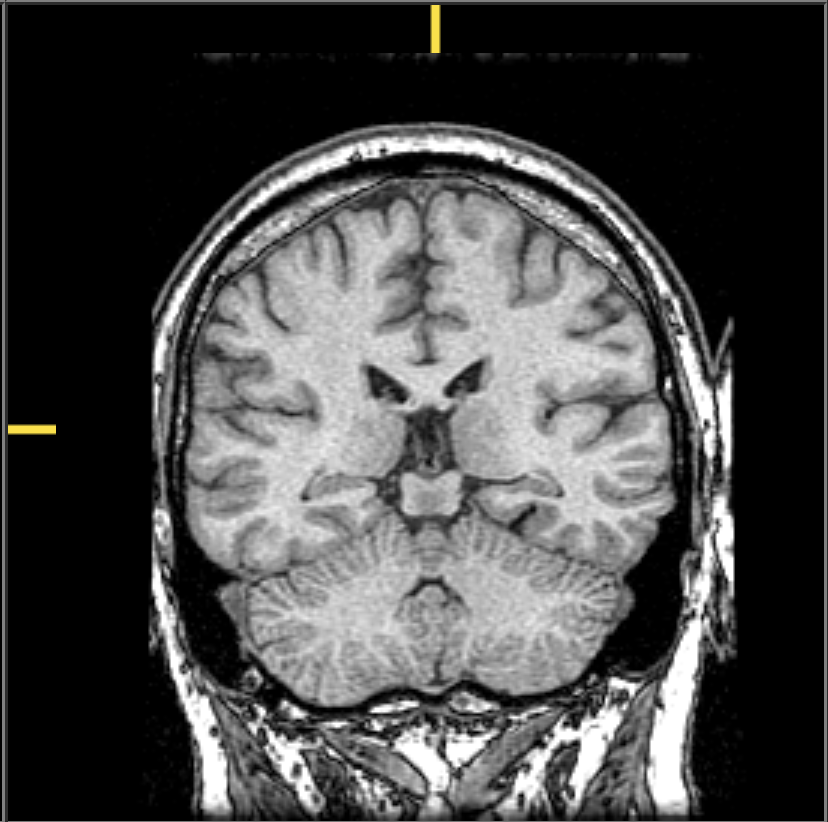
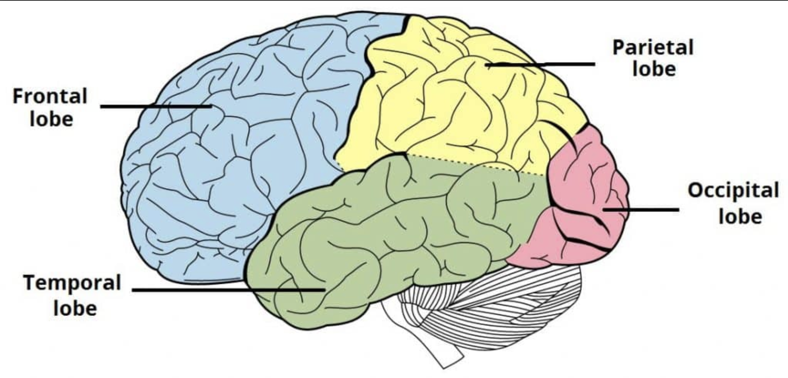

# Preliminaries

## Today's topics

- Announcement
- Warm up
- Anatomy of the brain and spinal cord (continued)

## Announcement

- Quiz 1 next [Wednesday, September 9](../schedule.qmd#wed-sep-09)
- 10 multiple choice questions + possible bonus

# Warm up

---

::: {.question}
## Which of the following structures are *not* part of the hindbrain?
:::

::: {.answer}
- A. 4th ventricle
- B. Tectum
- C. Medulla oblongata
- D. Pons
:::

---

::: {.question}
## Which of the following structures are *not* part of the hindbrain?
:::

:::: {.columns}
::: {.column width=50%}

::: {.answer}
- A. ~~4th ventricle~~
- B. **Tectum**
- C. ~~Medulla oblongata~~
- D. ~~Pons~~
:::

:::
::: {.column width=50%}
::: {.fragment}

:::
:::
::::

---

::: {.question}
## What plane of section does this image represent?
:::

:::: {.columns}

::: {.column width=50%}

::: {.answer}
- A. Dorsal
- B. Sagittal
- C. Axial
- D. Coronal/Frontal
:::

:::
::: {.column width=50%}

:::
::::

---

::: {.question}
## What plane of section does this image represent?
:::

:::: {.columns}

::: {.column width=50%}

::: {.answer}
- A. ~~Dorsal~~
- B. ~~Sagittal~~
- C. ~~Axial~~
- D. **Coronal/Frontal**
:::

:::
::: {.column width=50%}

:::
::::

---

::: {.question}
## Which structure(s) contain nerve cells that *release* neuromodulator neurotransmitters like dopamine and norepinephrine?
:::

::: {.answer}
- A. Hypothalamus
- B. Pons
- C. Tegmentum
- D. Both B. and C.
:::

---

::: {.question}
## Which structure(s) contain nerve cells that *release* neuromodulator neurotransmitters like dopamine and norepinephrine?
:::

::: {.answer}
- ~~A. Hypothalamus~~
- B. Pons
- C. Tegmentum
- **D. Both B. and C.**
:::

# Anatomy of the brain

## Organization of the brain

| Major division | Ventricular Landmark | Embryonic Division | Structure       |
|----------------|----------------------|--------------------|-----------------|
| *Forebrain*  | Lateral              | Telencephalon      | *Cerebral cortex* |
|                |                      |                    | [*Basal ganglia*](https://www.brainfacts.org/3D-Brain?__hstc=177771770.77b16463fbc715940e874d00368bdb13.1643137967770.1643137967770.1643137967770.1&__hssc=177771770.2.1643137967771&__hsfp=799304230#intro=false&focus=Brain-basal_ganglia){preview-link="true"}   |
|                |                      |                    | [*Hippocampus*](https://www.brainfacts.org/3D-Brain?__hstc=177771770.77b16463fbc715940e874d00368bdb13.1643137967770.1643137967770.1643137967770.1&__hssc=177771770.2.1643137967771&__hsfp=799304230#intro=false&focus=Brain-limbic_system-hippocampus-hippocampus){preview-link="true"}, [*Amygdala*](https://www.brainfacts.org/3D-Brain?__hstc=177771770.77b16463fbc715940e874d00368bdb13.1643137967770.1643137967770.1643137967770.1&__hssc=177771770.2.1643137967771&__hsfp=799304230#intro=false&focus=Brain-limbic_system-amygdala){preview-link="true"} |

## Organization of the brain

| Major division | Ventricular Landmark | Embryonic Division | Structure       |
|----------------|----------------------|--------------------|-----------------|
|                | Third                | Diencephalon       | [*Thalamus*](https://www.brainfacts.org/3D-Brain?__hstc=177771770.77b16463fbc715940e874d00368bdb13.1643137967770.1643137967770.1643137967770.1&__hssc=177771770.2.1643137967771&__hsfp=799304230#intro=false&focus=Brain-thalamus){preview-link="true"}        |
|                |                      |                    | [*Hypothalamus*](https://www.brainfacts.org/3D-Brain?__hstc=177771770.77b16463fbc715940e874d00368bdb13.1643137967770.1643137967770.1643137967770.1&__hssc=177771770.2.1643137967771&__hsfp=799304230#intro=false&focus=Brain-limbic_system-hypothalamus){preview-link="true"}    |
| [*Midbrain*](https://www.brainfacts.org/3D-Brain?__hstc=177771770.77b16463fbc715940e874d00368bdb13.1643137967770.1643137967770.1643137967770.1&__hssc=177771770.2.1643137967771&__hsfp=799304230#intro=false&focus=Brain-brain_stem-midbrain){preview-link="true"}   | Cerebral Aqueduct    | Mesencephalon      | *Tectum*, *Tegmentum* |

## Organization of the brain

| Major division | Ventricular Landmark | Embryonic Division | Structure       |
|----------------|----------------------|--------------------|-----------------|
| *Hindbrain*  | 4th                  | Rhombencephalon    | *Cerebellum*, [*pons*](https://www.brainfacts.org/3D-Brain?__hstc=177771770.77b16463fbc715940e874d00368bdb13.1643137967770.1643137967770.1643137967770.1&__hssc=177771770.2.1643137967771&__hsfp=799304230#intro=false&focus=Brain-brain_stem-pons){preview-link="true"}  |
|                | --                   |                    | [*Medulla oblongata*](https://www.brainfacts.org/3D-Brain?__hstc=177771770.77b16463fbc715940e874d00368bdb13.1643137967770.1643137967770.1643137967770.1&__hssc=177771770.2.1643137967771&__hsfp=799304230#intro=false&focus=Brain-brain_stem-medulla_oblongata){preview-link="true"} |

## [Hippocampus](https://en.wikipedia.org/wiki/Hippocampus){preview-link="true"}

:::: {.columns}
::: {.column width=50%}
- From Greek for "sea horse"
:::
::: {.column width=50%}

{fig-align="right" #fig-hippocampus}
:::
::::

## Hippocampus

:::: {.columns}
::: {.column width=50%}
- Immediately lateral to (inferior) lateral ventricles
- Medial temporal lobe
- Memories of specific facts or events, spatial locations
- Implicated in Alzheimer's Disease
:::
::: {.column width=50%}
{fig-align="right"}
:::
::::

## Hippocampus

:::: {.columns}
::: {.column width=50%}
- [Fornix](https://en.wikipedia.org/wiki/Fornix_(neuroanatomy)){preview-link="true"} projects to hypothalamus
- [Mammillary bodies](https://en.wikipedia.org/wiki/Mammillary_body){preview-link="true"}
:::
::: {.column width=50%}
{width="60%"}
:::
::::

## Amygdala

:::: {.columns}
::: {.column width=50%}
- “almond”-shaped
- Influences physiological state, behavioral readiness, affect
- NOT the fear center! [@ledoux_amygdala_2015].
:::
::: {.column width=50%}
{preview-link="true"}
:::
::::

## Cerebral Cortex

## Hemispheres
- [Right cerebral hemisphere](https://www.brainfacts.org/3d-brain#intro=true&focus=Brain-cerebral_hemisphere-right)
- [Left cerebral hemisphere](https://www.brainfacts.org/3d-brain#intro=true&focus=Brain-cerebral_hemisphere-left)
- Gyrus/gyri (bumps)
- Sulcus/sulci, fissures (grooves)

---

| Landmark | Identifies/separates |
|----------|----------------------|
| [Medial longitudinal fissure (longitudinal fissure)](https://en.wikipedia.org/wiki/Medial_longitudinal_fissure) | Divides hemispheres |
| [Lateral sulcus/fissure](https://en.wikipedia.org/wiki/Lateral_sulcus) *aka Sylvian Fissure* | Divides temporal lobe from frontal & parietal |
| [Central sulcus](https://en.wikipedia.org/wiki/Central_sulcus) *aka Rolandic Fissure* | Divides frontal from parietal lobe |

## (Medial) Longitudinal fissure

{#fig-medial-long-fissure}

## [Corpus Callosum](https://en.wikipedia.org/wiki/Corpus_callosum)

:::: {.columns}
::: {.column width=50%}
- Axon (fiber) bundle
- Bottom of longitudinal fissure
- Connects left and right hemispheres
- Part of "roof" of lateral ventricles
:::
::: {.column width=50%}
{#fig-corpus-callosum-wikipedia width="40%"}
:::
::::

## [Corpus Callosum](https://en.wikipedia.org/wiki/Corpus_callosum)

:::: {.columns}
::: {.column width=50%}
- Axon (fiber) bundle
- Bottom of longitudinal fissure
- Connects left and right hemispheres
- Part of "roof" of lateral ventricles
:::
::: {.column width=50%}
{#fig-corpus-callosum-wikipedia-2 width="60%"}
:::
::::

## Lateral sulcus/fissure

{#fig-lateral-sulcus width="75%"}

## Central sulcus

{#fig-central-sulcus width="75%"}

## Lobes of the Cerebral Cortex

{#fig-lobes}

## [Frontal lobe](https://en.wikipedia.org/wiki/Frontal_lobe)

:::: {.columns}
::: {.column width=50%}
- Where is it?
    - Anterior to central sulcus
    - Superior to lateral fissure
    - Dorsal to temporal lobe
:::
::: {.column width=50%}
{#fig-frontal-lobe}
:::
::::

## [Frontal lobe](https://en.wikipedia.org/wiki/Frontal_lobe)

:::: {.columns}
::: {.column width=50%}
- What does it do/contain?
    - Pre-central gyrus (pre/anterior to central sulcus)
        - [Primary motor cortex (M1)](https://www.brainfacts.org/3d-brain#intro=true&focus=Brain-cerebral_hemisphere-frontal_lobe-motor_cortex) 
:::
::: {.column width=50%}
{#fig-sensory-motor-ctx}
:::
::::

## [Frontal lobe](https://en.wikipedia.org/wiki/Frontal_lobe)

:::: {.columns}
::: {.column width=50%}
- What does it do/contain?
    - [Prefrontal cortex](https://www.brainfacts.org/3d-brain#intro=true&focus=Brain-cerebral_hemisphere-frontal_lobe-prefrontal_cortex)
        + Planning, problem solving, working memory...? 
    - Primary olfactory cortex
    - Gustatory cortex
    - Anterior cingulate cortex (ACC)
:::
::: {.column width=50%}
](http://cis.jhu.edu/data.sets/cortical_segmentation_validation/photos/cinggyrus75.jpg){#fig-cingulate-gyrus}
:::
::::

## [Temporal lobe](https://www.brainfacts.org/3d-brain#intro=true&focus=Brain-cerebral_hemisphere-temporal_lobe)

:::: {.columns}
::: {.column width=50%}
- Where is it?
    - Ventral to frontal, parietal lobes
    - Inferior to lateral fissure
:::
::: {.column width=50%}
{#fig-temporal-lobe}
:::
::::

## [Temporal lobe](https://www.brainfacts.org/3d-brain#intro=true&focus=Brain-cerebral_hemisphere-temporal_lobe)

:::: {.columns}
::: {.column width=50%}
- What does it do/contain?
    - [Primary auditory cortex (A-I)](https://www.brainfacts.org/3d-brain#intro=true&focus=Brain-primary_auditory_cortex)
    - Object, face recognition
    - [Amygdala](https://www.brainfacts.org/3d-brain#intro=true&focus=Brain-limbic_system-amygdala), [hippocampus](https://www.brainfacts.org/3d-brain#intro=true&focus=Brain-limbic_system-hippocampus-hippocampus)
    - Storage/recall of memories about events, objects
:::
::: {.column width=50%}
{#fig-temporal-lobe-inferior}
:::
::::

## [Parietal lobe](https://www.brainfacts.org/3d-brain#intro=true&focus=Brain-cerebral_hemisphere-pareital_lobe)

:::: {.columns}
::: {.column width=50%}
- Where is it?
    - Caudal to frontal lobe
    - Dorsal to temporal lobe
    - Posterior to central sulcus
:::
::: {.column width=50%}
{#fig-parietal-lobe}
:::
::::

## [Parietal lobe](https://www.brainfacts.org/3d-brain#intro=true&focus=Brain-cerebral_hemisphere-pareital_lobe)

:::: {.columns}
::: {.column width=50%}
- What does it do/contain?
    - Perception of spatial relations, action planning
    - Post-central gyrus
        - Post-central -> "posterior to" central sulcus
        - [Primary somatosensory cortex (S-I)](https://www.brainfacts.org/3d-brain#intro=true&focus=Brain-cerebral_hemisphere-pareital_lobe-somatosensory_cortex)
:::
::: {.column width=50%}

:::
::::

## [Parietal lobe](https://www.brainfacts.org/3d-brain#intro=true&focus=Brain-cerebral_hemisphere-pareital_lobe)

:::: {.columns}
::: {.column width=50%}
{#fig-sensory-motor-ctx-2}
:::
::: {.column width=50%}

:::
::::

## [Occipital lobe](https://www.brainfacts.org/3d-brain#intro=true&focus=Brain-cerebral_hemisphere-occipital_lobe)

:::: {.columns}
::: {.column width=50%}
- Where is it?
    - Caudal to parietal & temporal lobes
- What does it do/contain?
    - [Primary visual cortex (V1)](https://www.brainfacts.org/3d-brain#intro=true&focus=Brain-cerebral_hemisphere-occipital_lobe-primary_visual_cortex)
:::
::: {.column width=50%}
{#fig-occipital}
:::
::::

## [Occipital lobe](https://www.brainfacts.org/3d-brain#intro=true&focus=Brain-cerebral_hemisphere-occipital_lobe)

:::: {.columns}
::: {.column width=50%}
- Multiple visual areas in occipital lobe
:::
::: {.column width=50%}
{#fig-occipital-lobe-pathways}
:::
::::

## [Insular cortex (insula)](https://en.wikipedia.org/wiki/Insular_cortex)

:::: {.columns}
::: {.column width=50%}
-  Where is it?
    - medial to temporal lobe
    - deep inside lateral fissure
:::
::: {.column width=50%}
{#fig-insular-ctx}
:::
::::

## [Insular cortex (insula)](https://en.wikipedia.org/wiki/Insular_cortex)

:::: {.columns}
::: {.column width=50%}
- What does it do/contain?
  + Primary gustatory cortex
  + self-awareness, interpersonal experiences, motor control
:::
::: {.column width=50%}
{#fig-insula-namkung}
:::
::::

---

| Lobe     | Sulci      | Gyri          | Areas |
|----------|------------|---------------|-----------|
| Frontal  | Central sulcus | Precentral gyrus | motor cortex |
|          | Corpus callosum | Cingulate gyrus | anterior cingulate cortex   |
|          |                 |                 | olfactory cortex |
|          |                 |                 | gustatory cortex |

---

| Lobe     | Sulci      | Gyri          | Areas |
|----------|------------|---------------|-----------|
| Temporal | Lateral fissure |               | auditory cortex |
|          |                 |               | olfactory cortex |
|          |                 |               | hipppocampus |
|          |                 |               | amygdala |

---

| Lobe     | Sulci      | Gyri          | Areas |
|----------|------------|---------------|-----------|
| Parietal | Central sulcus  | Postcentral gyrus | somatosensory ctx |
| Occipital |     |     | visual ctx |
| Insula    | Lateral fissure |             | gustatory ctx |

## Brodmann Areas

:::: {.columns}
::: {.column width=50%}
- Regions of cerebral cortex that differ in *cellular* architecture^[Size, shape, density of cell types].
:::
::: {.column width=50%}
{#fig-brodmann-photo width="50%"}
:::
::::

## Brodmann areas

:::: {.columns}
::: {.column width=50%}
- Sequential (arbitrary) numbering scheme
- Brodmann Area (BA) 4: precentral gyrus of frontal lobe (M1)
- BA 17 and 18: Primary visual cortex (V1) in occipital lobe
:::
::: {.column width=50%}
{#fig-brodmann}
:::
::::
  
# Wrap-up

## Next time

- Quiz 1
- Cells of the nervous system

# Resources

## About

This talk was produced using [Quarto](https://quarto.org), using the [RStudio](https://posit.co/products/open-source/rstudio/)
Integrated Development Environment (IDE), version 2026.8.2.200.

The source files are in R and R Markdown, then rendered to HTML using the
[revealJS](https://revealjs.com) framework.
The HTML slides are hosted in a [GitHub repo](https://github.com/psu-psychology/psych-260-2025-fall) and served by GitHub pages:
<https://psu-psychology.github.io/psych-260-2025-fall/>

## References
