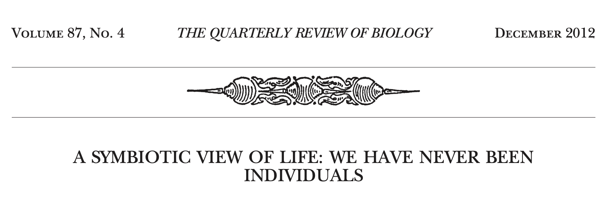
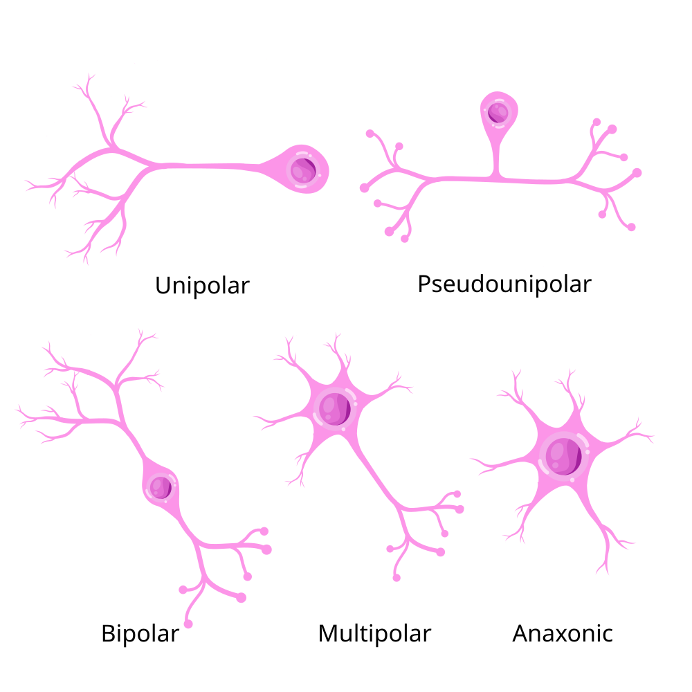

# Prelude

---

::: {#fig-neuron-song}
<iframe width="1280" height="450" src="https://www.youtube.com/embed/R0SZnLOeh5E?si=CKypPTKatJ5k1N_E" title="YouTube video player" frameborder="0" allow="accelerometer; autoplay; clipboard-write; encrypted-media; gyroscope; picture-in-picture; web-share" referrerpolicy="strict-origin-when-cross-origin" allowfullscreen></iframe>

@Neural-Academy2020-wg
:::

## Today's topics

- Quiz 1
- Why should *psychologists* care?
- Cells of the nervous system

# Quiz 1

# Why should *psychologists* care?

## We are family

{#fig-tree-of-life}


## Single-celled organisms

- Most recent common ancestors ~1-2 B yrs ago
- Many levels of analysis smaller than human behavior

## Single-celled organisms

- Behave
- Learn
- Communicate

## Via mechanisms similar to multicellular organisms 

::: {.callout-important}
### Communication channels

:::: {.columns}
::: {.column width=50%}
- Chemical release
  + via diffusion; slow(er)
  + Within & between cells 
  - Molecular matching (binding) for specificity
  - Metabolically efficient
:::
::: {.column width=50%}
- Electrical signalling
  + Fast(er) (10-100x)
  + Within cells
  + From one part of body to another
  - Point-to-point connections for specificity
  - Metabolically costly to create & maintain

:::
::::
:::

## Who (what) am I?

- $\approx$ 38 trillion bacteria + $\approx$ 30 trillion human cells
  - Me:Not me ratio $\approx$ 1:1.3 [@Sender2016-nk; @Bianconi2013-ur]
  
## Who (what) am I

- Varies across lifespan and experience [@Rodriguez2015-tv; @Nuriel-Ohayon2016-nl]
  - Newborns $\approx$ 1:0.01
  - Adults $\approx$ 1:1.3
  - Post-antibiotics $\approx$ 1:0.5
  - Pregnancy (3rd trimester) $\approx$ 1.1:1.3
  
## Who (what) am I?

:::: {.columns}
::: {.column width=50%}
- 20,000-25,000 human genes
- $\approx$ 2-20 million genes in non-human "metagenome"
- @Human-Microbiome-Project-Consortium2012-jl; @Tierney2019-ol
- humans as supraorganisms [@Gilbert2012-nv]
:::
::: {.column width=50%}

:::
::::

## *When* am I me?

| Cell Type | Lifespan | Primary Function |
|-----------|----------|------------------|
| Intestinal epithelium | 2-5 days | Nutrient absorption; barrier |
| Sperm cells | $\approx$ 2-3 mos | Reproduction |
| Red blood cells | 120 days | Oxygen transport |
| Liver cells | 1 year | Metabolism/Detoxification |

@Sender2021-qs; @Spalding2005-jz; @UnknownUnknown-ko

## *When* am I me?

| Cell Type | Lifespan | Primary Function |
|-----------|----------|------------------|
| Skeleton | 10+ years | Structural support |
| Egg cells | Menopause | Reproduction |
| Neurons | Lifetime | Signal processing/memory |

@Sender2021-qs; @Spalding2005-jz; @UnknownUnknown-ko

## Human vs. non-human cells

- ~ 37 trillion (10^9) cells [@Roy2018-wo]
- 10-100 trillion non-human cells (gut, skin/hair, bloodstream, etc.)
- Human bodies are a community

# Cells of the nervous system

## Glia (neuroglia)

:::: {.columns}
::: {.column width=50%}
- "Glia" means glue
- Functions
	+ Structural support
	+ Metabolic support
	+ Brain development
	+ Neural plasticity?
- Multiple types
:::
::: {.column width=50%}
{#fig-glia width="50%" fig-align="right"}
:::
::::


## Astrocytes (1 of 4)

:::: {.columns}
::: {.column width=50%}
- "Star-shaped"
- Physical and metabolic support
	+ [Blood/brain barrier](https://en.wikipedia.org/wiki/Blood%E2%80%93brain_barrier)
:::
::: {.column width=50%}
{fig-align="right" #fig-astrocytes}
:::
::::

## Astrocytes (2 of 4)

:::: {.columns}
::: {.column width=50%}
- Regulate concentration of key ions (Ca++/K+) for neural communication
- Regulate concentration of key neurotransmitters (e.g., glutamate)
- Shape brain development, [synaptic plasticity](https://en.wikipedia.org/wiki/Synaptic_plasticity)
- Regulate local blood flow

:::
::: {.column width=50%}
{fig-align="right" #fig-astrocytes-2}
:::
::::

## Astrocytes (3 of 4)

:::: {.columns}
::: {.column width=50%}
- Regulate/influence communication between neurons [@Bazargani2016-io]
- Disruption linked to cognitive impairment, disease [@chung_glia_2015]
:::
::: {.column width=50%}
{ #fig-astrocytes-3}
:::
::::

## Astrocytes (4 of 4)

{#fig-astrocyte-metabolism width="60%"}

## Myelinating cells (1 of 2)

:::: {.columns}
::: {.column width=50%}
- Produce [myelin](https://en.wikipedia.org/wiki/Myelin) or myelin sheath
  + White, fatty substance
  + Surrounds many neurons
  + The "white" in white matter
:::
::: {.column width=50%}
{#fig-white-matter}
:::
::::

## Myelinating cells (2 of 2)

:::: {.columns}
::: {.column width=50%}
- Provide electrical/chemical insulation
- Make neuronal messages faster, less susceptible to noise
:::
::: {.column width=50%}
{#fig-white-matter-2}
:::
::::
  
## [Oligodendrocytes](https://en.wikipedia.org/wiki/Oligodendrocyte)

:::: {.columns}
::: {.column width=40%}
- In brain and spinal cord (Central Nervous System or CNS)
- 1:many neurons
:::
::: {.column width=60%}
{#fig-oligodendrocyte width="35%"}
:::
::::
	
## [Schwann cells](https://en.wikipedia.org/wiki/Schwann_cell) (1 of 2)

:::: {.columns}
::: {.column width=50%}
+ In Peripheral Nervous System (PNS)
+ 1:1 neuron
:::
::: {.column width=50%}
{fig-align="right" #fig-schwann-cells}
:::
::::

## [Schwann cells](https://en.wikipedia.org/wiki/Schwann_cell) (2 of 2)

{#fig-schwann-cell-big width="60%"}

## TV-show-inspired mnemonic

{width="30%" fig-align="center"}

**C**entral **O**ligodendrocytes  **Peripheral** **S**chwann cells

## TV-show-inspired mnemonic

{fig-align="center" width="30%"}

**S**chwann cells **P**eripheral **O**ligodendrocytes **C**entral

## Microglia

:::: {.columns}
::: {.column width=50%}
- Clean-up damaged, dead tissue
    - [Phagocytosis](https://en.wikipedia.org/wiki/Phagocytosis)
- Prune synapses in normal development and disease
- Disruptions -> impaired connectivity and social behavior [@Zhan2014-lx]
:::
::: {.column width=50%}
{#fig-microglia}
:::
::::

## [Neurons](https://en.wikipedia.org/wiki/Neuron)

```{r fig-neurons-hippocampus, fig.cap="Neurons in mouse hippocampus: http://www.extremetech.com/wp-content/uploads/2012/03/a-mouse-hippocampus-640x353.jpg"}
knitr::include_graphics("http://www.extremetech.com/wp-content/uploads/2012/03/a-mouse-hippocampus-640x353.jpg")
```

## Fun facts about [neurons](https://en.wikipedia.org/wiki/Neuron)

- Specialized for electrical & chemical communication
- Post-mitotic -- don't divide
- Most [born early in life](http://www.ninds.nih.gov/disorders/brain_basics/ninds_neuron.htm), [@Bhardwaj2006-ny]
- Among longest-lived cells in body, may scale with *organism* lifespan [@Magrassi2013-il]
- Can extend over long distances

## Macrostructure of [neurons](https://en.wikipedia.org/wiki/Neuron)

:::: {.columns}
::: {.column width=50%}
- [Dendrites](https://en.wikipedia.org/wiki/Dendrite)
- [Soma (cell body)](https://en.wikipedia.org/wiki/Soma_(biology))
- [Axons](https://en.wikipedia.org/wiki/Axon)
- [Terminal buttons (boutons)](https://en.wikipedia.org/wiki/Axon_terminal)
:::
::: {.column width=50%}
{#fig-neurons}
:::
::::

## [Dendrites](https://en.wikipedia.org/wiki/Dendrite) (1 of 3)

:::: {.columns}
::: {.column width=50%}
- Branch-like "extrusions" from cell body
- Majority of input to neuron
- Cluster close to cell body/soma
- Usually receive info
- Passive (do not regenerate electrical signal) vs. active (regenerate signal)
:::
::: {.column width=50%}
{#fig-dendrites width="65%"}
:::
::::

## [Dendrites](https://en.wikipedia.org/wiki/Dendrite) (2 of 3)

:::: {.columns}
::: {.column width=50%}
- Dendritic Spines (protrusions from dendrites)
:::
::: {.column width=50%}
{#fig-dendritic-spines}
:::
::::

## [Dendrites](https://en.wikipedia.org/wiki/Dendrite) (3 of 3)

:::: {.columns}
::: {.column width=50%}
- "Polarized" or directional information flow (to soma)
:::
::: {.column width=50%}
{#fig-dendritic-spines}
:::
::::

## [Soma (cell body)](https://en.wikipedia.org/wiki/Soma_(biology))

:::: {.columns}
::: {.column width=50%}
- Varied shapes
- Nucleus
	+ Chromosomes (genetic material)
- Organelles
	+ Mitochondria
	+ Smooth and Rough Endoplasmic reticulum (ER)
:::
::: {.column width=50%}
{#fig-soma}
:::
::::

## [Axons](https://en.wikipedia.org/wiki/Axon) (1 of 2)

:::: {.columns}
::: {.column width=50%}
- Another branch-like "extrusion" from soma
- Extend farther than dendrites
- Usually transmit info
:::
::: {.column width=50%}
{#fig-axons}
:::
::::

## [Axons](https://en.wikipedia.org/wiki/Axon) (2 of 2)

:::: {.columns}
::: {.column width=50%}
- Parts
    + **Axon hillock** (closest to soma, unmyelinated)
    + **Nodes of Ranvier** (unmyelinated segments along axon)
    + Axon terminals, terminal buttons, synaptic boutons
:::
::: {.column width=50%}
{fig-align="right" #fig-axon-propagation}
:::
::::

## [Synaptic bouton (terminal button)](https://en.wikipedia.org/wiki/Axon_terminal) (1 of 2)

:::: {.columns}
::: {.column width=50%}
- [Synapse](https://en.wikipedia.org/wiki/Chemical_synapse#Structure) (~5-10K per neuron) 
- Presynaptic membrane (sending cell) and postsynaptic (receiving cell) membrane
- Synaptic cleft -- space between cells
:::
::: {.column width=50%}
{fig-align="right" #fig-synaptic-bouton}
:::
::::


## [Synaptic bouton (terminal button)](https://en.wikipedia.org/wiki/Axon_terminal) (2 of 2)

:::: {.columns}
::: {.column width=50%}
- [Synaptic vesicles](https://en.wikipedia.org/wiki/Synaptic_vesicle)
    - Pouches of neurotransmitters
    - Release contents into synaptic cleft
- [autoreceptors](https://en.wikipedia.org/wiki/Autoreceptor) (detect NTs)
- [transporters](https://en.wikipedia.org/wiki/Neurotransmitter_transporter) (transport NTs across membrane)
:::
::: {.column width=50%}
{fig-align="right" #fig-terminal-button}
:::
::::

## Classifying neurons

:::: {.columns}
::: {.column width=50%}
- Functional role
    + Input (sensory), output (motor/secretory), interneurons 
- Anatomy of axons
    + Unipolar
    + Bipolar
    + Multipolar
:::
::: {.column width=50%}

:::
::::

## Classifying neurons

:::: {.columns}
::: {.column width=50%}
- By specific anatomy
    + Pyramidal cells
    + Stellate cells 
    + Purkinje cells 
    + Granule cells
:::
::: {.column width=50%}
{fig-align="right" width="70%" #fig-neuron-classification}
:::
::::

# Wrap-up

## Main points

- Continuity between single-cellular and multicellular organisms
  - Neurons (and glia) specialized cells with unique functions
- Glia
  - Myelinating vs. non-myelinating
- Neurons

## Next time

- Neurophysiology I

# Resources

## About

This talk was produced using [Quarto](https://quarto.org), using the [RStudio](https://posit.co/products/open-source/rstudio/)
Integrated Development Environment (IDE), version 2026.8.1.195.

The source files are in R and R Markdown, then rendered to HTML using the
[revealJS](https://revealjs.com) framework.
The HTML slides are hosted in a [GitHub repo](https://github.com/psu-psychology/psych-260-2026-fall) and served by GitHub pages:
<https://psu-psychology.github.io/psych-260-2026-fall/>

## References
