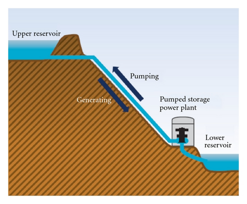
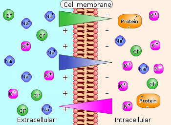

# Preliminaries

## Announcements

- Exam 1: Monday, September 21, 2026
  - 40 questions, plus bonus

## Today's topics

- Warm-up
- Cells of the nervous system
- Neurophysiology I

# Warm-up

---

::: question
## Glia comes from a Greek word meaning

- A. Support
- B. Glue
- C. Non-neuronal
:::

::: fragment
::: answer
- ~~A. Support~~
- **B. Glue**
- ~~C. Non-neuronal~~
:::
:::

---

::: {.question}
## All of the following are types of glial cells EXCEPT

- A. Astrocytes
- B. Schwann cells
- C. Pyramidal cells
- D. Oligodendrocytes
:::

::: {.fragment}
::: {.answer}
- ~~A. Astrocytes~~
- ~~B. Schwann cells~~
- **C. Pyramidal cells**
- ~~D. Oligodendrocytes~~
:::
:::

---

::: {.question}
## What part of the neuron receives the majority of input from other cells?

- A. Soma
- B. Axon
- C. Dendrites
- D. Node of Ranvier
:::

::: {.fragment}
::: {.answer}
- ~~A. Soma~~
- ~~B. Axon~~
- **C. Dendrites**
- ~~D. Nodes of Ranvier~~
:::
:::

# Cellular neuroscience

## Wrap up from last time

- [Link](wk-03-2026-09-09-cellular-neuro.qmd#/axons-2-of-2) to 2026-09-09 slides.

# Neurophysiology I

## Or how do neurons communicate?

## Two communication 'modes'

- Electrical
  - Membrane potential (voltage) changes
  - Propagate (move) along cell membrane
  - "Within" neuron
- Chemical
  - Neurotransmitter or hormone release
  - "Between" neurons

## Electrical potential

:::: {.columns}
::: {.column width=50%}
- Potential $\rightarrow$ voltage
- Voltage $\approx$ pressure
- Measure with
  - electrodes
  - Reference: outside
:::
::: {.column width=50%}
{fig-align="right" #fig-electrical-potential}
:::
::::

## Electrical potential

:::: {.columns}
::: {.column width=50%}
- Potential energy
  - Energy that could be released
  - If circumstances change
:::
::: {.column width=50%}
{#fig-potential-energy align="center"}
:::
::::

## Neurons have electrical potential

- [Resting potential](https://en.wikipedia.org/wiki/Resting_potential)
    - Voltage across neuronal membrane when cell is 'at-rest' (not firing an action potential)
- [Action potential](https://en.wikipedia.org/wiki/Action_potential)
    - Voltage across neuronal membrane when cell is active or firing

## Neuron as a [dynamical system](https://en.wikipedia.org/wiki/Dynamical_system)

- In a (temporarily stable) equilibrium
  - Not really at "rest"
- Influenced by multiple forces
- Forces balance-out (for now)
    
## Metaphor I

## Metaphor I story

- $K^+$ "wants"^[As sentient beings, humans often find it easier to understand natural processes using psychological terms. Obviously, ions don't "want" anything.] to flow out
  - Outflow makes membrane potential more negative
- $Na^+$ "wants" to flow in
  - Infow makes membrane potential more positive
- Membrane potential at any given point is somewhere in between

## Metaphor II (1 of 2)

- Annie/Alex ($A^-$) was having a party.
    + Used to date Nate/Natalie ($Na^+$), but now sees Karl/Kristie ($K^+$)
- Hired bouncers called
    + "The Channels"
    + Let Karl/Kristie and friends in or out, keep Nate/Natalie out

## Metaphor II (2 of 2)

:::: {.columns}
::: {.column width=50%}
- Annie/Alex's friends ($A^-$) and Karl/Kristie's ($K^+$) mostly inside
- Nate/Natalie and friends ($Na^+$) mostly outside
- Claudia/Claude ($Cl^-$) tagging along
:::
::: {.column width=50%}
{#fig-ions-neuron}
:::
::::

## Studying systems in equilibrium

- What are the forces?
- How do the forces act on system components *individually*?
- How do the forces act on system components *collectively*?
- What happens when the forces or the balance among them changes?

## Resting potential

- Ions (charged particles)
    - Potassium, $K^+$
    - Sodium, $Na^+$
    - Chloride, $Cl^-$
    - Organic anions, $A^-$
- Ion channels
    - Molecular gateways or doors
    
## Resting potential

- Separation between charges
    - Positive and negative charges spatially separated
- A balance of forces
    + *Force of diffusion*
    + *Electrostatic force*
- Forces cause ion flows across *membrane*
    - Force of diffusion consistent (over time)
    - Electrostatic force changes
    
## Ion channels

:::: {.columns}
::: {.column width=50%}
- Openings in neural membrane
- Selective for specific ions
- Vary in permeability (how readily ions flow)
    - Some ions can flow more easily than others at different times
:::
::: {.column width=50%}
{#fig-ion-channels}
:::
::::

## Ion channels

:::: {.columns}
::: {.column width=50%}
- Types
    + *Passive/leak (always open)*
    + Gated
      + *Ligand-gated (chemically-gated)*
      + *Mechanically-gated*
      + *Voltage-gated*
:::
::: {.column width=50%}

:::
::::

## [Na+/K+ "pump"](https://en.wikipedia.org/wiki/Sodium%E2%80%93potassium_pump)

:::: {.columns}
::: {.column width=50%}
- Also known as Na+/K+-ATPase
- Moves ions across membrane 
- With metabolic "help" (energy expenditure)
:::
::: {.column width=50%}
{#fig-na-k-pump}
:::
::::

## Metaphor III

{#fig-hydro}

## Neuron at rest permeable to $K^+$

- [$K^+$] concentration inside >> outside
  - Na+/K+ pump moves it in
- *Permeable*: Permits flow across/through
- Passive $K^+$ channels open
- $K^+$ flows out
    - Neuron constantly brings $K^+$ in

## Force of diffusion

{#fig-force-of-diffusion width="65%"}

---

::: {.infobox}

A practical illustration of the force of diffusion.

:::

---

- Organic anions ($A^-$) too large to move outside of cell
- $A^-$ and $K^+$ largely in balance == no net internal charge
- $K^+$ outflow creates *charge separation*: $K^+$ (outside) <-> $A^-$ (inside)
- Charge separation creates a voltage
- Outside +/inside -
- Voltage build-up stops outflow of $K^+$

## The resting potential

{fig-align="center"}

## Balance of forces

- **Force of diffusion**
    + $K^+$ moves from high concentration (inside) to low (outside)
    
## Balance of forces

- **Electrostatic force**
    + Voltage build-up stops $K^+$ outflow
    + Specific voltage that stops flow == *equilibrium potential* for $K^+$+
    + $K^+$ positive, so equilibrium potential negative (w/ respect to outside)
    + Equilibrium potential close to neuron's resting potential

---

::: {.callout-note}

In PSYCH 260, we do not emphasize the calculation of equilibrium potentials and the Nernst equation or the Goldman-Hodgkin-Katz equation.

We provide information about this, and the equivalent circuit model, in the next few slides for your reference.

:::

## Equilibrium potential

[Equilibrium potentials calculated](http://www.physiologyweb.com/calculators/nernst_potential_calculator.html) under typical conditions

| Ion | [inside]  | [outside]    | Voltage    |
|-----|-----------|--------------|------------|
| $K^+$  | ~150 mM   | ~4 mM        | ~ -90 mV    |
| $Na^+$ | ~10 mM    | ~140 mM      | ~ +55-60 mV |
| $Cl^-$ | ~10 mM    | ~110 mM      | - 65-80 mV  |

- Magnitude and sign of voltage indicates which direction a given ion will "drive" the neuron

## Nernst equation

{#fig-nernst-eq align="center"}

---

## Neuron resting potential ≠ $K^+$ [equilibrium potential](https://courses.washington.edu/conj/membpot/equilpot.htm)

- Resting potential not just due to $K^+$
- Other ions flow
- Resting potential == net effects of *all* ion flows across membrane

## Goldman-Hodgkin-Katz equation

{#fig-goldman-hodgkin-katz align="center"}

## $Na^+$ role

:::: {.columns}
::: {.column width=50%}
- $Na^+$ concentrated **outside** neuron
- Membrane at rest not very permeable to $Na^+$
- Some, but not much $Na^+$ flows *in*
- $Na^+$ has equilibrium potential ~ + 60 mV
:::
::: {.column width=50%}
{#fig-na-role}
:::
::::

## $Na^+$ role

:::: {.columns}
::: {.column width=50%}
- Equilibrium potential is positive (with respect to outside)
- Would need positive interior to keep $Na^+$ from flowing in
:::
::: {.column width=50%}

:::
::::

## Electrical circuit model

{#fig-electrical-circuit-model}

## Summary of forces in neuron at rest

| Ion | Concentration gradient | Force of diffusion  | Sign of electrostatic force |
|--------|--------------------------|---------------------|---------------------|
| $K^+$  | $[K^+]_{i} >> [K^+]_{o}$ | outward        | -     |
| $Na^+$ | $[Na^+]_{i} << [Na^+]_{o}$ | inward       | -     |

# Wrap-up

## Main points

- Neuron has a negative resting potential ~60-70 mV
- Na/K pump creates ion concentration differences
  - $K^+$ more concentrated on inside
  - $Na^+$ more concentrated on outside
- Force of diffusion pushes $K+$ outside through passive/leak channels
- Outward flow of $K^+$ coupled + no outflow of $A^-$ creates +/- charge along membrane

## Questions for next time

::: {.question}
## What would happen if $Na^+$ ions could flow more easily?
:::

::: {.question}
## What direction (in or out) would $Na^+$ ions flow and why?
:::

::: {.question}
## How would $Na^+$ ion flow change the neuron's membrane potential?
:::

## Next time

- Neurophysiology II

# Resources

## About

This talk was produced using [Quarto](https://quarto.org), using the [RStudio](https://posit.co/products/open-source/rstudio/)
Integrated Development Environment (IDE), version 2026.9.0.174.

The source files are in R and R Markdown, then rendered to HTML using the
[revealJS](https://revealjs.com) framework.
The HTML slides are hosted in a [GitHub repo](https://github.com/psu-psychology/psych-260-2026-fall) and served by GitHub pages:
<https://psu-psychology.github.io/psych-260-2026-fall/>

## References