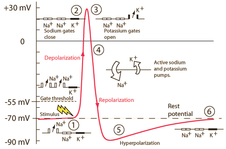
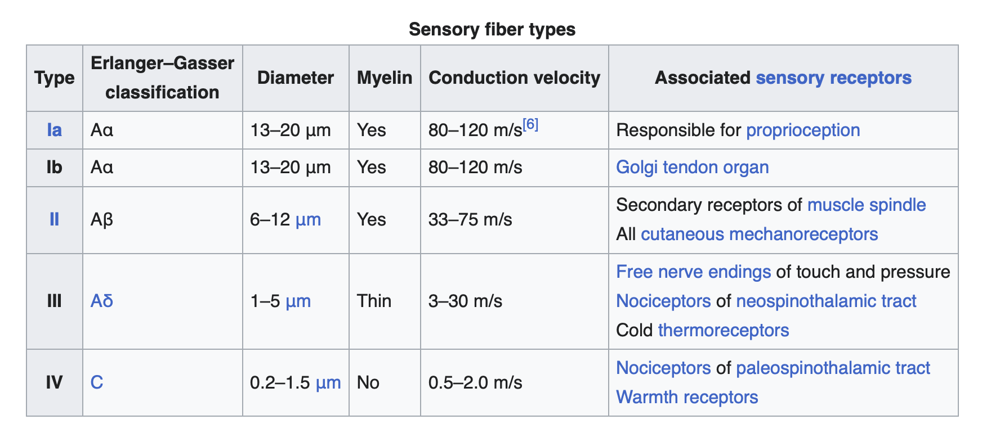

# Preliminaries

## Announcements

- Exam 1: Monday, September 21, 2026
  - 40 questions, plus bonus

## Today's topics

- Warm-up
- Neurophysiology II

# Warm-up

---

::: {.question}
## Which direction does the Na/K pump move K+ ions?

- A. Into the cell
- B. Out of the cell
- C. Around the cell in a circular motion
:::

::: {.fragment}
::: {.answer}
- **A. Into the cell**
- ~~B. Out of the cell~~
- ~~C. Around the cell in a circular motion~~
:::
:::

---

::: {.question}
## The *force of diffusion* tends to move K+ ions...

- A. Into the cell
- B. Out of the cell
- C. Against the K+ concentration gradient
:::

::: {.fragment}
::: {.answer}
- ~~A. Into the cell~~
- **B. Out of the cell**
- ~~C. Against the K+ concentration gradient~~
:::
:::

---

{#fig-hydro}

---

::: {.question}
## The *outward* flow of K+ ions causes the neuron's membrane potential (voltage) to become increasingly

- A. Positive
- B. Negative
- C. Neutral
:::

::: {.fragment}
::: {.answer}
- ~~A. Positive~~
- **B. Negative**
- ~~C. Neutral~~
:::
:::

# Neurophysiology II

## What we're trying to explain

- Neurons generate *action potentials*
  - Voltage waves that propagate down axons
- Action potentials build on the *resting potential*
  - Neuron voltate returns to resting potential after action potential

## What we're trying to explain

- Resting potential arises due to
  - K+, Na+, A- ions
  - Na/K pump
    - K+ in; Na+ out
  - Passive (leak) ion channels 
  - Balance between 
    - Force of diffusion (K+ -> out; Na+ -> in)
    - Electrostatic force (+/- voltage)
  
## Metaphor I

{#fig-tug-o-war}

## $Na^+$ role

:::: {.columns}
::: {.column width=50%}
- $Na^+$ concentrated **outside** neuron
- Membrane at rest not very permeable to $Na^+$
- Some, but not much $Na^+$ flows *in*
- $Na^+$ has equilibrium potential ~ + 60 mV
:::
::: {.column width=50%}
{#fig-na-role}
:::
::::

## $Na^+$ role

:::: {.columns}
::: {.column width=50%}
- Equilibrium potential is positive (with respect to outside)
- Would need positive interior to keep $Na^+$ from flowing in
:::
::: {.column width=50%}

:::
::::

## Electrical circuit model

{#fig-electrical-circuit-model}

## Summary of forces in neuron at rest

| Ion | Concentration gradient | Force of diffusion  | Sign of electrostatic force |
|--------|--------------------------|---------------------|---------------------|
| $K^+$  | $[K^+]_{i} >> [K^+]_{o}$ | outward        | -     |
| $Na^+$ | $[Na^+]_{i} << [Na^+]_{o}$ | inward       | -     |

## Summary: Why is there a membrane potential?

- Na+/K+ pump creates concentration differences
- K+ flows out (slowly), creating charge separation
- Charge separation $\rightarrow$ voltage (membrane potential)
- Voltage has negative sign (positive $K^+$ exit; negative $A^-$ remain)

## Summary: Why is there a membrane potential?

- Na+ ions flow in (*very* slowly, << $K^+$ flows out)
- Reducing charge separation (a bit), makes membrane potential less negative
- Net result
  - Balance of diffusion and electrostatic forces acting on $K^+$ and $Na^+$
  
## (Aside) Khan Academy video



-- @khanacademymedicine2012-fl

## What happens if something changes?

- "Something" == ion channels open (or close)
- Easier for $Na^+$ to enter? Or $K^+$ to exit?
- Some action!

## Action potential

{fig-align="center" #fig-action-potential-wikipedia width="40%" align="center"}

## Phases of the action potential

:::: {.columns}
::: {.column width=50%}
- Threshold (of excitation)
- Depolarization (rising voltage)
- Peak
    + at *positive* voltage
- Repolarization (declining voltage)
- Refractory period (return to resting potential)
:::
::: {.column width=50%}
![Wikipedia^[By Original by en:User:Chris 73, updated by en:User:Diberri, converted to SVG by tiZom - Own work, CC BY-SA 3.0, https://commons.wikimedia.org/w/index.php?curid=2241513]](https://thumb.wikimedia.org/wikipedia/commons/thumb/4/4a/Action_potential.svg/1920px-Action_potential.svg.png?utm_source=en.wikipedia.org&utm_campaign=imageinfo&utm_content=thumbnail){fig-align="right"}
:::
::::

## Phases of the action potential

| Phase             | Neuron State |
|-------------------|--------------|
| Rise to threshold | + input^[Q: From where? A: Other neurons.] makes membrane potential more + |
| Rising phase      | Voltage-gated $Na^+$ channels open, $Na^+$ flows in |

---

![Wikipedia^[By Original by en:User:Chris 73, updated by en:User:Diberri, converted to SVG by tiZom - Own work, CC BY-SA 3.0, https://commons.wikimedia.org/w/index.php?curid=2241513]](https://thumb.wikimedia.org/wikipedia/commons/thumb/4/4a/Action_potential.svg/1920px-Action_potential.svg.png?utm_source=en.wikipedia.org&utm_campaign=imageinfo&utm_content=thumbnail){width="60%"}

## Phases of the action potential

| Phase             | Neuron State |
|-------------------|--------------|
| Peak              | Voltage-gated $Na^+$ channels close and deactivate; voltage-gated $K^+$ channels open |
| Falling phase     | $K^+$ flows out |

---

![Wikipedia^[By Original by en:User:Chris 73, updated by en:User:Diberri, converted to SVG by tiZom - Own work, CC BY-SA 3.0, https://commons.wikimedia.org/w/index.php?curid=2241513]](https://thumb.wikimedia.org/wikipedia/commons/thumb/4/4a/Action_potential.svg/1920px-Action_potential.svg.png?utm_source=en.wikipedia.org&utm_campaign=imageinfo&utm_content=thumbnail){width="60%"}

## Phases of the action potential

| Phase             | Neuron State |
|-------------------|--------------|
| Refractory period | $Na^+$/$K^+$ pump restores [$Na^+$], [$K^+$]; voltage-gated $K^+$ channels close |

---

![Wikipedia^[By Original by en:User:Chris 73, updated by en:User:Diberri, converted to SVG by tiZom - Own work, CC BY-SA 3.0, https://commons.wikimedia.org/w/index.php?curid=2241513]](https://thumb.wikimedia.org/wikipedia/commons/thumb/4/4a/Action_potential.svg/1920px-Action_potential.svg.png?utm_source=en.wikipedia.org&utm_campaign=imageinfo&utm_content=thumbnail){width="60%"}

## Refractory period (phase)

- Absolute
  - No action potential can be generated
- Relative
  - Action potential requires larger input

## Absolute refractory phase

:::: {.columns}
::: {.column width=50%}
- Voltage-gated $K^+$ channels close
    - Driving force on $K^+$ tiny or absent
- $Na^+$/$K^+$ pump restores concentration balance
- No AP can be generated
:::
::: {.column width=50%}

:::
::::

## Relative refractory phase

:::: {.columns}
::: {.column width=50%}
- Can generate AP with larg(er) stimulus
- Some voltage-gated $Na^+$ 'de-inactivate'
  - can open with large input
  - membrane potential is more negative than resting potential
:::
::: {.column width=50%}

:::
::::

## Generating action potentials

:::: {.columns}
::: {.column width=50%}
- *Axon hillock*
    + Portion of soma adjacent to axon
    + Sums inputs to soma from many dendrites
:::
::: {.column width=50%}

:::
::::

## Generating action potentials

:::: {.columns}
::: {.column width=50%}
- *Axon initial segment*
    + Umyelinated portion of axon adjacent to soma
    + Voltage-gated $Na^+$ and $K^+$ channels exposed
    + If sum of input to soma > threshold, voltage-gated $Na^+$ channels open
:::
::: {.column width=50%}

:::
::::

## Simulating the action potential

- <https://phet.colorado.edu/sims/html/neuron/latest/neuron_en.html>

## Action potentials *propagate*

:::: {.columns}
::: {.column width=50%}
- Propagation $\rightarrow$ move
    + move down axon, away from soma, toward axon terminals
- Axon like an electrical cable
:::
::: {.column width=50%}

:::
::::

---

![Wikipedia^[By Laurentaylorj - Own work, CC BY-SA 3.0, https://commons.wikimedia.org/w/index.php?curid=26311114]](https://upload.wikimedia.org/wikipedia/commons/9/95/Action_Potential.gif?utm_source=en.wikipedia.org&utm_campaign=imageinfo&utm_content=thumbnail_unscaled){#fig-wiki-ap-propagation width="80%"}

## Propagation

:::: {.columns}
::: {.column width=50%}
- Unmyelinated axons
  - Each segment "excites" the next
:::
::: {.column width=50%}
{fig-align="right"}
:::
::::

## Propagation

:::: {.columns}
::: {.column width=50%}
- Myelinated axon
  + AP "jumps" between *Nodes of Ranvier*
  + voltage-gated $Na^+$, $K^+$ channels exposed
  + current flows through/down myelinated segments
:::
::: {.column width=50%}
{fig-align="right"}
:::
::::

## Nodes of Ranvier

:::: {.columns}
::: {.column width=50%}
- *Regenerate* action potential
- $Na^+$ and $K^+$ channels exposed to extracellular environment
- Between Nodes of Ranvier, ions can't move out, so move along
:::
::: {.column width=50%}
{fig-align="right"}
:::
::::

## Nodes of Ranvier

:::: {.columns}
::: {.column width=50%}
- Action potentials faster & more reliable for a given axon diameter
:::
::: {.column width=50%}
{fig-align="right"}
:::
::::

    

## Why does AP flow in one direction, away from soma?

+ Soma does not have (many) voltage-gated Na+ channels.
+ Soma is not myelinated.
+ Refractory periods mean polarization works only in one direction.

## Why does AP flow in one direction, away from soma?

+ **Soma does not have (many) voltage-gated Na+ channels.**
+ Soma is not myelinated.
+ **Refractory periods mean polarization works only in one direction.**

## How fast are APs?

:::: {.columns}
::: {.column width=50%}
- Axons carry information at different rates
    - More myelin -> faster
    - Larger diameter axon -> faster
- Somatosensory information faster than pain (nociception)
:::
::: {.column width=50%}

:::
::::

---

## Information processing

- Action potential amplitudes don't vary (much)
    + All or none^[Kind of like the `1`s and `0`s in a digital computer. There are many interconnections between the fields of computer science and neuroscience.]
    + $Na^+$/$K^+$ pumps working all the time
    + $[K^+]$ & $[Na^+]$ don't vary much, so
    + $V_{K^+}$ & $V_{Na^+}$ don't vary much
    
## Information processing

:::: {.columns}
::: {.column width=50%}
- Action potential *frequency* and *timing* vary
  + Rate vs. timing codes
  + Neurons use both
:::
::: {.column width=50%}

:::
::::

# Wrap-up

## Main points

- Resting potential due to ion concentration differences (thank you Na/K pump), passive outflow of K, balance of forces
- Change in membrane permeability to $Na^+$--voltage-gated $Na^+$ channels, triggers action potential.
  - Rapid rise to peak, fall, refractory, return to resting potential
- Action potentials propagate along the axon from soma to terminal button

## Next time

- Neurophysiology III
  - What happens when the action potential runs out of axon

# Resources

## About

This talk was produced using [Quarto](https://quarto.org), using the [RStudio](https://posit.co/products/open-source/rstudio/)
Integrated Development Environment (IDE), version 2026.9.0.174.

The source files are in R and R Markdown, then rendered to HTML using the
[revealJS](https://revealjs.com) framework.
The HTML slides are hosted in a [GitHub repo](https://github.com/psu-psychology/psych-260-2026-fall) and served by GitHub pages:
<https://psu-psychology.github.io/psych-260-2026-fall/>

## References