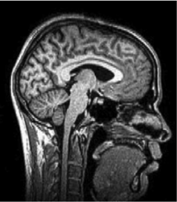

## Today's topics

- Your time is your money
- Quiz 1 review
- Exam 1 review

## Your time is your money

::: {.incremental}
- Penn State CLA students pay $1,857-1,951/credit hour
- PSYCH 260.001 cost: ~$5,712/student
- \$381/week or \$127/class
- Come to class, come to office hours
:::

# Quiz 1

## Summary data

```{r}
#| label: fig-quiz-01-histogram
#| fig-cap: "Histogram of scores for Quiz 01. Passing scores are indicated in teal."

library(ggplot2)
library(dplyr)
readr::read_csv("../private/quizzes/quiz-01/Canvas Report - Exam 23305 - Section 001.csv") |>
  select(FA26_QUIZ_1) |>
  mutate(passing = FA26_QUIZ_1 >= 7) |>
  ggplot() +
  aes(x = FA26_QUIZ_1, fill = passing) +
  geom_bar() +
  theme_minimal() +
  theme(legend.position = "none") +
  xlab("")
```

## 1. The image represents what type of slice?

:::: {.columns}
::: {.column width=50%}
::: {.incremental}
- A. Sagittal
- B. Horizontal
- C. Coronal
- D. Axial
:::
:::
::: {.column width=50%}
{fig-align="right"}
:::
::::

## 1. The image represents what type of slice?

:::: {.columns}
::: {.column width=50%}
- **A. Sagittal**
- B. Horizontal
- C. Coronal
- D. Axial
:::
::: {.column width=50%}
{fig-align="right"}
:::
::::

## 2. All of the following structures can be seen in the figure EXCEPT

:::: {.columns}
::: {.column width=50%}
::: {.incremental}
- A. Cerebellum
- B. Corpus callosum
- C. Lateral ventricles
- D. Cerebral cortex
:::
:::
::: {.column width=50%}
{fig-align="right"}
:::
::::

## 2. All of the following structures can be seen in the figure EXCEPT

:::: {.columns}
::: {.column width=50%}
- A. Cerebellum
- B. Corpus callosum
- **C. Lateral ventricles**
- D. Cerebral cortex
:::
::: {.column width=50%}
{fig-align="right"}
:::
::::

---


## 3. The figure illustrates which imaging model?

:::: {.columns}
::: {.column width=50%}
::: {.incremental}
- A. CT
- B. PET
- C. Magnetoencephalography (MEG)
- D. MRI
:::
:::
::: {.column width=50%}
{fig-align="right"}
:::
::::

## 3. The figure illustrates which imaging model?

:::: {.columns}
::: {.column width=50%}
- A. CT
- B. PET
- C. Magnetoencephalography (MEG)
- D. **MRI**
:::
::: {.column width=50%}
{fig-align="right"}
:::
::::

## 4. In the mid-1600s, reflexes and animal minds were thought of as ____.

::: {.incremental}
- A. Human minds
- B. Machines
- C. Early computers
- D. Artificial intelligence
:::

## 4. In the mid-1600s, reflexes and animal minds were thought of as ____.

- A. Human minds
- **B. Machines**
- C. Early computers
- D. Artificial intelligence

## 5. Descartes thought that this structure was the place where the soul influenced the human body’s voluntary movements.

::: {.incremental}
- A. The pons
- B. The pituitary gland
- C. The pineal gland
- D. The reflexive complex
:::

## 5. Descartes thought that this structure was the place where the soul influenced the human body’s voluntary movements.

- A. The pons
- B. The pituitary gland
- **C. The pineal gland**
- D. The reflexive complex

## 6. The tongue is _______________ with respect to the nose.

::: {.incremental}
- A. Ventral
- B. Superior
- C. Dorsal
- D. Medial
:::

## 6. The tongue is _______________ with respect to the nose.

- **A. Ventral**
- B. Superior
- C. Dorsal
- D. Medial

## 7. Which of the following is NOT MRI-related?

::: {.incremental}
- A. Diffusion Tensor Imaging (DTI)
- B. Voxel-based Morphometry (VBM)
- C. Computed Tomography (CT)
- D. Magnetic Resonance (MR) spectroscopy
:::

## 7. Which of the following is NOT MRI-related?

- A. Diffusion Tensor Imaging (DTI)
- B. Voxel-based Morphometry (VBM)
- **C. Computed Tomography (CT)**
- D. Magnetic Resonance (MR) spectroscopy

## 8. What animal class is single/multi-unit recording most commonly used in?

::: {.incremental}
- A. Humans
- B. Non-human Animals
- C. Both
- D. Neither
:::

## 8. What animal class is single/multi-unit recording most commonly used in?

- A. Humans
- **B. Non-human Animals**
- C. Both
- D. Neither

## 9. Electroencephalography (EEG) has ___ temporal resolution than functional MRI, but ___ spatial resolution.

::: {.incremental}
- A. better; similar
- B. better; worse
- C. worse; better
- D. worse; similar
:::

## 9. Electroencephalography (EEG) has ___ temporal resolution than functional MRI, but ___ spatial resolution.

- A. better; similar
- **B. better; worse**
- C. worse; better
- D. worse; similar

## 10. Which of these landmarks separates the frontal lobe from the parietal lobe?

::: {.incremental}
- A. Lateral fissure
- B. Longitudinal fissure
- C. Anterior cingulate gyrus
- D. Central sulcus
:::

## 10. Which of these landmarks separates the frontal lobe from the parietal lobe?

- A. Lateral fissure
- B. Longitudinal fissure
- C. Anterior cingulate gyrus
- **D. Central sulcus**

## 11.  Which brain structure means “little brain”?

::: {.incremental}
- A. Tectum
- B. Hippocampus 
- C. Cerebrum
- D. Cerebellum
:::

## 11.  Which brain structure means “little brain”?

- A. Tectum
- B. Hippocampus 
- C. Cerebrum
- **D. Cerebellum**

## 12. The superior longitudinal fissure divides what from what?

::: {.incremental}
- A. Frontal lobe from the parietal lobe
- B. Pons from the cerebellum 
- C. Left hemisphere from the right hemisphere
- D. Temporal lobe from the occipital lobe
:::

## 12. The superior longitudinal fissure divides what from what?

- A. Frontal lobe from the parietal lobe
- B. Pons from the cerebellum 
- **C. Left hemisphere from the right hemisphere**
- D. Temporal lobe from the occipital lobe

# Exam 1 review

## History

- Who invented the Golgi cell stain and what distringuishes it from other stains.

## Neuroanatomy

- Identify the lobes of the cerebral cortex from a brain image
- Sulcus/fissure landmarks of frontal, temporal, parietal lobe, cerebral hemispheres
- Identify hindbrain regions from a brain image

## Neuroanatomy

- Function, location, components of midbrain
- Parts and role of meninges

## Neuroanatomy

- Function, location of hypothalamus
- Function, location of hippocampus

## Methods

- Identify planes of section from a brain image
- Which methods use MR, X-rays, electromagnetic fields

## Cells of the brain

- General function of glial cells
- Types of glial cells, where found
- Role of dendrites, axon
- Unusual features of neurons (vs. other cells)

## Resting potential

- What does Na+/K+ pump do?
- How does the force of diffusion act on K+? Na+?
- What organic anions A- can and can't do, where concentrated

## Action potential

- Major event(s) during rising phase of action potential, falling phase
- Types of refractory periods and their differences
- What happens when neuron reaches threshold?
- Function of Nodes of Ranvier
- How action potentials are like signals in digital computers

# Wrap-up

## Next time

- Exam 1

# Resources

## About

This talk was produced using [Quarto](https://quarto.org), using the [RStudio](https://posit.co/products/open-source/rstudio/)
Integrated Development Environment (IDE), version 2026.9.0.174.

The source files are in R and R Markdown, then rendered to HTML using the
[revealJS](https://revealjs.com) framework.
The HTML slides are hosted in a [GitHub repo](https://github.com/psu-psychology/psych-260-2026-fall) and served by GitHub pages:
<https://psu-psychology.github.io/psych-260-2026-fall/>

## References
