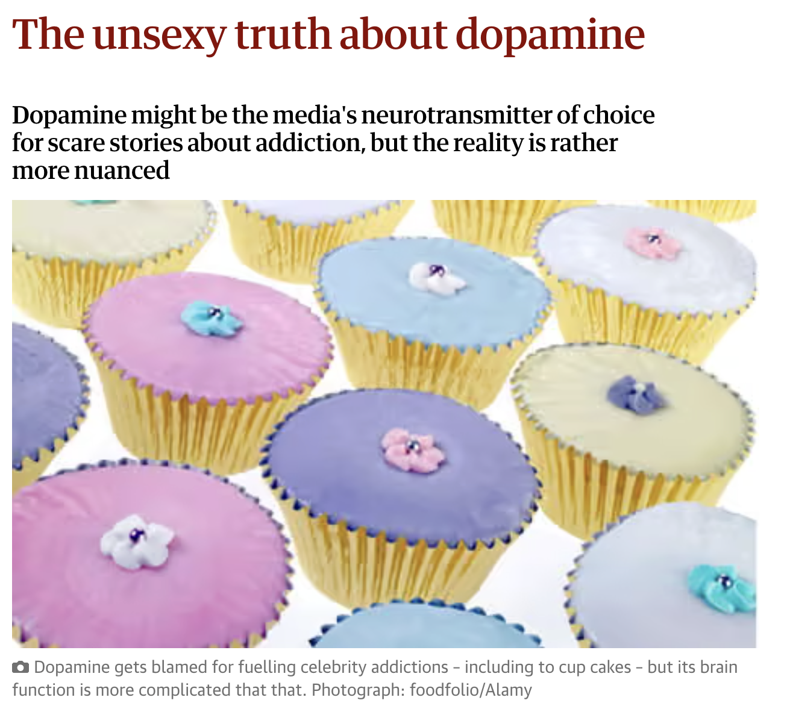

# Prelude

---

## Today's topics

- Wrap-up on synapses
- Neurotransmitters

# Warm-up

---

### What ion flows into the presynaptic terminal and triggers neurotransmitter release when the action potential arrives?

::: {.incremental}
- A. potassium, $K^+$
- B. organic anions, $A^-$
- C. calcium, $Ca^{++}$
- D. chloride, $Cl^-$

:::

---

### What ion flows into the presynaptic terminal and triggers neurotransmitter release when the action potential arrives?

- ~~A. potassium, $K^+$~~
- ~~B. organic anions, $A^-$~~
- **C. calcium, $Ca^{++}$**
- ~~D. chloride, $Cl^-$~~

---

### What ion flows into the presynaptic terminal and triggers neurotransmitter release when the action potential arrives?

- ~~A. potassium, $K^+$~~ flows out not in
- ~~B. organic anions, $A^-$~~ doesn't flow in or out
- **C. calcium, $Ca^{++}$**
- ~~D. chloride, $Cl^-$~~ flows in, but doesn't trigger NT release

---

### What ways are neurotransmitters inactivated after they bind with a postsynaptic receptor?

::: {.incremental}
- A. Buffering (e.g., by astrocytes)
- B. Chemical breakdown (enzymatic degradation)
- C. Reuptake (into presynaptic terminal)
- D. All of the above

:::

---

### What ways are neurotransmitters inactivated after they bind with a postsynaptic receptor?

- A. Buffering (e.g., by astrocytes)
- B. Chemical breakdown (enzymatic degradation)
- C. Reuptake (into presynaptic terminal)
- **D. All of the above**

---

### What sort of PSP would *opening* a Na+ channel produce?

::: {.incremental}
- Na+ flows in, so Excitatory PSP (EPSP)
- Na+ flows out, so Excitatory PSP (EPSP)
- Na+ flows in, so Inhibitory PSP (IPSP)
- Na+ flows out, so Inhibitory PSP (IPSP)
:::

---

### What sort of PSP would *opening* a Na+ channel produce?

- **Na+ flows in, so Excitatory PSP (EPSP)**
- ~~Na+ flows out, so Excitatory PSP (EPSP)~~
- ~~Na+ flows in, so Inhibitory PSP (IPSP)~~
- ~~Na+ flows out, so Inhibitory PSP (IPSP)~~

---

## Why must NTs be inactivated?

- Or what would happen if they weren't?
- Or weren't quickly?

::: {.fragment}
- Concentration gradient wouldn't be large
- NT flow would be altered
:::

---

# Neurotransmitters

## What are they?

:::: {.columns}
::: {.column width=40%}
- Chemicals produced by neurons
- Released by neurons
- Bound by neurons and other cells
:::
::: {.column width=60%}
{#fig-neurotransmitters}
:::
::::

## What are they?

:::: {.columns}
::: {.column width=40%}
- Send messages (have physiological effect on target cells)
- Inactivated after release
:::
::: {.column width=60%}
{#fig-neurotransmitters-2}
:::
::::

## Amino acids

| Family      | Neurotansmitter                         |
|-------------|-----------------------------------------|
| Amino acids | Glutamate (Glu)                     |
|             | Gamma aminobutyric acid (GABA)      |
|             | Glycine                               |
|             | Aspartate                             |

## Amino acids

| Family      | Neurotansmitter                         |
|-------------|-----------------------------------------|
| Amino acids | **Glutamate (Glu)**                     |
|             | **Gamma aminobutyric acid (GABA)**      |
|             | Glycine                               |
|             | Aspartate                             |

## Glutamate

::: {.incremental}
- Primary excitatory NT in CNS (~ 1/2 all synapses)
- Role in learning (via NMDA receptor)
- Transporters on neurons and glia (astrocytes and oligodendrocytes)
- Linked to umami (savory) taste sensation, think monosodium glutamate (MSG)
- Dysregulation in schizophrenia [@McCutcheon2020-ez](https://doi.org/10.1002/wps.20693), mood disorders [@Malgorzata2020-nz]
:::

## Glutamate

| Type         | Receptor   | Esp Permeable to |
|--------------|------------|------------------|
| Ionotropic   | **AMPA**   | Na+, K+          |
|              | Kainate    |                  |
|              | **NMDA**   | Ca++             |
| Metabotropic | mGlu       |                  |

## $\gamma$-aminobutyric Acid (GABA)

::: {.incremental}
- Primary inhibitory NT in CNS
<!-- - Excitatory in developing CNS, $[Cl^-]_{in} >> [Cl-]_{out}$ -->
- Binding sites for benzodiazepines (e.g., Valium), barbiturates, ethanol, etc.
- Synthesized from glutamate
- Inactivated by transporters
:::

## GABA

| Type         | Receptor   | Esp Permeable to |
|--------------|------------|------------------|
| Ionotropic   | **GABA-A**     | Cl-          |
| Metabotropic | **GABA-B**     | K+           |

---

### What PSP will occur if we *open* a K+ channel?

- K+ flows out, so excitatory (EPSP)
- K+ flows out, so inhibitory (IPSP)

---

### What PSP will occur if we *open* a K+ channel?

- ~~K+ flows out, so excitatory (EPSP)~~
- **K+ flows out, so inhibitory (IPSP)**

## Other amino acid NTs

- *Glycine*
    + Spinal cord interneurons
    + Also inhibitory
- *Aspartate*
    + Like Glu, stimulates NMDA receptor

## Acetylcholine (ACh)

:::: {.columns}
::: {.column width=40%}
::: {.incremental}
- Primary NT of CNS output
- Somatic nervous system (neuromuscular junction)
- Inactivated by acetylcholinesterase (AChE)
:::
:::
::: {.column width=60%}
[{fig-align="right"}](https://cdn.britannica.com/41/54741-004-8E4F81CC/acetylcholine-receptor-channel-subunits-diffusion-ions-sodium.jpg?w=300&h=300){#fig-ach-britannica}
:::
::::

## Acetylcholine (ACh)

:::: {.columns}
::: {.column width=40%}
- Autonomic nervous system
    + *Sympathetic branch*: preganglionic neuron
    + *Parasympathetic branch*: pre/postganglionic
:::
::: {.column width=60%}
{width="60%" fig-align="right" #fig-ans}
:::
::::

## Acetylcholine

| Type         | Receptor           | Esp Permeable to | Blocked by       |
|--------------|--------------------|------------------|------------------|
| Ionotropic   | **Nicotinic (nAChR)**  | Na+, K+          | e.g., Curare     |
| Metabotropic | **Muscarinic (mAChR)** | K+               | e.g., Atropine   |

## [Curare](https://en.wikipedia.org/wiki/Curare)

{fig-align="center" #fig-curare width="55%"}

## Atropine

:::: {.columns}
::: {.column width=50%}
- also known as (aka), nightshade or belladonna
- blocks ACh receptors in muscles of the iris
:::
::: {.column width=50%}
{fig-align="right"}
:::
::::

## Many ways to paralyze your prey

| Substance | Effect |
|-----------|--------|
| Japanese pufferfish toxin | Blocks voltage-gated Na+ channels |
| Black widow spider venom | Accelerates presynaptic ACh release |
| Botulinum toxin (BoTox)| Prevents ACh vesicles from binding presynaptically |

## Many ways to paralyze your prey

| Substance | Effect |
|-----------|--------|
| Sarin nerve gas | Impedes ACh breakdown by AChE |
| Pesticides | Impede AChE |
| Tetanus toxin | Blocks release of GABA, glycine |

## Monoamines

| Family      | Neurotansmitter                         |
|-------------|-----------------------------------------|
| Monoamines  | *Dopamine* (DA)                           |
|             | *Norepinephrine* (NE)/Noradrenaline (NAd) |
|             | Epinephrine (Epi)/Adrenaline (Ad)       |
|             | *Serotonin* (5-HT)                       |
|             | Melatonin                               |
|             | Histamine                               |

## Dopamine (DA)

:::: {.columns}
::: {.column width=50%}
- Released by two pathways 
- Both originate in the midbrain tegmentum
:::
::: {.column width=50%}
![Wikipedia^[By User:Slashme; Patrick J. Lynch; User:Fvasconcellos - self-made; re-use File:Brain bulbar region.svg, CC BY-SA 4.0, https://commons.wikimedia.org/w/index.php?curid=44402772]](https://thumb.wikimedia.org/wikipedia/commons/thumb/d/d8/Dopaminergic_pathways.svg/3840px-Dopaminergic_pathways.svg.png?utm_source=en.wikipedia.org&utm_campaign=imageinfo&utm_content=thumbnail)
:::
::::

## Dopamine (DA)

:::: {.columns}
::: {.column width=50%}
- Substantia nigra -> striatum, *meso-striatal projection*
- Ventral tegmental area (VTA) -> nucleus accumbens, ventral striatum, hippocampus, amygdala, cortex; *meso-limbo-cortical projection*
:::
::: {.column width=50%}
![Wikipedia^[By User:Slashme; Patrick J. Lynch; User:Fvasconcellos - self-made; re-use File:Brain bulbar region.svg, CC BY-SA 4.0, https://commons.wikimedia.org/w/index.php?curid=44402772]](https://thumb.wikimedia.org/wikipedia/commons/thumb/d/d8/Dopaminergic_pathways.svg/3840px-Dopaminergic_pathways.svg.png?utm_source=en.wikipedia.org&utm_campaign=imageinfo&utm_content=thumbnail)
:::
::::

## Dopamine (DA)

- Disruption linked to
    - Parkinson's Disease (mesostriatal)
        + DA agonists treat (agonists facilitate/increase transmission)
    - Schizophrenia (mesolimbocortical)
        + DA *ant*agonists treat
    - Addiction (mesolimbocortical)
    - ADHD (mesolimbocortical)
    
## Dopamine (DA)

:::: {.columns}
::: {.column width=50%}
- Inactivated by
  - [Chemical breakdown](http://www.scholarpedia.org/article/Dopamine_anatomy#Dopamine_receptors)
  - Dopamine transporter (DAT)
:::
::: {.column width=50%}
{#fig-dopamine-synthesis}
:::
::::

## Dopamine (DA)

| Type         | Receptor             | Comments                      |
|--------------|----------------------|-------------------------------|
| Metabotropic | *D1-like (D1 and D5)*  | more prevalent                |
|              | *D2-like (D2, D3, D4)* | target of many antipsychotics (drugs that treat schizophrenia symptoms) |

## Dopamine (DA)

:::: {.columns}
::: {.column width=50%}
- *Not* the pleasure or motivation NT
- One function: signals differences between predicted and actual outcomes
:::
::: {.column width=50%}
{fig-align="right" #fig-dopamine-boring-truth}
:::
::::

## Norepinephrine (NE)

:::: {.columns}
::: {.column width=50%}
- Role in arousal, mood, eating, sexual behavior
- Released by 
    + *[locus coeruleus](http://www.scholarpedia.org/article/Locus_coeruleus)* in pons/caudal tegmentum
:::
::: {.column width=50%}
{fig-align="center" #fig-ne-projections}
:::
::::

## Norepinephrine (NE)

:::: {.columns}
::: {.column width=50%}
- Released by Sympathetic branch of Autonomic Nervous System (ANS) onto targets in PNS
:::
::: {.column width=50%}
{width="80%" fig-align="right" #fig-ne-ans}
:::
::::

## Norepinephrine (NE)

:::: {.columns}
::: {.column width=50%}
- Monoamine oxidase (MAO) inactivates monoamines in neurons, glial cells
- Monoamine oxidase inhibitors (MAOIs) *increase* NE, DA
    + Inhibiting inactivation ~ `-(-1) = + 1`
:::
::: {.column width=50%}
{#fig-ne-youdim}
:::
::::

## Norepinephrine (NE)

:::: {.columns}
::: {.column width=50%}
- MAO-Is early treatment for depression, but side effects (dry mouth, nausea, headache, dizziness)
:::
::: {.column width=50%}
{#fig-maois}
:::
::::

## Norepinephrine (NE)

| Type         | Receptor             | Comments                           |
|--------------|----------------------|------------------------------------|
| Metabotropic | $\alpha$ (1,2)       | antagonists treat anxiety, panic   |
|              | $\beta$ (1,2,3)      | 'beta blockers' in cardiac disease |

## Serotonin (5-HT)

:::: {.columns}
::: {.column width=50%}
- Released by *raphe nuclei* in brainstem
- Role in mood, sleep, eating, pain, nausea, cognition, memory
- Modulates release of other NTs
:::
::: {.column width=50%}
{#fig-serotonin-pathways}
:::
::::

## Serotonin (5-HT)

:::: {.columns}
::: {.column width=50%}
- Most of body's 5-HT neurons regulate digestion
    - via Enteric Nervous System (in PNS)
:::
::: {.column width=50%}
{width="70%" #fig-5-ht-enteric}
:::
::::

## Serotonin (5-HT)

- 5-HT receptors
    - Seven families (5-HT 1-7) with 14 types
    - All but one metabotropic

## Serotonin (5-HT)

- Ecstasy (MDMA) disturbs serotonin
- So does LSD
- Fluoxetine (Prozac)
    + *Selective Serotonin Reuptake Inhibitor (SSRI)*
    + Inhibits reuptake -> increases extracellular concentration
    + Treats depression, panic, eating disorders, others
- 5-HT3 receptor antagonists are anti-mimetics used in treating nausea

## Melatonin

:::: {.columns}
::: {.column width=50%}
- Hormone released by pineal gland into bloodstream
- Concentrations vary over the day, peak near bedtime
- Release regulated by inputs from hypothalamus
:::
::: {.column width=50%}
{#fig-melatonin-gif}
:::
::::

# Wrap-up

## Key points about monoamines

- Monoamine neurotransmitters--DA, NE, 5-HT--modulate activity of other neurons
- Monoamines are released from specific areas in midbrain and hindbrain
- Monoamines project widely throughout the CNS
- Monamines are inactivated chemically and via transporters

## Key points about monoamines

- Many drugs that treat psychiatric illness affect monoamines
- Most monoamines activate metabotropic receptors

## Next time

- Wrap-up on neurochemistry
- Hormones

# Resources

## About

This talk was produced using [Quarto](https://quarto.org), using the [RStudio](https://posit.co/products/open-source/rstudio/)
Integrated Development Environment (IDE), version 2026.9.0.174.

The source files are in R and R Markdown, then rendered to HTML using the
[revealJS](https://revealjs.com) framework.
The HTML slides are hosted in a [GitHub repo](https://github.com/psu-psychology/psych-260-2026-fall) and served by GitHub pages:
<https://psu-psychology.github.io/psych-260-2026-fall/>

## References
