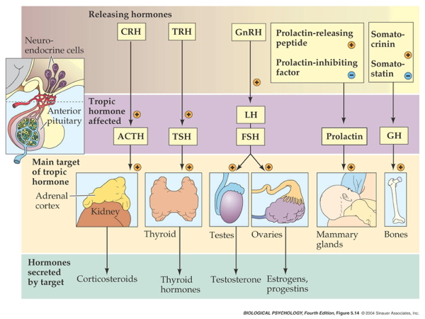
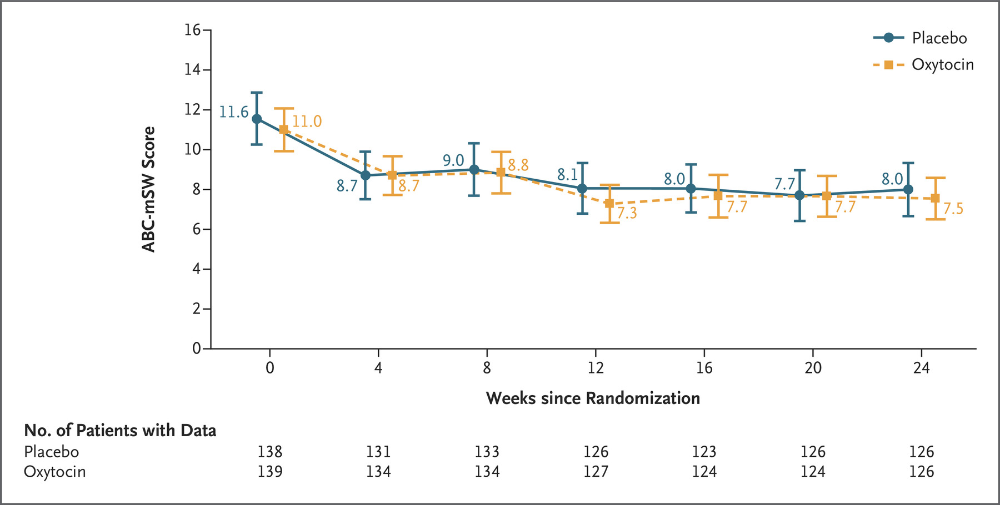
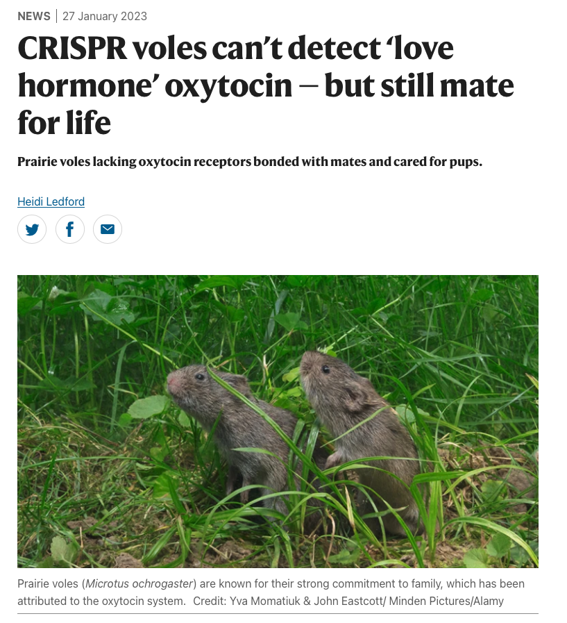
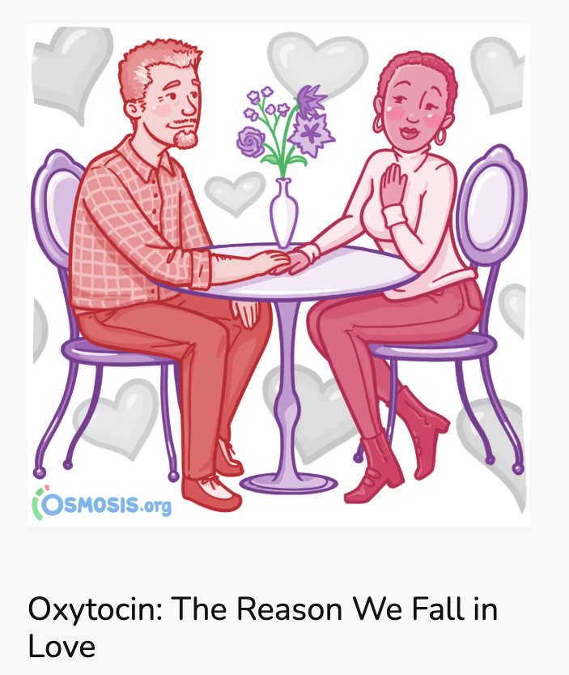
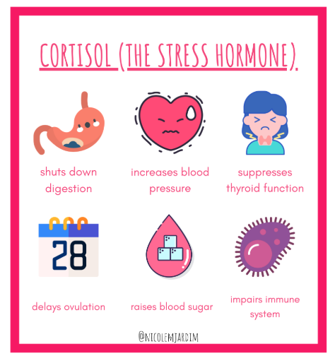
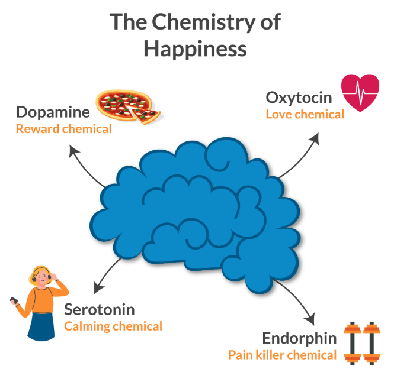
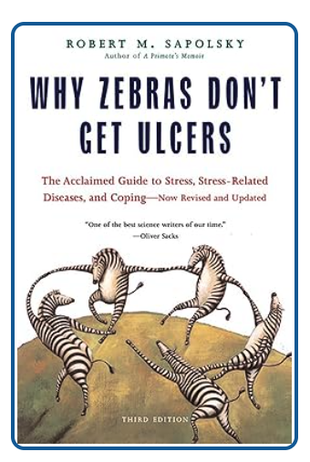

# Prelude

--- 



-- @Songs2018-lb

## Monoamine Song

Monoamines, do-do do do-do 
Monoamines, do do do-do 
Monoamines, do do do do-do do do-do do do-do do do do do-do do

## Monoamine Song

Monoamines, do-pa-mine is one 
Monoamines, nor-epi, too 
Monoamines, sero-tonin e-pinephrine, dop-a-mine, nor-epinephrine, melatonin, whoo!

## Monoamine Song

Monoamines, mod-u-late neurons  
Monoamines, throughout the brain 
Monoamines, keep people happy, brains snappy, not sleepy, not sappy, do-do do-do do-do do

## Today's topics

- Warm-up
- Wrap-up on neurochemistry
- Hormones

# Warm-up

---

### Motor neurons in the PNS release this neurotransmitter onto skeletal muscles:

::: {.incremental}
- A. Glutamate
- B. GABA
- C. Dopamine
- D. Acetylcholine (ACh)
:::

---

### Motor neurons in the PNS release this neurotransmitter onto skeletal muscles:

- ~~A. Glutamate~~
- ~~B. GABA~~
- ~~C. Dopamine~~
- **D. Acetylcholine (ACh)**

---

### What neurotransmitter is released widely across the CNS, at as many as 1/2 of all synapses?

::: {.incremental}
- A. Acetylcholine
- B. Serotonin (5-HT)
- C. Glutamate
- D. Glycine
:::

---

### What neurotransmitter is released widely across the CNS, at as many as 1/2 of all synapses?

- ~~A. Acetylcholine~~
- ~~B. Serotonin (5-HT)~~
- **C. Glutamate**
- ~~D. Glycine~~

---

### Where in the brain are nuclei whose axons release dopamine (DA), norepinephrine (NE), and serotonin. (5-HT) found?

::: {.incremental}
- A. Cerebral cortex
- B. Midbrain and hindbrain
- C. Thalamus
- D. Hypothalamus
:::

---

### Where in the brain are nuclei whose axons release dopamine (DA), norepinephrine (NE), and serotonin (5-HT) found?

- ~~A. Cerebral cortex~~
- **B. Midbrain and hindbrain**
- ~~C. Thalamus~~
- ~~D. Hypothalamus~~

---

:::: {.columns}
::: {.column width=30%}

:::
::: {.column width=5%}
:::
::: {.column width=30%}

:::
::: {.column width=5%}
:::
::: {.column width=30%}

:::
::::

# Neurochemistry wrap-up

## Key points about monoamines

- Monoamine neurotransmitters--DA, NE, 5-HT--modulate activity of other neurons
- Monoamines are released from specific locations
  - DA & NE from midbrain, 5-HT from hind brain
- Monoamines project widely throughout the CNS

## Key points about monoamines

- Monoamines are inactivated chemically and via transporters
- Many drugs that treat psychiatric illness affect monoamines
- Most monoamines activate metabotropic receptors

## Histamine

:::: {.columns}
::: {.column width=50%}
- In forebrain, released by hypothalamus, projects to whole brain
  + Metabotropic receptors
  + Role in arousal/sleep regulation
  + Anti-histamines can induce sleep
- In body, part of immune response
:::
::: {.column width=50%}

:::
::::

## Other NTs

- Gases
  + *Nitric Oxide (NO)*, *carbon monoxide (CO)*
- Neuropeptides
  + *Substance P* and *endorphins* (endogenous morphine-like compounds) have role in pain
  + *Orexin/hypocretin*, project from lateral hypothalamus across brain, regulate appetite, arousal
    
## Other NTs

- Neuropeptides (continued)
  + *Cholecystokinin (CCK)* stimulates digestion
  + *Oxytocin* and *vasopressin* released by posterior hypothalamus onto posterior pituitary, regulate social behavior
  
## Why are there so many neurotransmitters?
    
## Non-chemical communication between neurons

:::: {.columns}
::: {.column width=50%}
- Gap junctions
- Electrical coupling
- Connect cytoplasm directly
:::
::: {.column width=50%}

:::
::::

## Non-chemical communication between neurons

:::: {.columns}
::: {.column width=50%}
- Fast, but fixed, hard to modulate
- Examples: retina, cardiac muscle
:::
::: {.column width=50%}

:::
::::

## Ways to think about synaptic communication

- Specificity: point-to-point vs. broadcast
- Timing of action
  - Immediate, short-term vs. 
  - Delayed, prolonged
- Are non-NT substances agonists or antagonists?

## Agonists vs. Antagonists

- *Agonists* 
    + bind to receptor
    + mimic action of endogenous chemical
- *Antagonists*
    + bind to receptor
    + block/impede action of endogenous chemical
    
---
    
### Valium is a GABA-A receptor *agonist*. This means:

::: {.incremental}
- A. It decreases inhibition
- B. It activates a metabotropic Cl- channel 
- C. It facilitates/increases Cl- flow
- D. It blocks an ionotropic channel

:::

---

### Valium is a GABA-A receptor *agonist*. This means:

- ~~A. It decreases inhibition~~
- ~~B. It activates a metabotropic Cl- channel~~ 
- **C. It facilitates/increases Cl- flow**
- ~~D. It blocks an ionotropic channel~~

# Hormones

## Hormones are...

- Chemicals secreted into blood
- Act on specific target tissues via receptors
- Produce specific effects

---

### Can a substance be a hormone AND a neurotransmitter?

- A. No
- B. Yes

---

### Can a substance be a hormone AND a neurotransmitter?

- ~~A. No~~
- **B. Yes**

::: {.fragment}
- If the substances:
  - are released by neurons
  - bind to neurons, and 
  - bind to other cells in the body.
:::

## Substances that are both hormones and neurotransmitters

- Melatonin
- Epinephrine/adrenaline
- Oxytocin
- Vasopressin
    
## Physiological responses and behaviors under hormonal influence

:::: {.columns}
::: {.column width=50%}
- Ingestive (eating/ drinking)
    + Fluid levels
    + Na, K, Ca levels 
    + Digestion
    + Blood glucose levels
:::
::: {.column width=50%}

:::
::::

## Physiological responses and behaviors under hormonal influence

:::: {.columns}
::: {.column width=50%}
- Reproduction
    + Sexual Maturation
    + Mating
    + Birth
    + Care giving
:::
::: {.column width=50%}

:::
::::
    
## Physiological responses and behaviors under hormonal influence

:::: {.columns}
::: {.column width=50%}
- Responses to threat/challenge
    + Metabolism
    + Heart rate, blood pressure 
    + Digestion
    + Arousal
:::
::: {.column width=50%}

:::
::::
    
## Commonalities

- Biological imperatives
- Events restricted in space and time

## Differences: Neural vs. hormonal communication

::: {.incremental}
- Point to point vs.“broadcast”
    + Wider broadcast than neuromodulators
    + Everywhere in body via bloodstream
- Fast vs. slow-acting
:::

## Differences: Neural vs. hormonal communication

::: {.incremental}
- Short-acting vs. long-acting
- Digital (yes-no) vs. analog (graded) 
- Voluntary control vs. involuntary
:::

## Similarities: Neural vs. hormonal communication

::: {.incremental}
- Chemical messengers stored for later release 
- Release follows stimulation
- Action depends on specific receptors
- 2nd messenger (metabotropic receptors) systems common
:::

## Biology

:::: {.columns}
::: {.column width=50%}
- Rest of body
    + *Thyroid*
    +  *Adrenal (ad=adjacent, renal=kidney) gland*
        - *Adrenal cortex*
        - *Adrenal medulla*
    + *Gonads* (testes/ovaries)
:::
::: {.column width=50%}

:::
::::

## Biology

:::: {.columns}
::: {.column width=50%}
- CNS
    + Hypothalamus
    + *Pituitary*
        - *Anterior*
        - *Posterior*
    + Pineal gland
:::
::: {.column width=50%}

:::
::::

## Two release systems

- From hypothalamus/pituitary into bloodstream
  - Direct
  - Indirect

## Direct release

:::: {.columns}
::: {.column width=50%}
- Hypothalamus ->
- Posterior pituitary
    + *Oxytocin*
    + *Arginine Vasopressin (AVP, vasopressin)*, also known as anti-diuretic hormone (ADH)

:::
::: {.column width=50%}
{fig-align="right"}
:::
::::

## Indirect release

:::: {.columns}
::: {.column width=50%}
- Hypothalamus -> *releasing hormones* 
- Anterior pituitary -> *tropic hormones*
:::
::: {.column width=50%}

:::
::::

## Indirect release

:::: {.columns}
::: {.column width=50%}
- Blood stream ->
- End organs
:::
::: {.column width=50%}

:::
::::

# Case studies in neural & hormonal communication

## Responses to threat or challenge

{fig-align="center"}

## Responses to threat or challenge

:::: {.columns}
::: {.column width=60%}
- Neural response
  + Sympathetic NS activation of heart, lungs, etc.
  + Sympathetic Adrenal Medullary (SAM) axis (also system or response)
    + Releases NE and Epi into bloodstream
:::
::: {.column width=40%}

:::
::::

## Responses to threat or challenge

:::: {.columns}
::: {.column width=60%}
- Endocrine response
    + *Hypothalamic Pituitary Adrenal (HPA) axis*
- Hypothalamus 
    + Releases *Corticotropin Releasing Hormone (CRH)*
- Anterior pituitary
    + Releases *Adrenocorticotropic hormone (ACTH)* 
:::
::: {.column width=40%}

:::
::::

## Responses to threat or challenge

:::: {.columns}
::: {.column width=60%}
- Adrenal cortex
  + Responds to ACTH from anterior pituitary
  + Releases *Glucocorticoids (e.g., cortisol)*
:::
::: {.column width=40%}

:::
::::

## Responses to threat or challenge

:::: {.columns}
::: {.column width=50%}
- *Glucocorticoids (e.g., cortisol)*
  + increase blood glucose production
  + reduce inflammation
  - suppress immune system 
  + prolonged exposure unhealthy
:::
::: {.column width=50%}

:::
::::

## Cortisol affects brain, too

:::: {.columns}
::: {.column width=50%}
- Via receptors for CRF, cortisol
:::
::: {.column width=50%}

:::
::::

## Reproductive behavior

{fig-align="center"}

## Reproductive behavior

:::: {.columns}
::: {.column width=50%}
::: {.incremental}
- Milk letdown reflex
- Sensory inputs from infant (sight, smell, sound, touch)
- Hypothalamus releases oxytocin into posterior pituitary
- Oxytocin activates milk ducts in breast tissue
:::
:::
::: {.column width=50%}

:::
::::

## Oxytocin has multiple roles

::: {.incremental}
- Sexual arousal
- Released in bursts during orgasm
- Stimulates uterine, vaginal contraction
- Links to social interaction, bonding:  [@Weisman2013158](http://dx.doi.org/10.1016/j.biopsych.2013.05.026)
- Alters face processing in autism:  [@Domes2013164](http://dx.doi.org/10.1016/j.biopsych.2013.02.007)

:::

## But, can oxytocin treat social impairments in autism?

## Effects of "knocking-out" oxytocin receptors?

## Folk psychology memes

{fig-align="center"}

## Folk psychology memes

{fig-align="center"}

## Folk psychology memes

{fig-align="center"}

## Folk psychology memes

- Oversimplify
- Neurotransmitters and hormones have multiple physiological effects
- Nervous system and rest of body connected, interact
- Simplification sometimes useful, but can also mislead

---

{fig-align="center"}

# Wrap-up

## Main points

- Hormones are chemicals secreted into the blood
- Hormones bind to specialized receptors in the body and the nervous system
- Hormones influence biologically critical behaviors and physiology
- Hypothalamus controls hormone release via pituitary
- Release is indirect (via anterior pituitary) or direct (via posterior pituitary)

## Next time

- Evolution of the nervous system

# Resources

## About

This talk was produced using [Quarto](https://quarto.org), using the [RStudio](https://posit.co/products/open-source/rstudio/)
Integrated Development Environment (IDE), version 2026.9.0.174.

The source files are in R and R Markdown, then rendered to HTML using the
[revealJS](https://revealjs.com) framework.
The HTML slides are hosted in a [GitHub repo](https://github.com/psu-psychology/psych-260-2026-fall) and served by GitHub pages:
<https://psu-psychology.github.io/psych-260-2026-fall/>

## References
