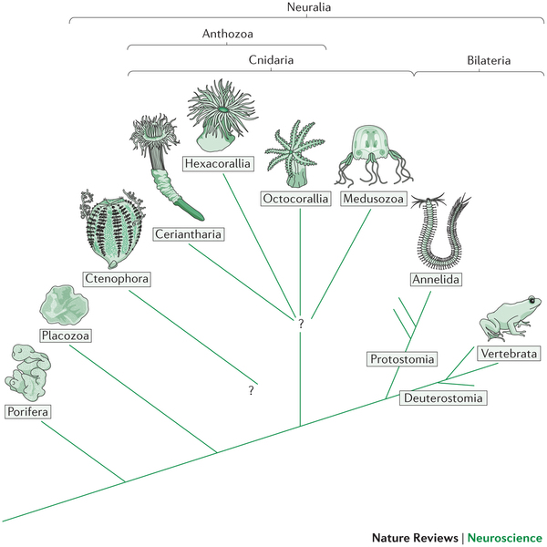
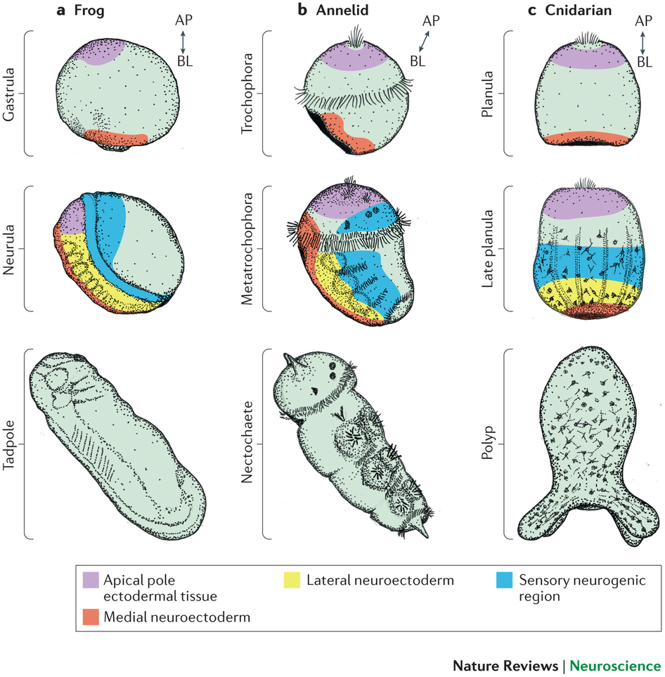
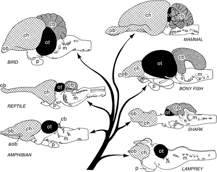
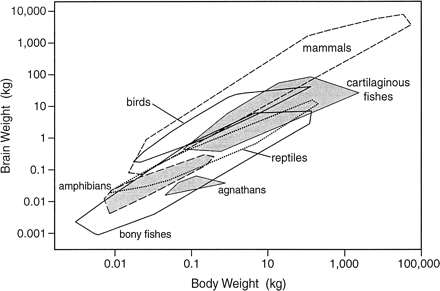

# Preliminaries

---

::: {#fig-video-woodburn}

<iframe width="1280" height="450" src="https://www.youtube.com/embed/bAGMATHlSK4?si=jmcMAy3jAHmek20n" title="YouTube video player" frameborder="0" allow="accelerometer; autoplay; clipboard-write; encrypted-media; gyroscope; picture-in-picture; web-share" referrerpolicy="strict-origin-when-cross-origin" allowfullscreen></iframe>

@twoodburn2008-cm
:::

## Announcement

- Quiz 2 next [Monday, October 05](../schedule.qmd#mon-oct-05)

## Today's topics

- Warm-up
- Wrap up on hormones
- Evolution of the nervous system

# Warm-up

---

###  With one exception, monoamine neurotransmitters bind to __________ receptors.

- ionotropic
- voltage-gated 
- nicotinic
- metabotropic

---

###  With one exception, monoamine neurotransmitters bind to __________ receptors.

- ~~ionotropic~~
- ~~voltage-gated~~ 
- ~~nicotinic~~
- **metabotropic**

---

### __________  receptors contain both chemical (ligand) binding sites and an ion channel. 

- Metabotropic
- Serotonin 
- Glutamate 
- Ionotropic

---

### __________  receptors contain both chemical (ligand) binding sites and an ion channel. 

- ~~Metabotropic~~
- ~~Serotonin~~ 
- ~~Glutamate~~ 
- **Ionotropic**

---

### What neurotransmitter is used to activate skeletal muscles, target organs in the parasympathetic nervous system, and the sympathetic ganglion chain?

- Glutamate
- Norepinephrine
- Acetylcholine
- Histamine

---

### What neurotransmitter is used to activate skeletal muscles, target organs in the parasympathetic nervous system, and the sympathetic ganglion chain?

- ~~Glutamate~~
- ~~Norepinephrine~~
- **Acetylcholine**
- ~~Histamine~~

# Wrap-up on hormones

## Last time...

- Link to [2026-09-28 slides](https://psu-psychology.github.io/psych-260-2026-fall/slides/wk-06-2026-09-28-hormones.html#/responses-to-threat-or-challenge-1)

# Evolution of the nervous system

## Principles of evolution

::: {.incremental}
- Life on Earth has existed for ~3.5 billion years
- Life forms existing in the Earth's past differed from those living today
- New generations of life forms inherit properties from their predecessors
:::

## Principles of evolution

::: {.incremental}
- New life forms evolved as a result of *mutations*, *selection pressures*, and *geological events*
- Greater reproductive success (more offspring) for some individuals, not others
- Characteristics of those who have more offspring increase in relative frequency in the population
:::

## Evidence for evolution

- Fossil
  + Fossil dating (radiometric)
- Geological
  + Where fossils are found relative to one another (relative dating)
  + How long it takes to form layers
    
## Evidence for evolution

- Chemical
  + Similarities between vastly different species (e.g., in neurotransmitters, hormones, receptors, metabolic pathways, etc.) 
- Genetic
  + Rates of mutation
  + Developmental patterns of gene expression
    
## Evidence for evolution

- Anatomical

](https://thumb.wikimedia.org/wikipedia/commons/thumb/5/5e/Homology_vertebrates-en.svg/3840px-Homology_vertebrates-en.svg.png?utm_source=en.wikipedia.org&utm_campaign=imageinfo&utm_content=thumbnail){#fig-homology-vertebrates width="55%"}

## Tree of life

{fig-align="center" #fig-tree-of-life}

---

>Nothing in biology makes sense except in the light of evolution

>Seen in the light of evolution, biology is, perhaps, intellectually the most satisfying and inspiring science. Without that light, it becomes a pile of sundry facts some of them interesting or curious, but making no meaningful picture as a whole.

-- @Dobzhansky1973

## Our story

::: {#fig-our-story}

<iframe width="1280" height="450" src="https://www.youtube.com/embed/nOVvEbH2GC0?si=9BvD-lkccqvReqa1" title="YouTube video player" frameborder="0" allow="accelerometer; autoplay; clipboard-write; encrypted-media; gyroscope; picture-in-picture; web-share" referrerpolicy="strict-origin-when-cross-origin" allowfullscreen></iframe>

@Scale-2023-gp
:::

## Looking back to the dawn of time

{#fig-hubble-deep-field width="45%"}

## Looking back to the dawn of time

{#fig-jwst-deepfield width="45%"}

## Timeline of life on Earth

:::: {.columns}
::: {.column width=50%}
{width="80%"}
:::
::: {.column width=50%}
{fig-align="right"}
:::
::::

## Cambrian Explosion

::: {#fig-cambrian-explosion}

<iframe width="1280" height="450" src="https://www.youtube.com/embed/qNtQwUO9ff8?si=guy_1VK4qmtnGGdm" title="YouTube video player" frameborder="0" allow="accelerometer; autoplay; clipboard-write; encrypted-media; gyroscope; picture-in-picture; web-share" referrerpolicy="strict-origin-when-cross-origin" allowfullscreen></iframe>

@The-Economist2015-gl
:::

## Cambrian Explosion

- Complex multicellular lifeforms emerged ~541 million years ago
- "Explosion" in geological terms: lasted ~13-25 million years

## Did *behavior* spark the explosion? [@fox_what_2016]

- Behavior requires movement through space
- Behavior requires perception at a distance
- Behavior requires coordinating perception with action

## Did *behavior* spark the explosion? [@fox_what_2016]

- Behavior requires fast & specific communication systems
- Behavior requires **energy**

## Requirements of behavior

- Input
  - From external world
  - Internal states
- Processing
- Output
  - Move body
  - Change physiological state

## How nervous systems differ...

- Body symmetry
  + radial
  + bilateral
- Segmentation
- Centralized vs. distributed function

---



-- @Park2009-ic

## How nervous systems differ

:::: {.columns}
::: {.column width=50%}
- Cephalization: sense organs & nervous system concentrated in anterior
- Encasement in bone (vertebrates)
:::
::: {.column width=50%}

:::
::::

## Nervous systems are similar...

- in patterns of early nervous system development 
  - across vastly different species
  - with very distant (in time) common ancestors
- Why?
  - Later forms evolved from earlier ones
  - Limited number of ways to build nervous systems that work well
  
---

{#fig-arendt-2026-fig-02 width="55%"}

## Vertebrates have similar brain plans

:::: {.columns}
::: {.column width=50%}
- Species differ in relative size of parts
:::
::: {.column width=50%}
{#fig-northcutt-fig-01}
:::
::::

## Vertebrate brain sizes scale with body

{#fig-northcut-fig-02}

## Some vertebrates have bigger brains than others

{#fig-jerison}

## Some vertebrates have bigger brains than others

- Mammals and birds have big brains
- Some specific mammals and birds have big brains for their bodies
    + Humans
    + Crows
    + Porpoises
    
## Some vertebrates have bigger brains than others

:::: {.columns}
::: {.column width=50%}
- Bigger than expected brains (relative to average) = high 'encephalization factor'
:::
::: {.column width=50%}

:::
::::

## Cerebral cortex size differs among mammals

{#fig-hofman-2024-fig-001 width="35%"}

## Primates have large cerebral cortex

| Structural measure | Non-human comparison | Human |
|--------------------|----------------------|-------|
| Cortical gray matter %/tot brain vol | insectivores 25% | 50% |
| Cortical gray + white | mice 40% | 80% |
| Cerebellar mass | primates, mammals 10-15% | 10-15% |

## Primates have large cerebral cortex {.scrollable}

{#fig-rakic-2009}

## Selection pressures shaping brain evolution

- Natural and sexual selection for
    + Traits that improve reproductive success
- Physical AND psychological traits
    + Hardware and software

## Virtues of big brains
  
- More memory
- More & faster processing capacity
- Better sensors
- Better output
- Do more, faster

## Costs of bigness

- Long time to build
- Long time to program/train/educate
- Lots of energy to nourish/maintain
- Head/neck must be strong enough to carry
  - How to connect brain/body parts widely, but process info quickly

## A new view 

- **Number** of neurons in *cerebral cortex* makes humans "special", not overall mass
- @Herculano-Houzel2016-oy

---

| Species | # cortical neurons | cortical mass (g) |
|---------|--------------------|-------------------|
| Human   | 16 B               | 1233              |
| Chimpanzee | 6 B             | 286               |
| Elephant | 5.6 B             | 2800              |
| Baboon | 2.9 B               | 120.2             |
| Giraffe | 1.7 B              | 398.8             |
| Rhesus | 1.7 B               | 69.8              |
| Pig    | 303 M               | 42.2              |
| Rabbit | 71 M                | 4.4               |

---

| Species | # cortical neurons | cortical mass (g) |
|---------|--------------------|-------------------|
| **Human**   | **16 B**               | **1233**              |
| Chimpanzee | 6 B             | 286               |
| Elephant | 5.6 B             | 2800              |
| Baboon | 2.9 B               | 120.2             |
| Giraffe | 1.7 B              | 398.8             |
| Rhesus | 1.7 B               | 69.8              |
| Pig    | 303 M               | 42.2              |
| Rabbit | 71 M                | 4.4               |

## How did the human brain get this way?

- Evolved from mammalian/primate norms
- More efficient energy intake
  + calories/hr foraging vs.
  + cooking? [@Wrangham2009-vq]
    
## How did the human brain get this way?

- Specialized patterns of development
  + Significant time post-natal/pre-reproductive (childhood)
  + Central role of language & culture
    
# Wrap-up

## Main points

- Life forms on Earth have evolved over *billions* of years
- Complex multicellular organisms with nervous systems emerged ~500-600 *million* years ago
- Centralized nervous systems have similarities in organization

- Brain sizes scale with body size, but species differences

## Main points

- Human brains similar to closely related primate species, but have more neurons in cerebral cortex
- Cerebral cortex in humans may have *developmental mechanisms* not found in other animals [@Vanderhaeghen2023-ay]

## Next time

- How the human brain develops

# Resources

## About

This talk was produced using [Quarto](https://quarto.org), using the [RStudio](https://posit.co/products/open-source/rstudio/)
Integrated Development Environment (IDE), version 2026.9.0.174.

The source files are in R and R Markdown, then rendered to HTML using the
[revealJS](https://revealjs.com) framework.
The HTML slides are hosted in a [GitHub repo](https://github.com/psu-psychology/psych-260-2026-fall) and served by GitHub pages:
<https://psu-psychology.github.io/psych-260-2026-fall/>

## References
