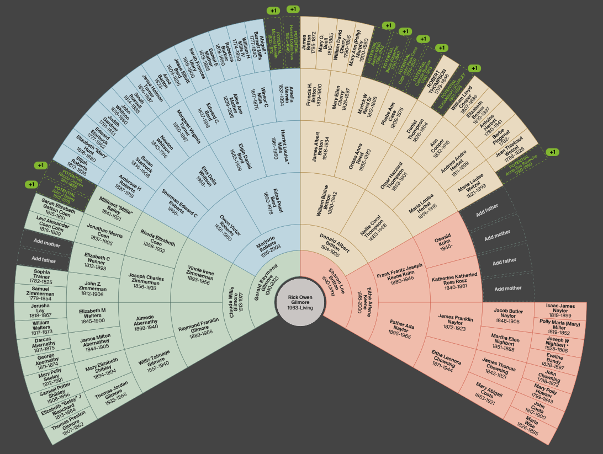
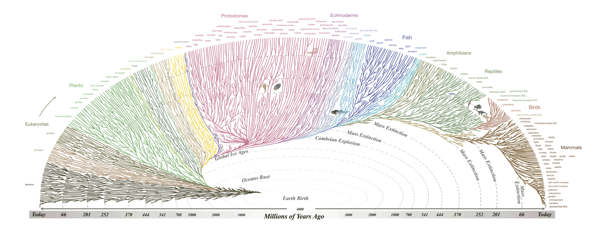
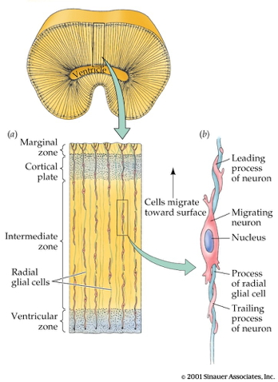
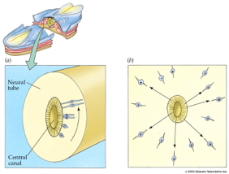
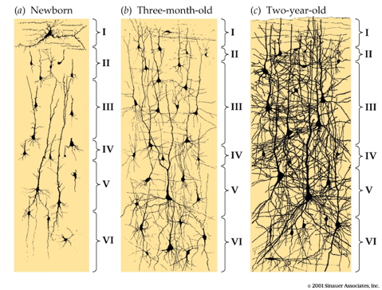
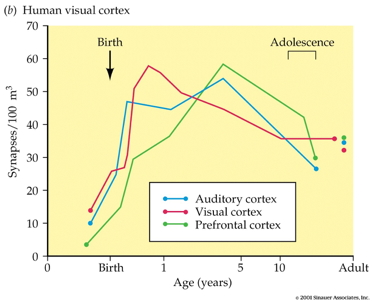
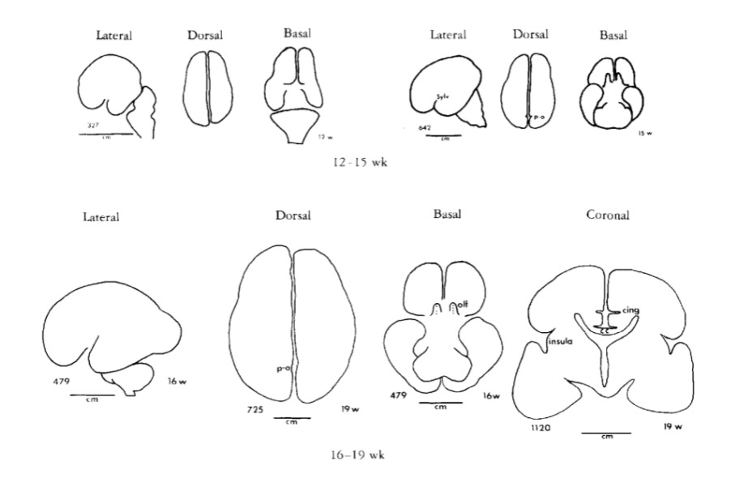
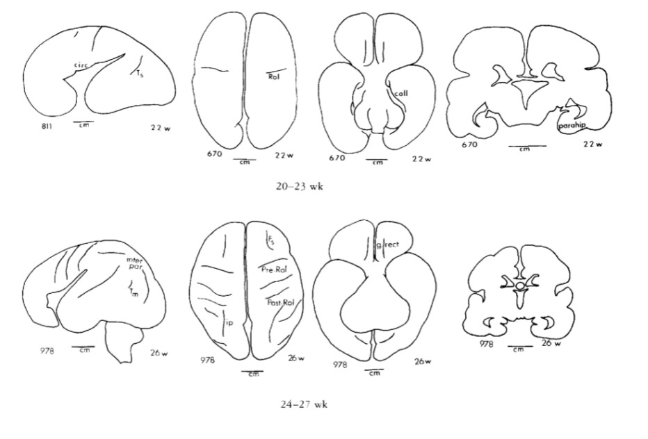
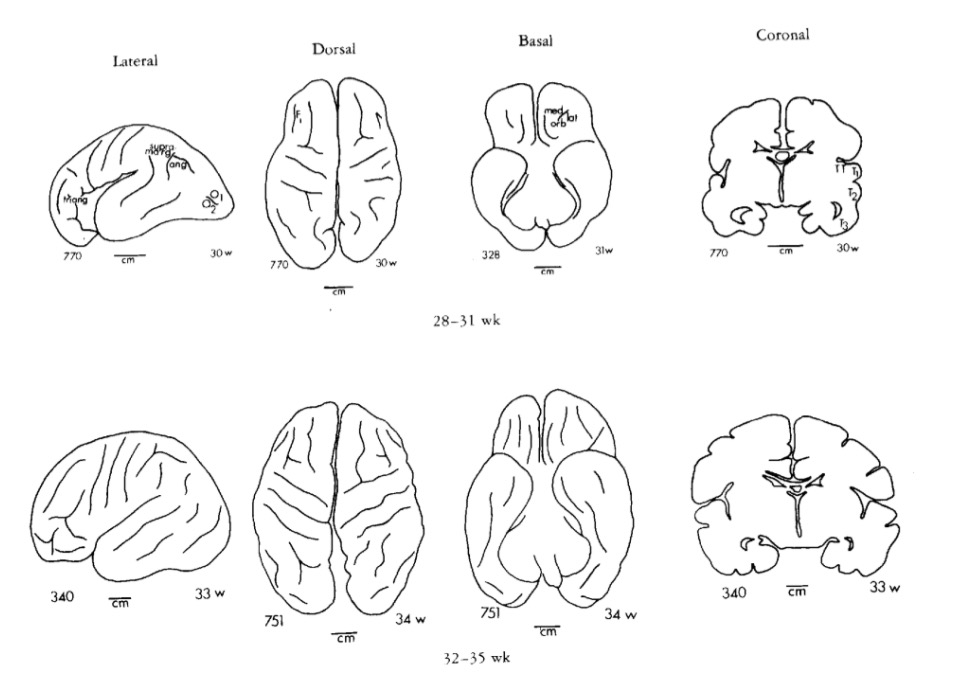
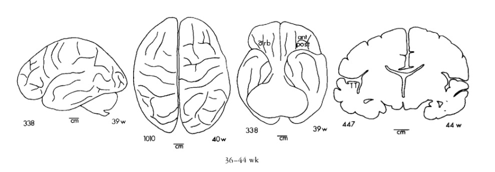

# Prelude

---



-- @Acapellascience2017-yt

## Today's topics

- Warm-up
- Wrap up on evolution
- Development of the nervous system

# Warm-up

---

### The human brain is special in which of the following ways?

::: {.incremental}
- A. It has a larger-than-expected cerebellum
- B. It has more neurons in the cerebral cortex
- C. It has an unusual shape
- D. Its size is independent of body size
:::

---

### The human brain is special in which of the following ways?

- ~~A. It has a larger-than-expected cerebellum~~
- **B. It has more neurons in the cerebral cortex**
- ~~C. It has an unusual shape~~
- ~~D. Its size is independent of body size~~

---

### Vertebrate nervous systems first emerged 

::: {.incremental}
- A. 4.5 billion years ago
- B. 13.8 billion years ago
- C. 250 thousand years ago
- D. 500-600 million years ago
:::

---

### Vertebrate nervous systems first emerged 

- ~~A. 4.5 billion years ago~~
- ~~B. 13.7 billion years ago~~
- ~~C. 200-300 thousand years ago~~
- **D. 500-600 million years ago**

## On family trees

:::: {.columns}
::: {.column width=50%}

:::
::: {.column width=50%}

:::
::::

---

### The theory of evolution explains how life began on Earth.

- A. True
- B. False

---

### The theory of evolution explains how life began on Earth.

- ~~A. True~~
- **B. False**

---

### The theory of evolution explains many aspects of how life has changed since it emerged here ~4 billion years ago.

- A. True
- B. False

---

### The theory of evolution explains many aspects of how life has changed since it emerged here ~4 billion years ago.

- **A. True**
- ~~B. False~~

# Wrap-up on evolution

## Last time...

- Link to 2026-09-29 [slides](wk-06-2026-09-30-evolution.qmd#how-nervous-systems-differ-1)

# Development of the nervous system

## Recap

- Human brain has large cerebral cortex with more neurons than comparable primates
- How did the human brain get this way?
  - Building upon mammalian/primate norms
  - Specialized patterns of development

## What must develop

:::: {.columns}
::: {.column width=70%}
- Brain ~ 2.5% of body mass
  - consumes 18% of $O_2$ at rest, [@Kety1948-ty]
  - about 20 W
- AI generated video: 20 W-h [@UnknownUnknown-sk]
:::
::: {.column width=30%}
{width="30%" fig-align="right"}
:::
::::

## What must develop

:::: {.columns}
::: {.column width=50%}
- CNS among earliest-developing, last to finish organ systems
  - Prolonged developmental period (==childhood) makes CNS especially malleable
:::
::: {.column width=50%}
{fig-align="right"}
:::
::::

## Neurons

- ~ 86 billion neurons in adult CNS
  - similar # of glia [@Herculano-Houzel2016-oy]
- In cortex, about 16 (14-32) billion [@Herculano-Houzel2016-oy]
- Development generates millions neurons/hr

## Synapses

- 7-80K synapses/cortical neuron
- ~ $10^{15}$ (quadrillion) synapses in CNS
- ~164 trillion synapses in cerebral cortex [@DeFelipe2002-xz]

## Axons

- 145-175 km (90-109 mi) of myelinated axons, [@Marner2003-qu]

## Timeline {.scrollable}

## Prenatal milestones

+ Neuro- and glio-genesis
+ Migration
+ Synaptogenesis begins
+ Cell differentiation
+ Apoptosis
+ Myelination begins

## Postnatal milestones

+ Synaptogenesis
+ Cortical expansion, activity-dependent change
  - Then cubic, quadratic, or linear declines in cortical thickness
+ Myelination
+ Prolonged period of postnatal/pre-reproductive development [[@konner_evolution_2011]](http://www.hup.harvard.edu/catalog.php?isbn=9780674062016)
- Neurogenesis in selected areas (cerebellum; basal ganglia; hippocampus)

---

---

## Prenatal period

- ~38 weeks from conception/fertilization on average
  - Embryonic period (weeks 1-8)
  - Fetal period (weeks 9+)
- Divided into 3 12-13 week trimesters

## Insemination

- Can occur 3-4 days before or up to 1-2 days after...ovulation
- Some animals signal ovulation, humans don't

## Fertilization

- One sperm cell fuses with ovum
- Within ~ 24 hrs of ovulation

## Implantation

- Fertilized ovum implants in wall of uterus
- ~ 6 days after fertilization

## Early embryogenesis



-- @Khan_Academy_undated-gx

## Neural tube formation

{fig-align="center"}

## Neural tube formation

:::: {.columns}
::: {.column width=50%}
- Embryonic layers: ectoderm, mesoderm, endoderm
  - Neural tube forms from ectoderm
  - beginning ~ 23 pcd (postconceptual days) or week 3
:::
::: {.column width=50%}

:::
::::

## Neural tube formation

:::: {.columns}
::: {.column width=50%}
- Neural tube closes in middle
  - Moves toward rostral & caudal ends
  - closing by 29-30 pcd (week 4)
:::
::: {.column width=50%}
{fig-align="right"}
:::
::::

## Neural tube formation

:::: {.columns}
::: {.column width=50%}
- Failures of neural tube closure
  + Anencephaly (rostral neuraxis)
  + Spina bifida (caudal neuraxis)
- Folic acid supplements can prevent
:::
::: {.column width=50%}
{fig-align="right"}
:::
::::

## Neural tube formation

:::: {.columns}
::: {.column width=50%}
- Neural tube becomes...
  + Ventricles & cerebral aqueduct
  + Central canal of spinal cord
:::
::: {.column width=50%}

:::
::::
  
## Neural tube

:::: {.columns}
::: {.column width=50%}
- Rostro-caudal patterning via differential growth into vesicles
  - Forebrain (prosencephalon)
  - Midbrain (mesencephalon)
  - Hindbrain (rhombencephalon)
:::
::: {.column width=50%}

:::
::::

## Neurogenesis and gliogenesis

:::: {.columns}
::: {.column width=50%}
- Neuroepithelium cell layer adjacent to neural tube 
  - creates ventricular zone (VZ) and subventricular zone (SVZ)
- Pluripotent stem and progenitor cells divide, produce new neurons & glia
:::
::: {.column width=50%}

:::
::::

## Neurogenesis and gliogenesis

:::: {.columns}
::: {.column width=50%}
- Neurogenesis (of excitatory Glu neurons) observed by 27 pcd (4 pcw; post-conceptual week)
  - complete by 191 pcd (27 pcw), [@Silbereis2016-la](http://dx.doi.org/10.1016/j.neuron.2015.12.008)
- Most cortical and striatal neurons generated prenatally, but
  - Cerebellum continues neurogenesis ~ 18 mos postnatal mos
:::
::: {.column width=50%}

:::
::::

## Can 'old' brains make new neurons?

- In some animals, yes == songbirds, birds that store food caches
- Humans, on much more limited scale
  - hippocampus (especially dentate gyrus)
  - striatum
  - olfactory bulb (minimally)
  - not much, if any, in cerebral cortex
- Most neurogenesis occurs near ventricles

---

## Cell division & migration

:::: {.columns}
::: {.column width=50%}
- Neural progenitor/stem cells
  - Undergo *symmetric* & *asymmetric* cell division
  - Generate glia, neurons, and basal progenitor cells
- Radial glia aid cell migration
:::
::: {.column width=50%}
{fig-align="right"}
:::
::::

## Cell division & migration

{fig-align="center"}

## Cell division & migration



-- @Bui2006-gy

## Cell division & migration



-- @Bbscottvids2009-ad

## Cell division & migration

- Migration aided by axon growth cones
- Growth cones guided by
    - Chemoattractants
        + e.g., Nerve Growth Factor (NGF)
    - Chemorepellents
    - Chemical receptors in growth cone detect spatial/temporal patterns

## Cell division & migration



-- @Moore2009-db

## Cell division & migration

## Cell division & migration

:::: {.columns}
::: {.column width=50%}
- Glia migrate, too
:::
::: {.column width=50%}

:::
::::

## Cell differentiation

- Neuron vs. glial cell
- Cell type
  - myelin-producing vs. astrocyte vs. microglia
  - pyramidal cell vs. stellate vs. Purkinje vs. ...
- NTs released
- Where to extend axons

# Infancy & early childhood

## Timeline of milestones {.scrollable}

## Synaptogenesis

:::: {.columns}
::: {.column width=50%}
- Begins prenatally (~ 18 pcw)
- Peak density ~ 15 mos postnatal
- Spine density in prefrontal cortex ~ 7 yrs postnatal
- 700K synapses/s on average
:::
::: {.column width=50%}

:::
::::

## Synaptogenesis

:::: {.columns}
::: {.column width=50%}
- Synaptic proliferation, pruning
    - Early proliferation (make many synapses)
    - Later pruning
    - Rates, peaks differ by area
:::
::: {.column width=50%}

:::
::::

## Apoptosis (programmed cell death)

- 20-80% of all cells, varies by area
- Spinal cord >> cortex
- Quantity of nerve growth factor (NGF) influences survival

## Synaptic rearrangement

:::: {.columns}
::: {.column width=50%}
- New synapses added
- Existing synapses altered
- Progressive phase: growth rate >> loss rate
- Regressive phase: growth rate << loss rate

:::
::: {.column width=50%}

:::
::::

## Myelination

:::: {.columns}
::: {.column width=50%}
- Neonatal brain largely unmyelinated
- Gradual myelination, peaks in mid-20s
- Non-uniform pattern
    - Spinal cord before brain
    - Sensory before motor
:::
::: {.column width=50%}

:::
::::

## Myelination

:::: {.columns}
::: {.column width=50%}
- Diffusion Tensor Imaging (DTI)
- A *structural* MRI measure of white matter integrity
- Shows significant developmental changes
:::
::: {.column width=50%}

:::
::::

## Structural/morphometric development

## Gyri & sulci

{width="50%"}

## Gyri & sulci

{width="50%"}

## Gyri & sulci

{width="50%"}

## Gyri & sulci

{width="50%"}

## Changes in brain glucose use 

## Gene expression across development

# Wrap-up

## Main points

- Human nervous system develops rapidly beginning about week 3, post-conception
- Develops throughout lifespan
- Development consists of progressive & regressive events

## Milestone summary

:::: {.columns}
::: {.column width=50%}
Prenatal \

- Neuro- and gliogenesis
- Migration
- Synaptogenesis begins
:::
::: {.column width=50%}
Postnatal \

- Neurogenesis, but only in selected areas (cerebellum; basal ganglia; hippocampus)
- Synaptogenesis
- Cortical expansion, activity-dependent change

:::
::::

## Milestone summary

:::: {.columns}
::: {.column width=50%}
Prenatal \

- Differentiation
- Cell death
- Myelination begins
:::
::: {.column width=50%}
Postnatal \

- Cortex thins
- Myelination through 3rd decade
- Prolonged period of postnatal/pre-reproductive development [@konner_evolution_2011](http://www.hup.harvard.edu/catalog.php?isbn=9780674062016)
:::
::::

## Next time

- Quiz 2; Go over Exam 1

# Resources

## About

This talk was produced using [Quarto](https://quarto.org), using the [RStudio](https://posit.co/products/open-source/rstudio/)
Integrated Development Environment (IDE), version 2026.8.1.195.

The source files are in R and R Markdown, then rendered to HTML using the
[revealJS](https://revealjs.com) framework.
The HTML slides are hosted in a [GitHub repo](https://github.com/psu-psychology/psych-260-2026-fall) and served by GitHub pages:
<https://psu-psychology.github.io/psych-260-2026-fall/>

## References
