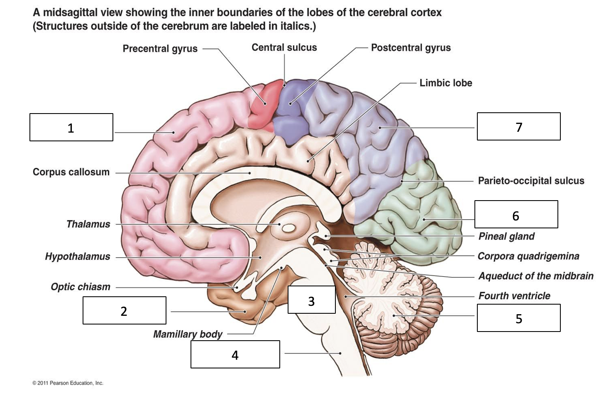

# Preliminaries

## For fun

## Announcements

## Today's topics

- Quiz 2
- Exam 1 answers

# Quiz 2

# Exam 1 answers

---

:::: {.columns}
::: {.column width=50%}
1. Identify structure #1 

- a. Frontal lobe
- b. Parietal lobe
- c. Occipital lobe
- d. Temporal lobe
:::
::: {.column width=50%}

:::
::::

---

:::: {.columns}
::: {.column width=50%}
1. Identify structure #1 

- **a. Frontal lobe**
- b. Parietal lobe
- c. Occipital lobe
- d. Temporal lobe
:::
::: {.column width=50%}

:::
::::

---

:::: {.columns}
::: {.column width=50%}
2. Identify structure #2 

- a. Frontal lobe
- b. Parietal lobe
- c. Occipital lobe
- d. Temporal lobe
:::
::: {.column width=50%}

:::
::::

---

:::: {.columns}
::: {.column width=50%}
2. Identify structure #2 

- a. Frontal lobe
- b. Parietal lobe
- c. Occipital lobe
- **d. Temporal lobe**
:::
::: {.column width=50%}

:::
::::

---

:::: {.columns}
::: {.column width=50%}
3. Identify structure #3 

- a. 4th ventricle
- b. Medulla oblongata 
- c. Cerebellum
- d. Pons
:::
::: {.column width=50%}

:::
::::

---

:::: {.columns}
::: {.column width=50%}
3. Identify structure #3 

- a. 4th ventricle
- b. Medulla oblongata 
- c. Cerebellum
- **d. Pons**
:::
::: {.column width=50%}

:::
::::

---

:::: {.columns}
::: {.column width=50%}
4. Identify structure #4

- a. 4th ventricle 
- b. Medulla oblongata
- c. Cerebellum
- d. Pons
:::
::: {.column width=50%}

:::
::::

---

:::: {.columns}
::: {.column width=50%}
4. Identify structure #4

- a. 4th ventricle 
- **b. Medulla oblongata**
- c. Cerebellum
- d. Pons
:::
::: {.column width=50%}

:::
::::

---

:::: {.columns}
::: {.column width=50%}
5. Identify structure #5

- a. 4th ventricle 
- b. Medulla oblongata
- c. Cerebellum 
- d. Pons
:::
::: {.column width=50%}

:::
::::

---

:::: {.columns}
::: {.column width=50%}
5. Identify structure #5

- a. 4th ventricle 
- b. Medulla oblongata
- **c. Cerebellum** 
- d. Pons
:::
::: {.column width=50%}

:::
::::

---

:::: {.columns}
::: {.column width=50%}
6. Identify structure #6

- a. Frontal lobe
- b. Parietal lobe
- c. Occipital lobe 
- d. Temporal lobe
:::
::: {.column width=50%}

:::
::::

---

:::: {.columns}
::: {.column width=50%}
6. Identify structure #6

- a. Frontal lobe
- b. Parietal lobe
- **c. Occipital lobe** 
- d. Temporal lobe
:::
::: {.column width=50%}

:::
::::

---

:::: {.columns}
::: {.column width=50%}
7. Identify structure #7

- a. Frontal lobe
- b. Parietal lobe 
- c. Occipital lobe 
- d. Temporal lobe
:::
::: {.column width=50%}

:::
::::

---

:::: {.columns}
::: {.column width=50%}
7. Identify structure #7

- a. Frontal lobe
- **b. Parietal lobe** 
- c. Occipital lobe 
- d. Temporal lobe
:::
::: {.column width=50%}

:::
::::

---

:::: {.columns}
::: {.column width=50%}
8. What plane of section is represented in the left panel? 

- a. Coronal 
- b. Sagittal 
- c. Axial/horizontal 
- d. Dorsal

:::
::: {.column width=50%}

:::
::::

---

:::: {.columns}
::: {.column width=50%}
8. What plane of section is represented in the left panel? 

- a. Coronal 
- b. Sagittal 
- **c. Axial/horizontal** 
- d. Dorsal

:::
::: {.column width=50%}

:::
::::

---

:::: {.columns}
::: {.column width=50%}
9. What plane of section is represented in the right panel? 

- a. Coronal 
- b. Sagittal 
- c. Axial/horizontal 
- d. Dorsal

:::
::: {.column width=50%}

:::
::::

---

:::: {.columns}
::: {.column width=50%}
9. What plane of section is represented in the right panel? 

- **a. Coronal** 
- b. Sagittal 
- c. Axial/horizontal 
- d. Dorsal

:::
::: {.column width=50%}

:::
::::

---

:::: {.columns}
::: {.column width=50%}
10. These images are examples of what whole brain structural imaging technique that does not rely on X-rays or radioactive tracing substances?  
- a. Magnetic resonance imaging (MRI)
- b. Positron Emission Tomography (PET)
- c. Single unit recording
- d. Computed Axial Tomography (CAT)

:::
::: {.column width=50%}

:::
::::

---

:::: {.columns}
::: {.column width=50%}
10. These images are examples of what whole brain structural imaging technique that does not rely on X-rays or radioactive tracing substances?  
- **a. Magnetic resonance imaging (MRI)**
- b. Positron Emission Tomography (PET)
- c. Single unit recording
- d. Computed Axial Tomography (CAT)

:::
::: {.column width=50%}

:::
::::

---

11. Which tissues provide external structural support and protection for the CNS?

- a. Astrocytes 
- b. Meninges 
- c. 4th ventricle
- d. Circle of Willis

---

11. Which tissues provide external structural support and protection for the CNS?

- a. Astrocytes 
- **b. Meninges** 
- c. 4th ventricle
- d. Circle of Willis

---

12. Glial cells serve this function, among others.

- a. Metabolic, physical support of neurons
- b. Sensory relay
- c. Preparation for action
- d. Memory storage and retrieval
- e. PNS protection

---

12. Glial cells serve this function, among others.

- **a. Metabolic, physical support of neurons**
- b. Sensory relay
- c. Preparation for action
- d. Memory storage and retrieval
- e. PNS protection

---

13. Primary auditory cortex (A1) is found in the_______________.

- a. Temporal lobe 
- b. Frontal lobe 
- c. Hypothalamus 
- d. Basal ganglia 
- e. Parietal lobe

---

13. Primary auditory cortex (A1) is found in the_______________.

- **a. Temporal lobe** 
- b. Frontal lobe
- c. Hypothalamus 
- d. Basal ganglia 
- e. Parietal lobe

---

14. Which of the following statements about neurons is *incorrect*? 
- a. Neurons have very short lives
- b. Neurons can extend over long distances 
- c. Neurons are among the family of cells that have negative resting potentials 
- d. Neurons use both electrical and chemical mechanisms to communicate

---

14. Which of the following statements about neurons is *incorrect*? 
- **a. Neurons have very short lives**
- b. Neurons can extend over long distances 
- c. Neurons are among the family of cells that have negative resting potentials 
- d. Neurons use both electrical and chemical mechanisms to communicate

---

15. Primary motor cortex is found in the ______________. 

- a. Temporal lobe 
- b. Frontal lobe 
- c. Hypothalamus 
- d. Basal ganglia 
- e. Parietal lobe

---

15. Primary motor cortex is found in the ______________. 

- a. Temporal lobe 
- **b. Frontal lobe**
- c. Hypothalamus 
- d. Basal ganglia 
- e. Parietal lobe

---

16. Your grandmother has a stroke. The neurologist chooses an X-ray-based structural brain imaging method that gives satisfactory, but not especially detailed spatial resolution. What method is that? 

- a. Computed tomography (CT)
- b. Functional magnetic resonance imaging (fMRI)
- c. Positron Emission Tomography (PET)
- d. Anterograde tract tracers

---

16. Your grandmother has a stroke. The neurologist chooses an X-ray-based structural brain imaging method that gives satisfactory, but not especially detailed spatial resolution. What method is that? 

- **a. Computed tomography (CT)**
- b. Functional magnetic resonance imaging (fMRI)
- c. Positron Emission Tomography (PET)
- d. Anterograde tract tracers

---

17. These fluid-filled structures were once thought critical for sending signals from the brain to the body. 

- a. Basal ganglia 
- b. Synaptic vesicles
- c. Cauda equina 
- d. Cerebral ventricles

---

17. These fluid-filled structures were once thought critical for sending signals from the brain to the body.

- a. Basal ganglia 
- b. Synaptic vesicles
- c. Cauda equina 
- **d. Cerebral ventricles**

---

18. The ______________ plays a role in biologically crucial behaviors, including those associated with ingestion (eating and drinking) and reproduction: 

- a. Temporal lobe 
- b. Frontal lobe 
- c. Hypothalamus 
- d. Basal ganglia
- e. Parietal lobe

---

18. The ______________ plays a role in biologically crucial behaviors, including those associated with ingestion (eating and drinking) and reproduction: 

- a. Temporal lobe 
- b. Frontal lobe 
- c. **Hypothalamus** 
- d. Basal ganglia
- e. Parietal lobe

---

19. What generates and maintains the intracellular (inside)/extracellular (outside) concentration differences of K+ and Na+ ions? 

- a. The myelin sheath
- b. The force of diffusion
- c. Action of the Na+/K+ pump (ATPase)
- d. Ion flow through passive/leak channels

---

19. What generates and maintains the intracellular (inside)/extracellular (outside) concentration differences of K+ and Na+ ions? 

- a. The myelin sheath
- b. The force of diffusion
- **c. Action of the Na+/K+ pump (ATPase)**
- d. Ion flow through passive/leak channels

---

20. The tough, canvas-like tissue that surrounds and protects the __________ is called __________.

- a. white matter; cerebrospinal fluid (CSF) 
- b. gray matter; myelin
- c. central nervous system (CNS); dura mater 
- d. cerebral ventricles; endothelial cells

---

20. The tough, canvas-like tissue that surrounds and protects the __________ is called __________.

- a. white matter; cerebrospinal fluid (CSF) 
- b. gray matter; myelin
- **c. central nervous system (CNS); dura mater** 
- d. cerebral ventricles; endothelial cells

---

21. This Italian scientist invented a cell stain that allowed entire neurons to be visualized for the very first time. 

- a. Camillo Golgi 
- b. Rene Descartes 
- c. Santiago Ramon Y Cajal 
- d. Galen

---

21. This Italian scientist invented a cell stain that allowed entire neurons to be visualized for the very first time. 

- **a. Camillo Golgi** 
- b. Rene Descartes 
- c. Santiago Ramon Y Cajal 
- d. Galen 

---

22. This type of glial cell provides neurons in the peripheral nervous system (PNS) with a myelin sheath: 

- a. Schwann cells 
- b. Oligodendrocytes 
- c. Microglia 
- d. Purkinje cells

---

22. This type of glial cell provides neurons in the peripheral nervous system (PNS) with a myelin sheath: 

- a. Schwann cells 
- b. Oligodendrocytes 
- c. Microglia 
- d. Purkinje cells

---

23. The hippocampus plays a central role in __________. 
- a. Sexual behavior 
- b. Metabolic, physical support of neurons 
- c. Sensory relay processing 
- d. Memory storage and retrieval
e. CNS protection

---

24. This part of the brain is located adjacent to the 4th ventricle and just rostral to the central canal of the spinal cord:
- a. Forebrain 
- b. Midbrain 
- c. Diencephalon. 
- d. Hindbrain 

---

25. Sodium (Na+) is highly concentrated _____________ the neuron. This means that the force of diffusion acting alone will push Na+ _____________. 
- a. inside; inward 
- b. outside; inward
- c. inside; outward 
- d. outside; outward

---

26. You’re having trouble sleeping, so your physician orders a sleep study using polysomnography. You spend a night in the hospital with electrodes on your scalp while the clinicians record patterns of electrical activity. This is an example use case of _____________. 
- a. Electroencephalograpy (EEG)
- b. Multi-unit recording
- c. Transcranial magnetic stimulation
- d. Optical imaging

---

27. _____________ , a type of glial cell, help regulate local blood oxygen levels in response to neuronal activity. These cells thus contribute to the signal measured by _____________. 
- a. Oligodendrocytes; MEG
- b. Schwann cells; structural MRI
- c. Astrocytes; functional MRI 
- d. Microglia; structural and functional MRI

---

28. Which ventral midbrain region is one of the main sites for neurons that release neuromodulators (e.g., dopamine, norepinephrine, and serotonin)? 
- a. Basal ganglia 
- b. Lateral geniculate nucleus 
- c. Tegmentum
- d. Tectum

---

29. The hypothalamus is NOT responsible for which of the following functions? 
- a. Fleeing 
- b. Feeding
- c. Fighting
- d. Falling

---

30. Which of the following marks the medial boundary of the frontal and parietal lobes? 
- a. Lateral fissure
- b. Longitudinal fissure 
- c. Central sulcus
- d. Inferior temporal gyrus

---

31. Nodes of Ranvier, or gaps in the myelination of an axon, serve what purpose? 
- a. Increase the speed of propagation 
- b. Allow space in the axon for neurotransmitter release 
- c. Provide structural support to the neuron 
- d. Combine input from different dendrites

---

32. Descartes thought that this midbrain structure was the place where the soul interacted with the body to create movement by inflating the muscles 
- a. Pons 
- b. Cerebral aqueduct 
- c. Pineal gland 
- d. Superior colliculus

---

33. When a neuron’s membrane potential is “at rest,” which of the following ions are more heavily concentrated inside of the cell? 
- a. Na+ and Cl- 
- b. K+ and A-
- c. Na+ and K+
- d. Cl- and A-

---

34. When a neuron’s membrane potential reaches the threshold for an action potential, ___________. 
- a. voltage-gated K+ channels close 
- b. voltage-gated Na+ channels close and inactivate 
- c. the Na/K pump works even harder to keep the concentration balance 
- d. voltage-gated Na+ channels open

---

35. This part of the cell functions as the neuron’s “antennae” by serving as the primary place for receiving input. 
- a. Axon 
- b. Soma 
- c. Dendrites 
- d. Terminal Buttons

---

36. During the repolarization (falling) phase of the action potential, ___________ channels _____________. 
- a. Ligand-gated K+; close 
- b. Voltage-gated Cl-; close
- c. Voltage-gated Na+; open 
- d. Voltage-gated K+; are open.

---

37. The speed of electrical signaling via action potentials is ____________ the speed of chemical signaling via diffusion. 
- a. much faster than 
- b. much slower than 
- c. about the same speed as 
- d. slightly slower than

---

38. During the absolute refractory period, a neuron will ___________. 
- a. fire again in response to an especially strong input
- b. produce an action potential that is twice the normal size
- c. open voltage-gated Ca++ channels
- d. not fire no matter the strength of the input

---

39. All of the following ions move across the neuronal membrane at different times EXCEPT: 
- a. Na+.
- b. K+. 
- c. Cl-. 
- d. Organic anions (A-).

---

40. Action potentials propagate along unmyelinated axons, just more slowly than in myelinated ones.
- a. True.
- b. False. 

---

41. During the rising phase of the action potential, ____________ ions ___________. 
- a. K+; flow out 
- b. Na+; flow out 
- c. K+; flow in 
- d. Na+; flow in

---

42. A toxin found in Japanese pufferfish blocks voltage-gated Na+ channels. Applying such a toxin to neurons would have what effect? 
- a. Slower falling phase of the action potential 
- b. Increasing the concentration of Na+ inside the cell 
- c. K+ ions would accelerate their flow to compensate 
- d. Action potentials would be abolished

---

43. The all or none property of action potentials is analogous to what feature of modern computers? 
- a. Computers don’t work when they are powered off
- b. Electrical communication requires the movement of charged particles (current)
- c. Brains and computers make use of Na, K, and Cl
- d. Use of 1s and 0s to indicate information states

# Wrap-up

## Main points

## Next time

# Resources

## About

This talk was produced using [Quarto](https://quarto.org), using the [RStudio](https://posit.co/products/open-source/rstudio/)
Integrated Development Environment (IDE), version 2026.8.1.195.

The source files are in R and R Markdown, then rendered to HTML using the
[revealJS](https://revealjs.com) framework.
The HTML slides are hosted in a [GitHub repo](https://github.com/psu-psychology/psych-260-2026-fall) and served by GitHub pages:
<https://psu-psychology.github.io/psych-260-2026-fall/>

## References