# Prelude

---

::: {#fig-optogenetics-video}
<iframe width="1280" height="450" src="https://www.youtube.com/embed/I64X7vHSHOE?si=NCLrZmGwZoNkGF9m" title="YouTube video player" frameborder="0" allow="accelerometer; autoplay; clipboard-write; encrypted-media; gyroscope; picture-in-picture; web-share" referrerpolicy="strict-origin-when-cross-origin" allowfullscreen></iframe>

@Video2010-jw
:::

---

{#fig-deissorth-nobel width="65%"}

## Today's topics

- Mental illness & psychiatric disorders
- Major depressive disorder

# Mental illness & psychiatric disorders

## Prevalence: Any

](https://www.samhsa.gov/data/sites/default/files/reports/rpt57150/2025-nsduh-annual-national-html/images/nsduh-nnr-fig63-2025.jpg)

## Prevalence: Serious

](https://www.samhsa.gov/data/sites/default/files/reports/rpt57150/2025-nsduh-annual-national-html/images/nsduh-nnr-fig64-2025.jpg)

## Neuroscience of

- Presume diseases of the mind are disorders of the brain, see @Kendler2024-fz

## Neuroscience of

:::: {.columns}
::: {.column width=60%}
- Diagnose via measurements/observations of behavior & mood
  - e.g., Hamilton Rating Scale for Depression [@Wikipedia-contributors2025-ix; @UnknownUnknown-ef]
:::
::: {.column width=40%}

:::
::::

## Neuroscience of...

:::: {.columns}
::: {.column width=60%}
- No reliable biological test or biomarker
- System-wide effects; no single or simple cause
:::
::: {.column width=40%}
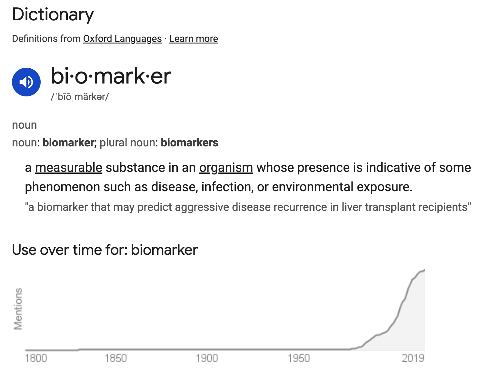{fig-align="right"}
:::
::::
    
## Heritability of...

+ *proportion of variance in trait accounted for by genetic factors*
  - e.g., p(your sibling has X | you have X)
- Higher for psychiatric disorders than non-psychiatric diseases
- Family member with mental illness often highest known risk factor

## Heritability of...

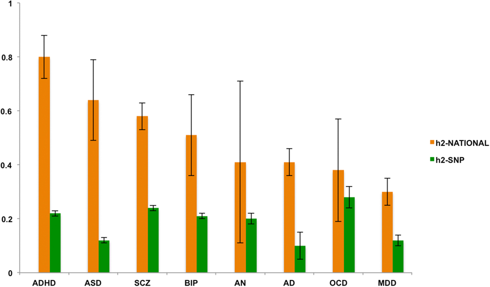{#fig-pettersson-2019 width="65%"}

## Gene & brain measures relate *across* disorders {.scrollable}

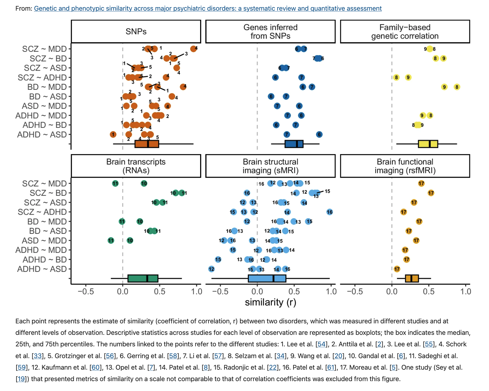

---

::: {.fragment}
- Categorical boundaries between disorders aren't so firmly established.
:::

# Major depressive disorder

## Major Depressive Disorder

:::: {.columns}
::: {.column width=50%}
- Symptoms
  + Depressed mood or loss of interest in daily activities
  - Plus 4 others
- Most of the day, every day, lasting for two weeks or more
:::
::: {.column width=50%}
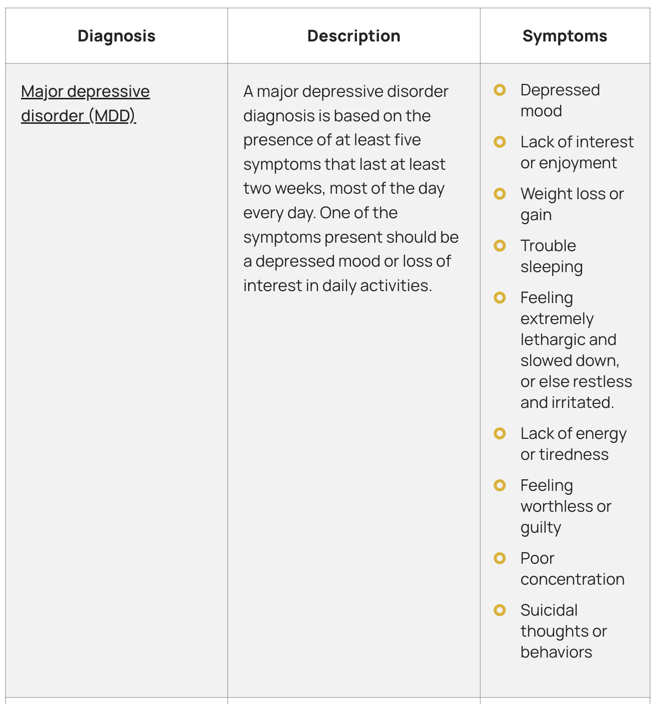{#fig-khaliq-2022}
:::
::::

## Major Depressive Disorder (MDD)

- Experienced by ~8% Americans in any year
- U.S. prevalence up to ~20% lifetime (higher than international average; @Bromet2011-sc)
  - Females 2-3x males
- Median age of first episode ~25 years

## Prevalence of MD episodes

:::: {.columns}
::: {.column width=50%}
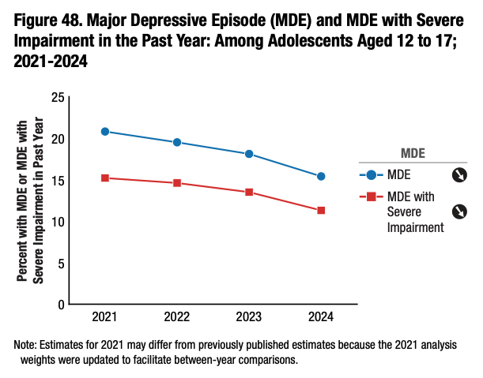
:::
::: {.column width=50%}
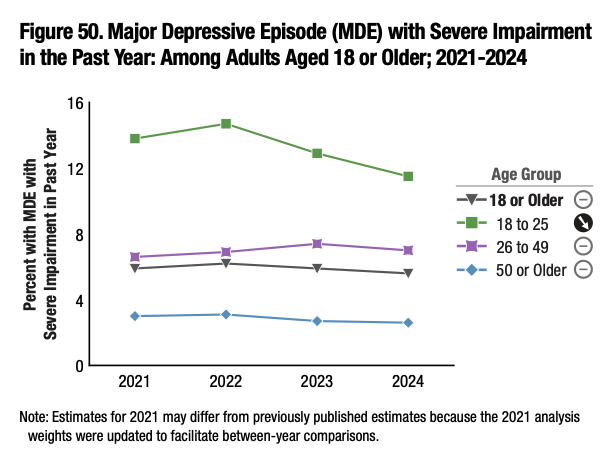
:::
::::

---

>*MDD is a complex disorder that cannot be fully explained by any one single established biological or environmental pathway. Instead, MDD seems to be caused by a combination of genetic, environmental, psychological and biological factors.*

-- @Marx2023-ks

# Causes & effects

## Pathogenesis

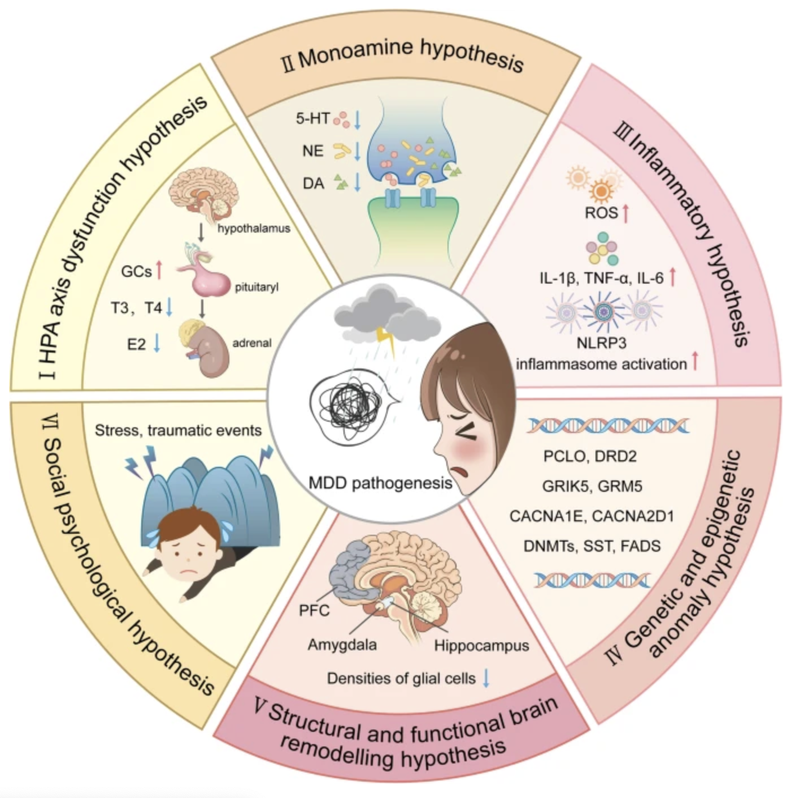{width="45%" #fig-cui-2024-fig-01}

## 

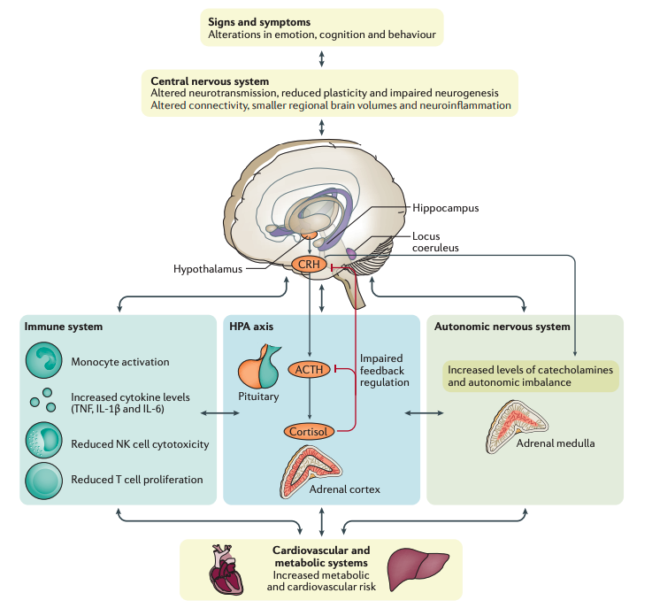{#fig-otte-2016 width="55%"}

## MDD Heritability

- Large (2.5 M) Swedish population study, @Kendler2018-cl
  - Females 0.49 (twins); 0.51 (non-twin relatives)
  - Males 0.41 (twins); 0.36 (non-twin relatives)
- ~35% [@Geschwind2015-xm; @Otte2016-rp]

## Sex-specific genetic effects {.scrollable}

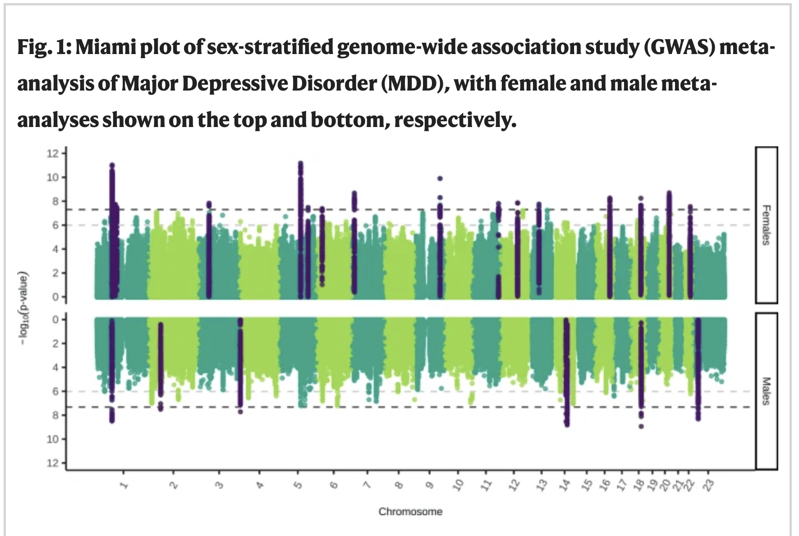{#thomas-2025-fig-01 width="65%"}

## Genes and environment interact

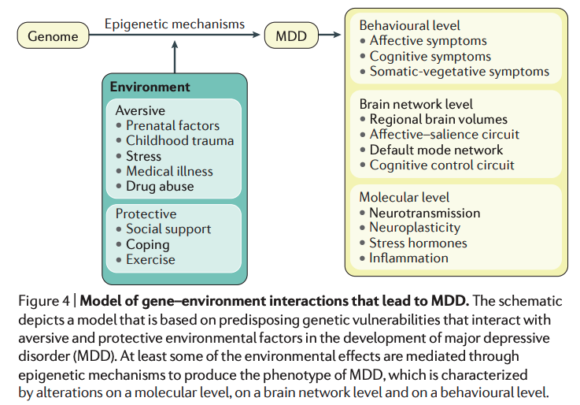

## Smaller brain areas 

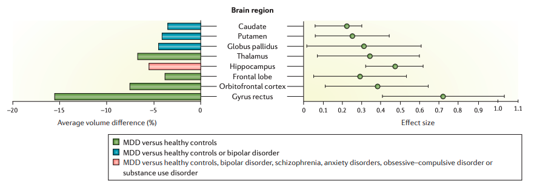

## Monoamine hypothesis

- Or "chemical imbalance theory"
+ More: euphoria
+ Less: depression

## Monoamine hypothesis

- Reserpine [@Wikipedia-contributors2025-ov]
  - reduces blood pressure
  - NE antagonist
  - Early (1950s-60s) use as anti-psychotic drug to treat schizophrenia
  - Once thought to *induce* depressive symptoms, but see [@Baumeister2003-cw]

## Drug treatments for MDD

- Monoamine oxidase (MAO) inhibitors (MAO-Is)
- Tricyclics
- Selective (Serotonin/Serotonin-Norephinephrine) Reuptake Inhibitors (SSRIs/SNRIs)

## Monoamine oxidase (MAO) inhibitors

+ MAO degrades monoamines in neurons and glia
+ MAO-Is boost monoamine levels
- Treat MDD, panic disorder, anxiety disorder
  - Side effects, especially high blood pressure^[Boosting/prolonging NE -> upregulation of SNS]
      
## Tricyclics

- Named for atomic structure
+ Inhibit NE, 5-HT reuptake -> Upregulate monoamine levels
- Used to treat MDD, anxiety
- Non-selective -> side effects

## Tricyclics

>*The long-term effects of tricyclic antidepressants and the effects on quality of life are unknown. Short-term results suggest that tricyclic antidepressants may reduce depressive symptoms while also increasing the risks of serious adverse events, but these results were based on low and very low certainty evidence.*

-- @Kamp2024-mz
    
## Selective Serotonin Reuptake Inhibitors (SSRIs)

::: {.incremental}
+ Fluoxetine (Prozac, Paxil, Zoloft)
+ Impede transporters
  - Transport 5-HT across presynatic membrane for repackaging & reuse
  - Prolong duration of 5-HT in synaptic cleft
:::

## Selective Serotonin Reuptake Inhibitors (SSRIs)

- Selective Serotonin Norepinephrine Reuptake Inhibitors (SNRIs)
  - Inhibit both 5-HT and NE transporters

## Cymbalta an SNRI



## How well do the drugs work?

- [STAR*D trial](http://www.nimh.nih.gov/funding/clinical-research/practical/stard/allmedicationlevels.shtml)
- $35M NIMH-funded clinical trial 2001-2007, target *n*=4,000

## STAR*D protocol

- On SSRI for 12-14 weeks.
- If SSRI didn't work, could switch drugs up to 3 times

## STAR*D results

- 1st round
  - ~1/3 achieved remission; 10-15% showed symptom reduction
- 2nd round
  - ~25% became symptom free.
- 67% cumulative remission rate
- 6-7 weeks to show response

## STAR*D reanalyzed 

- @Pigott2023-xv
- STAR*D investigators deviated from their own protocol
  - raters were not blind to status
- Included data that should have been excluded

::: {.fragment}

>*In contrast to the STAR\*D-reported 67% cumulative remission rate after up to four antidepressant treatment trials, the rate was 35.0% when using the protocol-stipulated HRSD and inclusion in data analysis criteria*

:::

## Monoamine hypothesis reconsidered

:::: {.columns}
::: {.column width=50%}
- Too simplistic
- Monoamines interact 
- Drugs fast acting (min), but improvement slow (weeks)
:::
::: {.column width=50%}
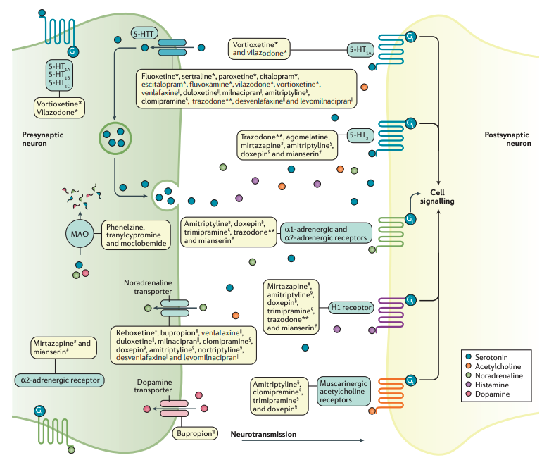
:::
::::

---

>*No correlation between serotonin and its metabolite 5-HIAA in the cerebrospinal fluid and [11C]AZ10419369 binding measured with PET in healthy volunteers.*

-- @Tiger2015-dy

---

>...we performed the first meta-analysis of the mood effects in [acute tryptophan depletion] ATD and [alpha-methyl-para-tyrosine] APTD studies. **The depletion of monoamine systems (both 5-HT and NE/DA) does not decrease mood in healthy controls.** However, **in healthy controls with a family history of MDD the results suggest that mood is slightly decreased**...by [monoamine depletion]...

-- @Ruhe2007-qc

---

>*The serotonin hypothesis of depression is still influential. We aimed to synthesise and evaluate evidence on whether depression is associated with lowered serotonin concentration or activity in a systematic umbrella review of the principal relevant areas of research.* 

-- @Moncrieff2022-os

---

>The main areas of serotonin research provide **no consistent evidence of there being an association between serotonin and depression, and no support for the hypothesis that depression is caused by lowered serotonin activity or concentrations**.

-- @Moncrieff2022-os

## When drugs *do* work, how?

- Alter receptor sensitivity?
  - 5-HT terminals contain autoreceptors
  - Presynaptic autoreceptors regulate 5-HT release
  - Autoreceptors compensate for elevated 5-HT from SSRIs 
  + Postsynaptic receptor upregulation of NE/5-HT effects?

## When drugs do work, how?

- Stimulate neurogenesis?
  + Link to neurotrophin, brain-derived nerve growth factor (BDNF)
  + BDNF boosts neurogenesis

## Neurogenesis hypothesis 

- @mahar_stress_2014
- Chronic stress causes neural loss in hippocampus
  - Cortisol and CRF receptors in hippocampus
- Chronic stress down-regulates 5-HT sensitivity

## Neurogenesis hypothesis

- Depression ~ chronic stress
- Anti-depressants upregulate neurogenesis via 5-HT modulation
- Hippocampus one site where neurogenesis occurs in adults

## Other therapeutic approaches

- Psychotherapy
- Other drugs
- Neurostimulation

## Psychotherapy

- Effective in treating MDD
- No clear differences among therapy types
- Similar outcomes as antidepressant medication
- @Otte2016-rp

## Ketamine

- Selective antagonist of the NMDA receptor
  - NMDA is an ionotropic glutamate (Glu) receptor
- Relieves depressive symptoms relatively quickly [@Berman2000-vg; @Zarate2006-np]
  - But only for a short time
- Boosts synaptic spine formation [@Li2010-ve] and reverses effects of induced stress

## Ketamine

>*Our findings show that ketamine and esketamine may be more efficacious than placebo at 24 hours. How these findings translate into clinical practice, however, is not entirely clear...Long term non‐inferiority RCTs comparing repeated ketamine and esketamine, and rigorous real‐world monitoring are needed to establish comprehensive data on safety and efficacy.*

-- @Dean2021-qw

## Electroconvulsive Therapy (ECT)

- Last line of treatment for drug-resistant depression
- Electric current delivered to the brain causes 30-60s seizure
- Usually done in a hospital's operating or recovery room under general anesthesia

## Electroconvulsive Therapy (ECT)

- Once every 2-5 days for a total of 6-12 sessions.
- Remission rates of up to 50.9% [@dierckx_efficacy_2012]
- Seems to work via
  + Intrinsic anticonvulsant effects (brain responds to seizure with seizure-preventing responses)
  + Neurotrophic (stimulates neurogenesis) effects
  
## Electroconvulsive Therapy (ECT)

:::: {.columns}
::: {.column width=50%}
- ECT more effective than ketamine?
:::
::: {.column width=50%}
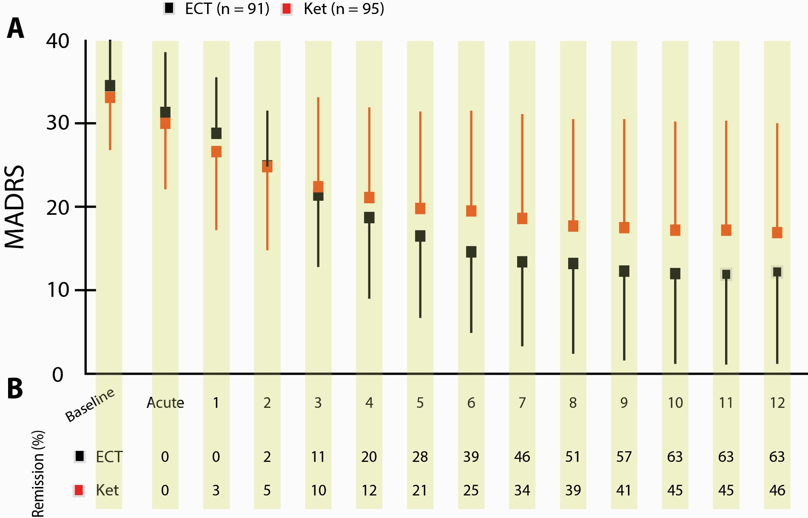
:::
::::

## Deep brain stimulation



-- @ucsf2021-db

## Other neurostimulation

:::: {.columns}
::: {.column width=50%}
- Vagal (Xth cranial) nerve stimulation
- Parasympathetic branch of ANS
- Mixed (afferent/efferent)
:::
::: {.column width=50%}

:::
::::

## Other neurostimulation

:::: {.columns}
::: {.column width=50%}
- Transcranial Magnetic Stimulation
- Non-invasive
- Weekday treatments, 20-30 min/session, 4-8 weeks
- Target dorsolateral prefrontal cortex
- @Kim2024-ay
:::
::: {.column width=50%}

:::
::::

# Wrap-up

## Main points

- MDD highly prevalent
- MDD widespread dysfunction
- No universal biomarkers, but high heritability

## Main points

- Weak evidence for "chemical imbalance"
- Monoamine drugs widely prescribed, work sometimes in some people
- Weak evidence for monoamine hypothesis
- How reuptake inhibitors (e.g., SSRIs/SNRIs) alleviate MDD not clear

## Main points  

- Some evidence for altered HPA system, especially cortisol
- MDD may mimic chronic stress & affect neural development
- Ketamine faster acting than monoamine-affecting drugs

## Main points

- Psychotherapy can be effective
- ECT, deep brain stimulation for treatment-resistant depression

>...High-quality (prospective) studies on MDD are needed to disentangle the etiology and maintenance of MDD.

-- @Kennis2020-rw

## Next time

- Bipolar disorder and schizophrenia

# Resources

## About

This talk was produced using [Quarto](https://quarto.org), using the [RStudio](https://posit.co/products/open-source/rstudio/)
Integrated Development Environment (IDE), version 2026.8.1.195.

The source files are in R and R Markdown, then rendered to HTML using the
[revealJS](https://revealjs.com) framework.
The HTML slides are hosted in a [GitHub repo](https://github.com/psu-psychology/psych-260-2026-fall) and served by GitHub pages:
<https://psu-psychology.github.io/psych-260-2026-fall/>

## References
