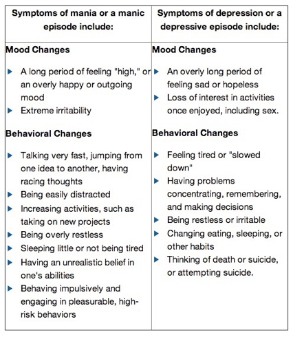
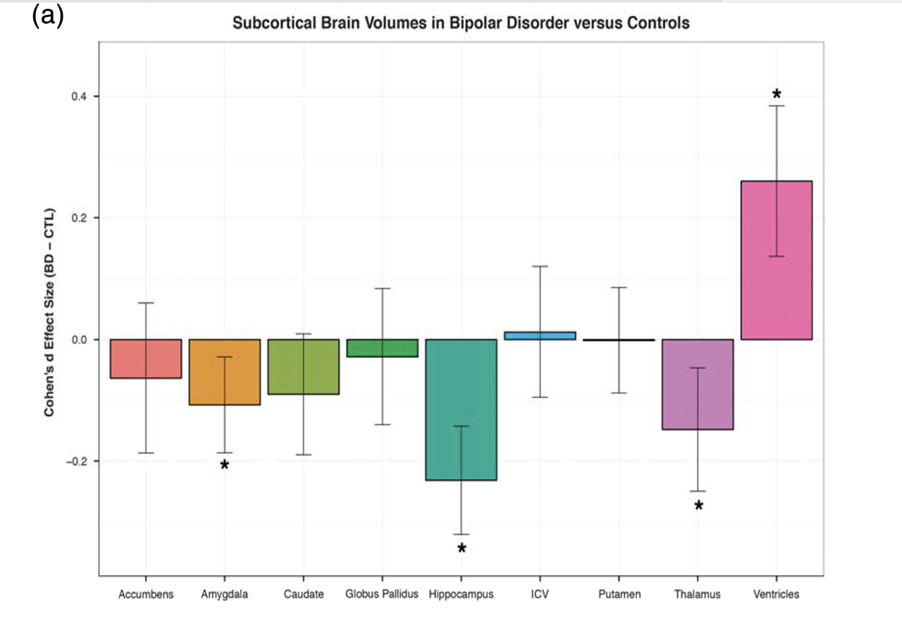
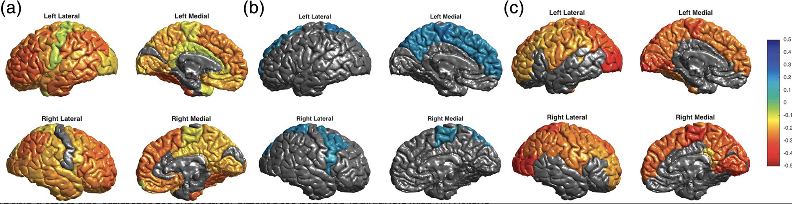
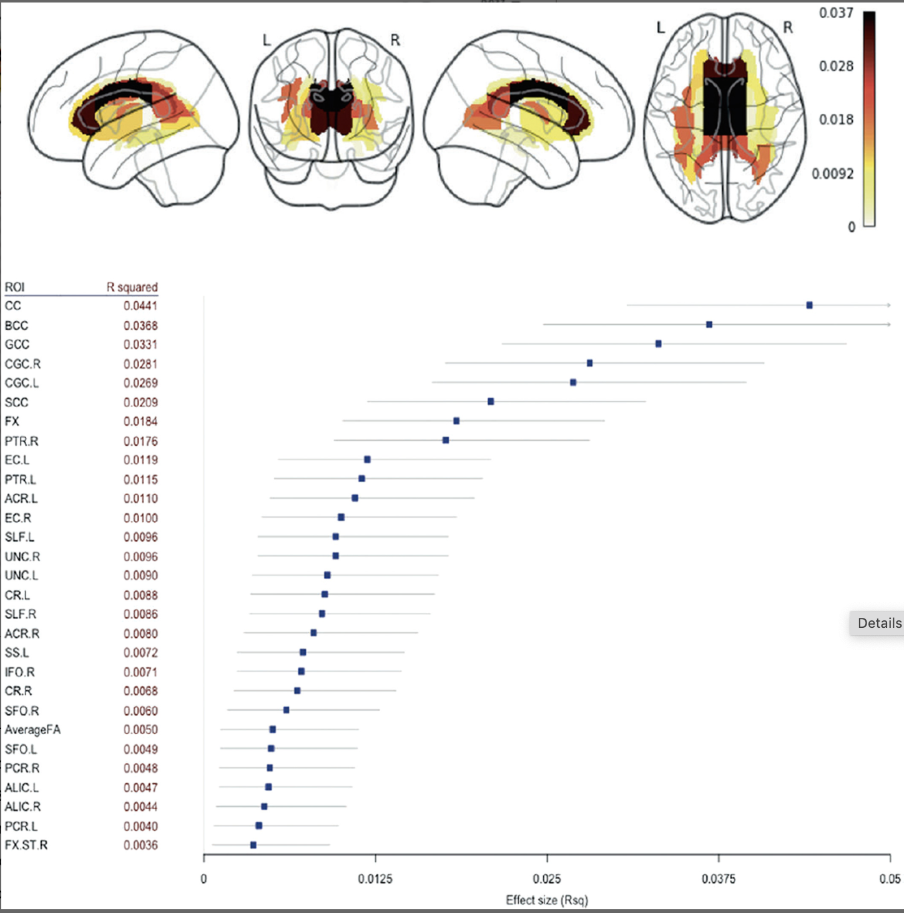

# Prelude

---

<!-- Mariah Carey I'll Be There -->



-- @MariahCareyVEVO2010-sl

## Today's topics

- Quiz 2 scores
- Warm-up
- Wrap-up on Major depressive disorder
- Bipolar disorder

# Quiz 2 scores

## Summary data

```{r}
#| label: fig-quiz-02-histogram
#| fig-cap: "Histogram of scores for Quiz 02. Passing scores are indicated in teal."

library(ggplot2)
library(dplyr)
readr::read_csv("../private/quizzes/quiz-02/Canvas Report - Exam 23454 - Section 001.csv") |>
  select(FA26_QUIZ_2) |>
  mutate(passing = FA26_QUIZ_2 >= 7) |>
  ggplot() +
  aes(x = FA26_QUIZ_2, fill = passing) +
  geom_bar() +
  theme_minimal() +
  theme(legend.position = "none") +
  xlab("")
```


# Warm-up

---

### For most psychiatric disorders, diagnostic tests involve behavior not biological measures. True or False?

- True
- False

---

### For most psychiatric disorders, diagnostic tests involve behavior not biological measures. True or False?

- **True**
- ~~False~~

---

### The monoamine hypothesis of depression claims that monoamine levels are ________ in people with major depressive disorder (MDD).

::: {.incremental}
- A. elevated
- B. reduced
- C. variable
- D. normal
:::

---

### The monoamine hypothesis of depression claims that monoamine levels are ________ in people with major depressive disorder (MDD).

- ~~A. elevated~~
- **B. reduced**
- ~~C. variable~~
- ~~D. normal~~

---

### The STAR-D clinical trial initially showed that ____ of participants showed symptom improvement on an SSRI, but a recent reanalysis suggested that only ____ improved.

::: {.incremental}
- A. ~^[The `~` character means approximately.]2/3; ~1/3.
- B. 1/2; 1/10.
- C. 80%; 50%.
- D. millions; hundreds.
:::

---

### The STAR-D clinical trial initially showed that ____ of participants showed symptom improvement on an SSRI, but a recent reanalysis suggested that only ____ improved.

- **A. ~2/3; ~1/3.**
- ~~B. 1/2; 1/10.~~
- ~~C. 80%; 50%.~~
- ~~D. millions; hundreds.~~

# Major depressive disorder

## Last time...

- Link to 2026-10-07 [slides](wk-07-2026-10-09-psychopathology-I#ketamine)

# Bipolar (BP) disorder

## Background on BP

- Formerly “manic depression” or “manic depressive disorder"
- Alternating mood states
  + Mania or hypomania (milder form)
  + Depression
    
## Background on BP

:::: {.columns}
::: {.column width=40%}
- Cycles 3-6 mos in length
  + but rapid cycling (weeks or days)
- Suicide risk 20-60x normal population  [@baldessarini_suicide_2006](http://dx.doi.org/10.1017/S1092852900014681)
:::
::: {.column width=60%}
{height="80%"}
:::
::::

## Background on BP

- 1-3% lifetime prevalence, subthreshold affects another ~2% [@Merikangas2007-hu](Merikangas2007-hu)
- Subtypes
  + **Bipolar I**: manic episodes, possible depressive ones
  + **Bipolar II**: no manic episodes but hypomania (disinhibition, irritability/agitation) + depression

## Background on BP

- Psychosis (hallucinations or delusions)
- Anxiety, attention-deficit hyperactivity disorder (ADHD)
- Substance abuse

## (Neuro)biology of BP {.scrollable}

{#fig-bourque-2024-fig-02}

## Genetics of BP

- 40-70% concordance (higher in some samples)
- Polygenic (many risk alleles)
- BP and schizophrenia overlap [@craddock_genetics_2013]

---

{#fig-pettersson-2019 width="65%"}

## Genetics of BP

- Genes for voltage-gated Ca++ channels
  + Regulate NT, hormone release
  + Gene expression, cell metabolism
- @craddock_genetics_2013; @Cross-Disorder_Group_of_the_Psychiatric_Genomics_Consortium2013-ms

## Brain activation changes

:::: {.columns}
::: {.column width=50%}
- Areas linked to...
  - cognitive control $\downarrow$
  - emotion regulation $\uparrow$
:::
::: {.column width=50%}
{#fig-maletic-2014}
:::
::::

## Brain structure

:::: {.columns}
::: {.column width=50%}
- Volume
  - Amygdala, hippocampus, thalamus $\downarrow$
  - ventricles $\uparrow$

:::

::: {.column width=50%}
{#fig-ching-2022-fig-04a}

:::
::::


## Brain structure

{#fig-ching-2022-fig-05}

- Cerebral cortex thinner
  - BP vs. healthy controls (a)
  - BP on anti-convulsant (c)

## Brain structure


- But, ctx *thicker* for BP on Li (b)

## Brain structure

:::: {.columns}
::: {.column width=50%}
- White matter altered.
:::
::: {.column width=50%}
{#fig-ching-2022-fig-07}
:::
::::

## Toward a unified model

{#fig-magioncalda-2022 width="65%"}

## Therapies for BP

- Psychotherapy
- Electroconvulsive Therapy (ECT)
- Sleep medications
- Drugs

## Drugs

- Anti-depressants not especially effective [@Sidor2012-ki; @Gitlin2018-uu]
  - May destablize mood
- Anticonvulsants
    + Typically used to treat epilepsy
    + Usually GABA-A receptor agonists
    + e.g. [lamotrigine](https://medlineplus.gov/druginfo/meds/a695007.html) (Lamictal)
- Atypical antipsychotics

## Drugs

- Mood stabilizers
  + [Valproate](https://medlineplus.gov/druginfo/meds/a682412.html) (Depakote)
  + Lithium (Li)

## Lithium (Li)

:::: {.columns}
::: {.column width=60%}
- "Discovered" accidentally in 1948
- [John Cade](https://en.wikipedia.org/wiki/John_Cade)
  - Injected manic patients' urine with a lithium compound (chemical stabilizer) into guinea pig test animals
  - Had calming effect
- Earliest effective medication for treating mental illness
:::
::: {.column width=40%}

:::
::::

## Li effects 

::: {.incremental}
- Reduces mania, minimal effects on depressive states
- Preserves volume of prefrontal cortex (PFC), hippocampus, amygdala
- downregulates DA, glutamate; upregulates GABA
- **levels can be tested/monitored via blood test**

:::

-- @malhi_potential_2013

## [Systematic Treatment Enhancement Program for Bipolar Disorder (STEP-BD)](https://www.nimh.nih.gov/funding/clinical-research/practical/step-bd) cohort 

- $n=1,469$
- Intensive psychosocial treatments (e.g., psychotherapy) effective for 64% of trial participants, [@Geddes2013-hm]
+ Mood stabilizer effects not enhanced by anti-depressant, [@Geddes2013-hm]

## [ENIGMA BD working group](https://enigma.ini.usc.edu/ongoing/enigma-bipolar-working-group/)

{#fig-engigma-bd width="65%"}

---

>**From a neurobiological perspective there is no such thing as bipolar disorder**. Rather, it is almost certainly the case that many somewhat similar, but subtly different, pathological conditions produce a disease state that we currently diagnose as bipolarity...

-- @Maletic2014-oe

---

>From a neurobiological perspective there is no such thing as bipolar disorder. Rather, it is almost certainly the case that **many somewhat similar, but subtly different, pathological conditions produce a disease state that we currently diagnose as bipolarity**...

-- @Maletic2014-oe

---

>**This heterogeneity** – reflected in the lack of synergy between our current diagnostic schema and our rapidly advancing scientific understanding of the condition – **limits attempts to articulate an integrated perspective on bipolar disorder**.

-- @Maletic2014-oe

# Wrap-up

## Main points: MDD  

- Some evidence for altered HPA system, especially cortisol
- MDD may mimic chronic stress & affect [neural development](wk-07-2026-10-07-psychopathology-I.qmd#neurogenesis-hypothesis)
- Ketamine faster acting than monoamine-affecting drugs

## Main points: MDD

- Psychotherapy can be effective
- ECT, deep brain stimulation for treatment-resistant depression
- Newer, non-invasive [stimulation types](wk-07-2026-10-07-psychopathology-I.qmd#other-neurostimulation)

>*...High-quality (prospective) studies on MDD are needed to disentangle the etiology and maintenance of MDD.*

-- @Kennis2020-rw

## Main points: BP

- Changes in mood, but ≠ MDD
- Genetic + environmental risk
- Changes in emotion processing, cognition, size of hippocampus
- Heterogeneous
- No simple link to a specific NT system

## Next time

- Schizophrenia

# Resources

## About

This talk was produced using [Quarto](https://quarto.org), using the [RStudio](https://posit.co/products/open-source/rstudio/)
Integrated Development Environment (IDE), version 2026.8.1.195.

The source files are in R and R Markdown, then rendered to HTML using the
[revealJS](https://revealjs.com) framework.
The HTML slides are hosted in a [GitHub repo](https://github.com/psu-psychology/psych-260-2026-fall) and served by GitHub pages:
<https://psu-psychology.github.io/psych-260-2026-fall/>

## References
